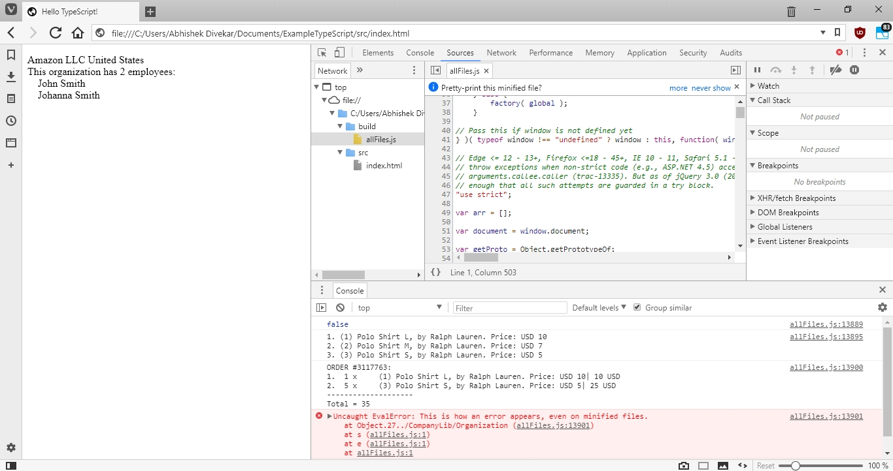
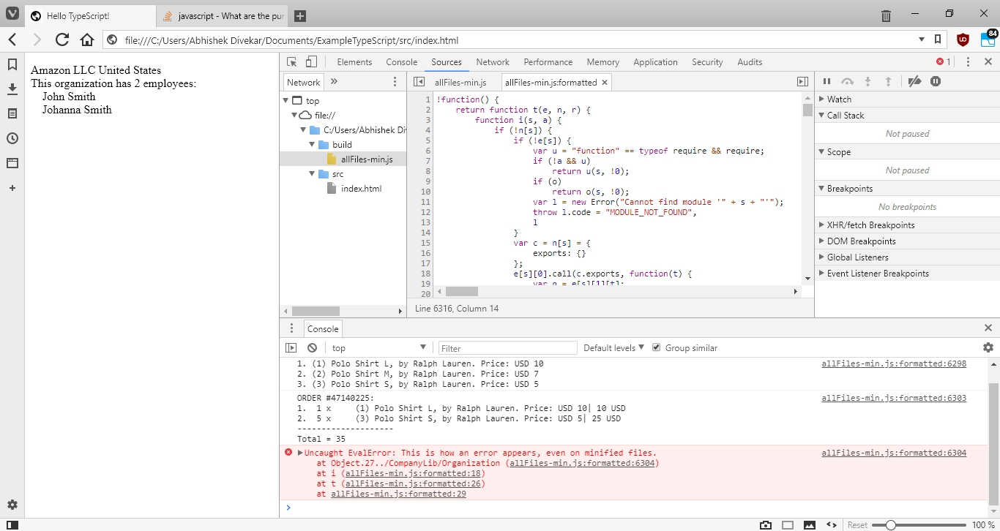
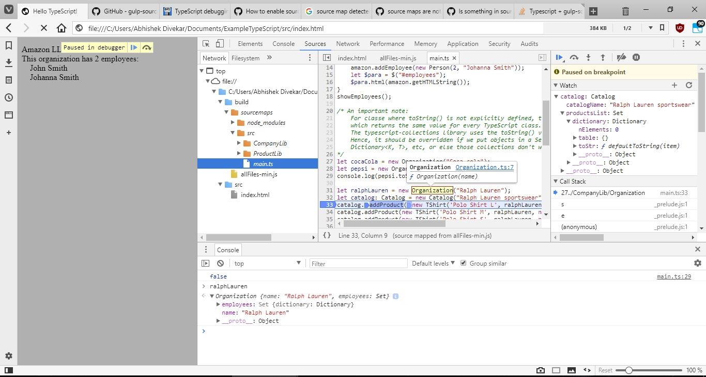
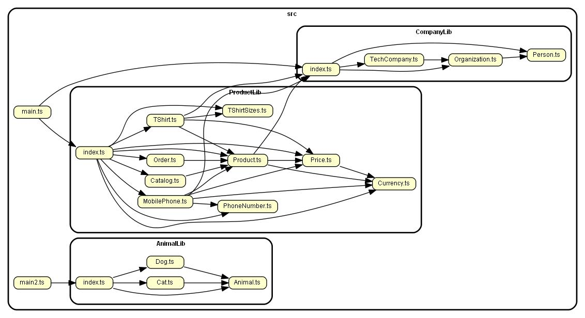
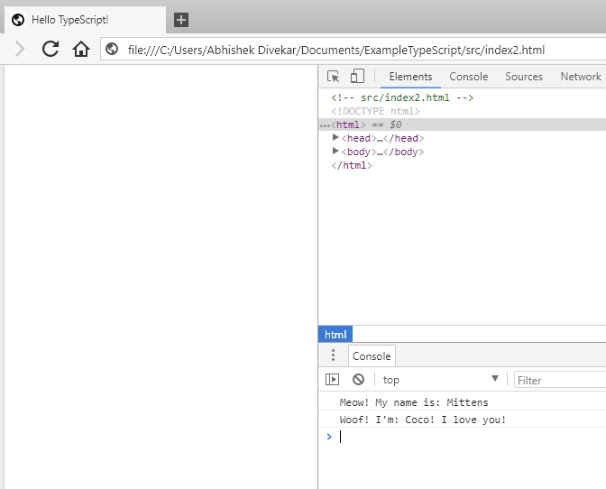
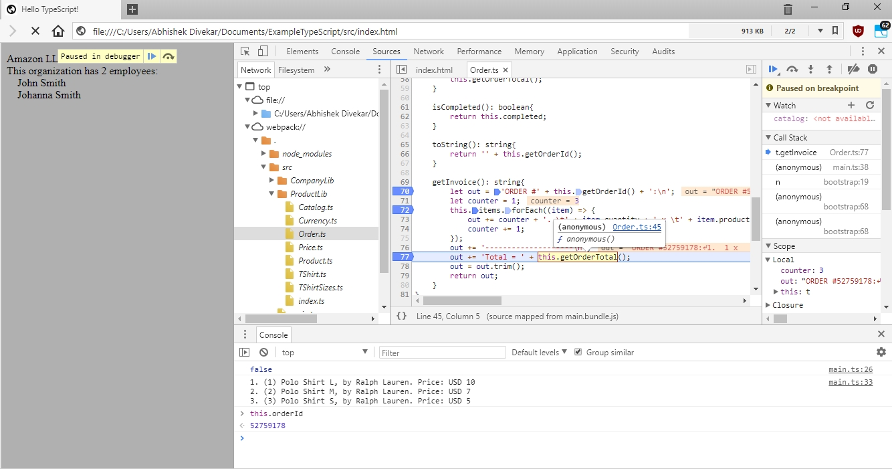

## Intro and scope
This README and associated project guide is for building web applications using TypeScript on the client side. 

Unlike others of its kind, this guide describes how to set up a TypeScript web application:
1. _Without_ a TypeScript-supporting framework (React, Angular, Vue.js, etc). 
2. With _any_ server-side technology (Node.js, Java + Spring MVC, Ruby on Rails, PHP, etc).

Instead of spending time integrating with frameworks, we go into depth on how to create client-side functionality using vanilla TypeScript, which is then transpiled to JavaScript and sent to the user. This approach allows the guide to be agnostic of any frameworks. 

This is an iterative guide covers the following topics:
1. Setting up a TypeScript build system using:
    1. Gulp + Browserify
    1. Gulp + Webpack
1. Source mapping (from client-side JavaScript to TypeScript).
1. Minification (up to L3, i.e. obfuscation).
1. Supporting both Dev and Production environments.
1. Modularizing TypeScript code.
1. Code-splitting to allow browser caching and reduced latency.

This guide is aimed at programmers familiar with JavaScript but new to TypeScript, and new to the various build tools required to deliver modern web applications using TypeScript on the client side.


## Why TypeScript on the browser?
A lot of large web applications today use Java on the server side. As a result, teams are often made completely of Java developers who are unfamilar with the strange and fast-paced world of JavaScript. This leads to a client-facing bugs and poor coding practices.

TypeScript is a very good solution to this problem, as it combines the strong-type assurance of Java with the flexibility of JavaScript. It offers the following advantages:

1. Unlike JavaScript, variable types are checked at _compile time_. This is a huge win over the standard JavaScript practice, where errors are often caught only at runtime. No amount of testing can catch all of these errors. TypeScript provides a level of assurance, especially with codebases maintained by several developers.

1. Its syntax, inheritance model, generics etc. is very similar to that of Java/C++:
    1. Object oriented programming concepts such as classes, interfaces, etc are baked into the language itself (albeit, with minor variations over those found in Java/C++). This removes the need to use a JavaScripe class framework such as BaseJS or Simple JavaScript Inheritance. There is also no need to write ECMAScript 6/7 and transpile to ECMAScript 5 to support old browsers.

    1. Classes can have final (readonly), static, and private member variables and functions. This is enforced at compile time but not runtime.

    1. Functions can have default arguments. Arguments can (optionally) have types (either basic types like "string" or "number", or classes).

    Thus, there should be minimum friction for Object-oriented programmers to cross over.

1. Supported by large industry players:
    - The language and compiler are designed and maintained by Microsoft, but open-sourced. Thus it is stable and secure. 
    - Google and Facebook have created frameworks that can leverage TypeScript (Angular and React, respectively).

1. Integration with existing JavaScript libraries is possible via [TypeScript definition files](https://stackoverflow.com/a/29197665). jQuery, Mocha, etc thus all have good support for TypeScript.
    
1. Unit tests for TypeScript classes can be written in TypeScript, using existing JavaScript unit-testing frameworks such as Mocha, Chai and Sinon.

1. Always minifiable (upto L3 minification level), thus reducing network latency as only the minified files need to be sent to the client.
    <br>
    Additionally, it is possible to use the Google Closure Compiler to opimize the minified JS to make it faster and lighter.

1. Can transpile all the way from ECMA3 to ECMA6. Depending on browser compatibility and optimization, you can create multiple versions and choose which one to use dynamically.
    <br>
    E.g. Newer browsers might be most optimized for ECMA 6 or 7 and can execute that code faster. Older devices might not support above ECMA5, so they can be targeted with that version.

1. Ability to debug TypeScript directly in browser, using sourcemaps.

1. The language is a superset of JavaScript, thus it supports the most advanced ECMAScript features, and more:
    - `let` variable declaration for block-scoping (whereas `var` has function scoping).
    - Basic data structures are same (Array, JSON, etc), and easy-to-use containers.
    - Advanced data structures (Set<T>, HashMap<K, V>, etc) are possible using the excellent third party library "typeScript-collections" (which has an overhead of ~30kB).
    - Closures
    - The "any" type allows functions to return any type, same as JavaScript.
    
1. As TypeScript finally becomes JavaScript (via transpilation), so how a certain feature is defined depends on the JavaScript version to which we transpile. Programmers only need to remember and use one syntax, without worrying which is the "right" one.

1. VSCode IDE provides excellent, first-class TypeScript support for free:
    - Syntax highlighting.
    - Jump to function/class definition.
    - Find all usages of a function/class.
    - etc.
    <br>
    Other editors which provide the same features are IntelliJ Ultimate Edition (paid).

1. Excellent learning materials:
    - The best TypeScript starter I have found so far is [TypeScript Deep Dive by Barasat](https://basarat.gitbooks.io/typescript/). Check it out.


# Project aim
The idea is to set up TypeScript such that:
1. We develop a web application using TypeScript and some external libraries such as `jquery` and `typescript-collections`
1. We can debug TypeScript directly on the browser in a Dev/Pre-production setting. 
1. During Production, we can use L3 minified JavaScript (i.e. with function names, class names etc. replaced by single letters). 
1. Code-splitting will allow us to leverage browser caching, so that client-side network latency is reduced.

This is **not** a tutorial on how to develop TypeScript to be hosted from a Node.js server (although we do use Node.js for the build system). 

Additionally, we use vanilla TypeScript, with no other frameworks (Angular, React, etc). 

Finally, HTML and CSS code in this project will be minimal and only for example purposes.

Let's get started.

# Gulp + Browserify build system

The major steps of this section are taken from [this tutorial](https://www.typescriptlang.org/docs/handbook/gulp.html) on the Microsoft website. However, I have used a more comprehensive example involving a third-party libraries:
1. `'jquery'`: the extremely popular JavaScript library for working with the DOM.
1. `'typescript-collections'`: Data structures in TypeScript like `Set<T>`, `Map<K,V>`, etc.

## Basic setup

### Node installation:
First, you must install NodeJS, which by default comes bundled with `npm` (there's lots of tutorials for this). 
    
Node is only used for the build system, it will _not_ be used to host a webserver.

### Install build dependencies:

Next, install the list of NPM modules. 
Either run `npm install` to install them from the `package.json` file, or download them explictly with the following command:

> `npm install --save-dev typescript gulp gulp-typescript browserify tsify vinyl-source-stream gulp-uglify vinyl-buffer gulp-sourcemaps`

Either way, the dependencies should be installed to the package's `node_modules/` folder. We add this folder to the repository's `.gitignore` since we don't want to add it to Git.


### Initial project structure:

Let's set up the project structure:
- `src/` stores all our source code (`*.ts`, `*.html`, `*.css`, etc)
    At present, it looks like this:
    ```
    src
    |
    |-- CompanyLib  // a library folder
    |   |-- Person.ts
    |   |-- Organization.ts
    |   |-- TechCompany.ts
    |
    |-- ProductLib  // a library folder
    |   |-- Currency.ts
    |   |-- Price.ts
    |   |-- Product.ts
    |   |-- TShirt.ts
    |   |-- TShirtSizes.ts
    |   |-- MobilePhone.ts
    |   |-- PhoneNumber.ts
    |   |-- Catalog.ts
    |   |-- Order.ts
    |-- main.ts     // a file that uses the libraries
    |-- index.html  // an HTML that includes our minified, browserified JS.
    ```
- `tst/` should store any and all unit tests. Right now, there aren't any, but we'll add them later.
- `build/` will store all the `*.js` files which are accessed by client-facing webpages.  It is the same as `dist/` in other tutorials.


### Loading static assets:

In this sample, we just use `build/index.html` as a static webpage, but in an actual web app, the webpage might be rendered by Node, JSP, Ruby, etc. In all of these cases, there are three ways to import the generated JS files:

1. Put all the JS code in the HTML payload sent to the client:
    ```html
    <!-- JSP example -->
    ...
    <script>
        <jsp:include page="build/someJsFile.js">  
    </script>
    ...
    ```
    On rendering, the following is sent to the client (the JS executes on page load):
    ```html
    ...
    <script>
        (function Person(){
            ...
        })
        ...
    </script>
    ...
    ```
    This is a bad solution, because it increases the HTML payload size, and the browser cannot cache the JS code.
1. Add static imports to the `*.js` files. 

    ```html
    ...
    <script src="build/someJsFile.js"/></script>
    ...
    ```

    This is a decent solution, because browsers can cache these files. However, it still adds a load to the server to send the files.

1. Upload the files to a CDN (Content Delivery Network) and let the client browser fetch the files from there. 
    ```html
        ...
        <script 
        src="http://cdnjs.cloudflare.com/209182031/someJsFile.js">
        </script>
        ...
    ```

    This is the best solution performance-wise: CDNs are built for high uptime and low latency, and the load is taken off the server. 
    
    However, the compiled `*.js` files need to be uploaded to a production CDN before users arrive at the page. Depending on how Prod deployments happen on your stack, this might be an issue, as you need all `*.js` files to be reflected to the Prod CDN at same time, as well as at the same time that backend code changes (requiring these JS files) are deployed onto your Prod server. 
    
    A possible solution is to write some backend code on the Prod server which checks the version of the file on the CDN against that of the JS code available in the `build` folder. If the CDN has an older version stale, the server can push the newer JS code to the CDN, replacing the stale version but preserving the CDN URL to the file (this assumes the newly compiled JS code was deployed onto the server along with the backend code changes). Thus the changes are seamless.

From the above three solutions, only the first two are possible with the build system described in this sample project. You'll have to integrate with a CDN on your own.

## Build system setup

Now, we set up the build system.

### TypeScript inbuilt support:

1. TypeScipt by default provides the `tsc` command to compile a `*.ts` file to the equivalent `*.js` file (technically called _transpilation_). It saves the resultant file in the same folder as the source. 

    E.g. `$ tsc src/CompanyLib/Person.ts` becomes `src/CompanyLib/Person.js`

1. Doing this for every file is time consuming. We can create a file [`tsconfig.json`](http://www.typescriptlang.org/docs/handbook/tsconfig-json.html) at the project root, which tells us which files to compile, and some options on how to compile them:
    ```json
    {
        "include": [
            "src/**/*.ts"
        ],
        "exclude": [
            "node_modules",
            "**/*.spec.ts"
        ],
        "compilerOptions": {
            "noImplicitAny": true,
            "target": "es5",
            "removeComments": false
        }
    }
    ```
    Here, by running `$ tsc` from anywhere in the project, we can compile each the `*.ts` files in `src/` to a corresponding `*.js` file in the same folder. From a webpage, we can import them using folder-relative paths.

### Integrating Gulp:

These `*.js` files generated by running `$ tsc` are annoying to delete individually. So, we can use the `gulp` task runner and `gulp-delete-file` plugin to remove them. 
   
Gulp works as follows ([Source](http://brandonclapp.com/what-is-gulp-js-and-why-use-it/)):
- We start by defining a task that we would like to accomplish. This is a JavaScript function passed to one or more `gulp.task(...)`s, which we define in `gulpfile.js`, placed at the project root.
- Within that task, a desired set of files (`*.ts`, `*.js`, `*.html`, `*.css`, etc) are loaded into the _gulp stream_ to be processed. 
- Once files are in the stream, zero or more modifications can be made to the files. This processing of files in the stream happpens in-memory without any creation of temporary files in between.
- Finally, the output files at the end of the stream (i.e. the built files) are usually written to disk, in specified destination directory(s).
- Processing of the files in a stream might mean different things depending on the type of file, location of the file, target environment (e.g. Devo vs Prod) and other such factors. 
    - The files that go into the stream might not be the same as the ones that come out. There might be fewer (or more!), they might be minified, etc.
- To open a stream, we use `gulp.src(...)`, to which we pass a regex that matches files in or filesystem. This function reads in all the files from disk and puts them in our stream.
- To add a stream-processing step, we use `.pipe(...)`, chained to the `gulp.src(...)` call or a previous `.pipe(...)` call. More info about this step can be found [here](https://stackoverflow.com/a/38404984).
- Once we are done processing the stream, we optionally write the files to disk using `.dest(...)` (we pass the output folder name).

For our current use-case of removing all `*.js` files from the `src/` directory, we create `gulpfile.js` (in the project root). 

However, we expect that we are also going to create a lot of other gulp tasks, so to keep the gulpfile clean, we create a `gulp/` folder in the project root to hold all the tasks (credit to [this blogpost](https://lincolnloop.com/blog/speedy-browserifying-multiple-bundles/) for the idea). The gulpfile will import tasks from this folder using `require(gulp/task-name-*.js);`. E.g.     
```js
/* gulpfile.js */
var SOURCE_DIR = 'src';
require('./gulp/js-clean-src')(SOURCE_DIR); // Source: https://stackoverflow.com/a/10688968
```
In the imported file, we define a task which will delete all `*.js` files from the `src/` directory. This task will use a Gulp plugin, [`gulp-delete-file`](https://www.npmjs.com/package/gulp-delete-file) during stream processing:
```js
/* gulp/js-clean-src.js */
var gulp = require("gulp"),
    deleteFile = require('gulp-delete-file');

module.exports = function (SOURCE_DIR) {
    /* delete all *.js files in the src/ folder */
    gulp.task('js-clean-src', function () {
        var stream = gulp.src([
            './' + SOURCE_DIR + '/**/*.js'
        ]);
        /* From all the files in the stream, pick 
        those matching the regular expression, and
        delete them. */
        var regexp = /.*\.js$/
        stream.pipe(deleteFile({
            reg: regexp, 
            deleteMatch: true
        }));
    });
}
```
Note that the SOURCE_DIR parameter is passed while importing, to keep the task more generic ([Source]( https://stackoverflow.com/a/10688968)).

The `gulp.task(...)` call registers a task, which we can run using `$ gulp js-clean-src` anywhere in the project directory.
Note that since we don't have a write-to-disk step now, calling `.dest(...)` at the end is not necessary.

### Integrating Browserify with Gulp:

Module inclusion in NodeJS is done using the `module.exports = {...}` and `require` keywords. This is all fine when we use it on the backend, but our use-case here is about getting TypeScript to work on browsers. In browsers, all `<script>` tags are executed from top to bottom once the page loads. Both `require` and `exports` keywords are not supported.

This is a problem for us, because the compiled files we generated by running `$ tsc` use `export`.
We thus use another NodeJS library called `browserify`. According to its documentation:
> Browsers don't have the `require` method defined, but Node.js does. With Browserify you can write code that uses `require` in the same way that you would use it in Node, and use it in the browser. [[1]](http://browserify.org)
>
> Browserify is a tool for compiling [node-flavored](http://nodejs.org/docs/latest/api/modules.html) commonjs modules for the browser.
> You can use browserify to organize your code and use third-party libraries even if you don't use node itself in any other capacity except for bundling and installing packages with npm.
> 
> The module system that browserify uses is the same as node, so packages published to npm that were originally intended for use in node but not browsers will work just fine in the browser too. [[2]](https://github.com/browserify/browserify-handbook)

We can use browserify to combine all our compiled `src/**/*.js` files into one single file, `build/allFiles.js`. Our HTML code only needs import this file to work.

Lets add Browserify to our build system:

- To give an elevator pitch ([Source](https://github.com/browserify/browserify-handbook#how-browserify-works)): 
    > Browserify starts at the entry point files that you give it and searches for any `require()` calls it finds in these files.
    >
    > For every require() call with a string in it, browserify resolves those module strings to file paths and then searches those file paths for `require()` calls recursively, until the entire dependency graph is visited.
    >
    > Browserify is a build step that runs on the server. It generates a single **bundle** file that has everything in it. The HTML just needs to import this file.

- Initially, there was a separate plugin called `gulp-browserify` which was a wrapper around the browserify library to make it compatible with Gulp. However, as of this writing (Feb 2018), the Gulp team decided to [blacklist the plugin](https://www.npmjs.com/package/gulp-browserify) and get users to use browserify directly, since they both use [NodeJS streams](https://www.sitepoint.com/basics-node-js-streams/), albiet [in slightly different ways](https://fettblog.eu/gulp-browserify-multiple-bundles/). 

    As a result, we shall be importing the browserify library directly to use in our Gulp tasks. Using browserify directly is great because you'll always have access to 100% of the features, as well as the most up-to-date version. However, it means that there will be two incompatible streams inside a single Gulp task: the Gulp stream, and the Browserify stream. Gulp is built on the library `vinyl-source-stream`, so we use this to convert the Gulp stream into the stream format Browserify is expecting ([source](https://www.viget.com/articles/gulp-browserify-starter-faq/) for the above).

- Browserify's JS API depends on the concept of "entry" files, i.e. a list of files which are at the root of the `require()` dependency graph. From this set of files, all imported files are discovered. 
    
    In our example code, `src/main.ts` is the only such entry file. It is a TypeScript file, which on running `$ tsc` generates a `main.js` file with several `require(...)` calls:
    ```js
    "use strict";
    Object.defineProperty(exports, "__esModule", { value: true });
    var $ = require("jquery");
    var Person_1 = require("./CompanyLib/Person");
    var Organization_1 = require("./CompanyLib/Organization");
    var TechCompany_1 = require("./CompanyLib/TechCompany");
    var Order_1 = require("./ProductLib/Order");
    var TShirt_1 = require("./ProductLib/TShirt");
    var Catalog_1 = require("./ProductLib/Catalog");
    var Price_1 = require("./ProductLib/Price");
    ...
    ```
    Note that all of the imported files are `*.js` files.
    
    We can now create a Gulp task to combine them all into a single "bundle" file. This file will be in the Browserify stream format, so we have to use `vinyl-source` to first convert it to the Gulp stream format. We can then write to `build/allFiles.js` using the normal `gulp.dest(...)` step:
    ```js
    /* gulp/js-browserify-single-file.js */
    var gulp = require('gulp'),
        browserify = require('browserify'),
        source = require('vinyl-source-stream');

    module.exports = function (SOURCE_DIR, ENTRY_FILE_NAME, BUILD_DIR, OUT_FILE_NAME) {
        gulp.task('js-browserify-single-file', function () {
            return browserify({
                entries: [
                    SOURCE_DIR + '/' + ENTRY_FILE_NAME
                ]
            })
            .bundle()
            .pipe(source(OUT_FILE_NAME)) /* convert to Gulp stream format. */
            .pipe(gulp.dest(BUILD_DIR));
        });
    }
    ```
    And import it in the gulpfile:
    ```js
    /* gulpfile.js */
    var SOURCE_DIR = 'src';
    var BUILD_DIR = 'build';

    require('./gulp/js-browserify-single-file')(
        SOURCE_DIR, 'main.js',
        BUILD_DIR, 'allFiles.js'
    );
    ```
    We can make the task more generic (e.g. to take an array of entry files as input), but this suffices for now.

### Integrating `tsify`, the Browserify plugin for TypeScript:

One annoying thing is that to run the above, we must actually run four commands every time we want to re-compile our TypeScript, create one single file and then clean all the compiled files in the `src/` folder:
```
$ gulp js-clean-src
$ tsc
$ gulp js-browserify-single-file
$ gulp js-clean-src
```
This is error-prone, and - quite frankly - I am personally too lazy to do it. You could write a bash script to automate it, but that's just avoiding the problem, which is: we need to transpile each TypeScript file to JavaScript as an intermediate step in our build process.

The solution is to use `tsify`, which is a Browserify plugin which allows us to work with TypeScript entry files, and compile them (using the options into our `tsconfig.json`), then browserify them into a single file. To do this, we must call `.plugin(tsify)` before we call `.bundle()`:
```js
/* gulp/ts-browserify-single-file.js */
var gulp = require('gulp'),
    browserify = require('browserify'),
    source = require('vinyl-source-stream'),
    tsify = require("tsify");
    
module.exports = function (SOURCE_DIR, ENTRY_FILE_NAME, BUILD_DIR, OUT_FILE_NAME) {
    gulp.task('ts-browserify-single-file', function () {
        return browserify({
            entries: [
                SOURCE_DIR + '/' + ENTRY_FILE_NAME
            ]
        })
        .plugin(tsify)
        .bundle()
        .pipe(source(OUT_FILE_NAME))
        .pipe(gulp.dest(BUILD_DIR));
    });
}
```
We import it in the gulpfile as before:
```js
/* gulpfile.js */
var SOURCE_DIR = 'src';
var BUILD_DIR = 'build';

require('./gulp/ts-browserify-single-file')(
    SOURCE_DIR, 'main.ts', /* Note: TypeScript file */
    BUILD_DIR, 'allFiles.js'
);
```
`build/allFiles.js` is exactly the same as it was before, but we don't generate any intermediate files.

Our TypeScript is now automatically converted to JavaScript, and we can import it in the browser. `src/index.hml` is an example file which uses our compiled JavaScript:
```html
<!-- src/index.html -->
<!DOCTYPE html>
<html>
    <head>
        <meta charset="UTF-8" />
        <title>Hello TypeScript!</title>
    </head>
    <body>
        <p id="employees">EMPTY</p>
        <script src="../build/allFiles.js"></script>
    </body>
</html>
```
The thing is, when we try to debug the code in the browser, it looks like this (note, I'm using Vivaldi, which is a Chromium derivative):




### Minification with Uglify:

Minification is an important step in the build process for client-side JavaScript. As we can see, `build/allFiles.js` is very large:

```
$ wc -m build\allFiles.js
400672 build\allFiles.js
```
That's over 390kB! Granted, a lot of it is because we have `jqeury` and the `typescript-collections` libraries. However, it's still too much. We use the `gulp-uglify` plugin to minify the generated JS, before we write it to the minified JS file, `build/addFiles-min.js`. 

However, we cannot just add another `.pipe(uglify())` statement directly before `gulp.dest(...)`. This is because, the uglify libary requires one big file to uglify together, whereas after we call `pipe(source(OUT_FILE_NAME))`, the data is in a Gulp-stream format. So, we use `vinyl-buffer` to first buffer (i.e. collect) the stream, then we pass the buffered stream files to UglifyJs ([Source](https://stackoverflow.com/a/38883791)):
```js
/* gulp/ts-browserify-minify-single-file.js */
var gulp = require('gulp'),
    browserify = require('browserify'),
    tsify = require("tsify");
    source = require('vinyl-source-stream'),
    buffer = require('vinyl-buffer'),
    uglify = require('gulp-uglify');

module.exports = function (SOURCE_DIR, ENTRY_FILE_NAME, BUILD_DIR, OUT_FILE_NAME) {
    gulp.task('ts-browserify-minify-single-file', function () {
        return browserify({
            entries: [
                SOURCE_DIR + '/' + ENTRY_FILE_NAME
            ]
        })
        .plugin(tsify)
        .bundle()
        .pipe(source(OUT_FILE_NAME))
        .pipe(buffer())
        .pipe(uglify())
        .pipe(gulp.dest(BUILD_DIR));
    });
}
```
And import it:
```js
/* gulpfile.js */
var SOURCE_DIR = 'src';
var BUILD_DIR = 'build';

require('./gulp/ts-browserify-minify-single-file')(
    SOURCE_DIR, 'main.ts',
    BUILD_DIR, 'allFiles-min.js'
);
```
Let's see how much we saved:
```
$ wc -m build\allFiles-min.js
123677 build\allFiles-min.js
```
Wow! The file is now only around 120kB...that's a 69% reduction! (As a side note, this happy number occurred completely by accident :P).

### Using SourceMaps for debugging:

After minification, the HTML will import the minified `build/allFiles-min.js` file, and our original TypeScript is nowhere to be seen. This is good in one sense that it reduced the payload sent to the client, thus making the page load faster. 

However, minified JavaScript is incomprehensible; as we can see from the following image, even after we preyty-print it, all of our identifiers are lost.



You can't debug this minified code during development. Worse, you can't debug it if your app gets a high-severity, user-facing issue.

The solution: _Source Maps_.
> A source map provides a way of mapping code within a compressed file back to it’s original position in a source file. This means that – with the help of a bit of software – you can easily debug your applications even after your assets have been optimized. The Chrome and Firefox developer tools both ship with built-in support for source maps.
>
> We’re going to be focussing primarily on source maps for JavaScript code but the principles apply to CSS source maps too. ([Source](http://blog.teamtreehouse.com/introduction-source-maps))

We're going to use source maps to trace our minified JavaScript _all the way back to TypeScript_, using the `gulp-sourcemaps` plugin. We create a new dependency called `sourcemap` and add calls to `sourcemaps.init(...)` and `sourcemaps.write(...)`. The latter one one generates and writes source maps, and the former loads any cached source maps which already exist. We also have to enable the `debug` plugin in browserify:
```js
/* gulp/ts-browserify-single-file-with-sourcemap.js */
var gulp = require('gulp'),
    browserify = require('browserify'),
    tsify = require("tsify");
source = require('vinyl-source-stream'),
    buffer = require('vinyl-buffer'),
    sourcemaps = require('gulp-sourcemaps'),
    uglify = require('gulp-uglify');

module.exports = function (
    SOURCE_DIR,
    ENTRY_FILE_NAME,
    BUILD_DIR,
    OUT_FILE_NAME,
    SOURCE_MAPS_DIR) {
    gulp.task('/ts-browserify-single-file-with-sourcemap', function () {
        return browserify({
            entries: [
                SOURCE_DIR + '/' + ENTRY_FILE_NAME
            ],
            debug: true, /* Source mapping requires this flag.*/
        })
            .plugin(tsify)
            .bundle()
            .pipe(source(OUT_FILE_NAME))
            .pipe(buffer())
            .pipe(sourcemaps.init({
                loadMaps: true,
                sourceRoot: SOURCE_MAPS_DIR,
            }))
            /* Source *.ts TypeScript files will be available inside 
            BUILD_DIR/SOURCE_MAPS_DIR/src/
            */
            .pipe(sourcemaps.write(SOURCE_MAPS_DIR))
            .pipe(gulp.dest(BUILD_DIR));
    });
}
```
And import it:
```js
var SOURCE_DIR = 'src';
var BUILD_DIR = 'build';
var SOURCE_MAPS_DIR = 'sourcemaps';

require('./gulp/ts-browserify-single-file-with-sourcemap')(
    SOURCE_DIR, 'main.ts', 
    BUILD_DIR, 'allFiles-min.js',
    SOURCE_MAPS_DIR
);
```
Note how we drop the call to uglify; since we're going to only call this gulp task while debugging, we don't need to generate a minified file. However, to avoid having to change our import in the `index.html`, we've kept the resultant JS file name the same. 

This laziness will pay off when we have dozens of js imports: we don't have to keep removing `-min` from lots and lots of filenames. 

The end result is pretty great:



Viola, we are able to use the Chrome debugger to set up breakpoints, observe variables etc in the TypeScript code itself. We could not have asked for better! 

[You can actually do more than just uglify before and after generating the source map](https://github.com/gulp-sourcemaps/gulp-sourcemaps/wiki/Plugins-with-gulp-sourcemaps-support). This is useful if you want to perform other gulp steps in between generating and writing your source maps.

--- 

We're at a point where our build system can now be used both in production (by only creating the minified JS file) and for debugging (by creating source maps for unminified JS). 

Let's make it more concrete by creating two gulp tasks, `debug` and `prod`. These tasks will each have a Gulp dependency on the tasks we created previously, as well as a new task `clean-build`, which (surprise!) cleans the `build/` folder of all content.
```js
/* gulpfile.js */
var gulp = require('gulp');

var SOURCE_DIR = 'src';
var BUILD_DIR = 'build';
var SOURCE_MAPS_DIR = 'sourcemaps';

require('./gulp/clean-build')(BUILD_DIR);

require('./gulp/ts-browserify-minify-single-file')(
    SOURCE_DIR, 'main.ts',
    BUILD_DIR, 'allFiles-min.js'
);

require('./gulp/ts-browserify-single-file-with-sourcemap')(
    SOURCE_DIR, 'main.ts', 
    BUILD_DIR, 'allFiles-min.js',
    SOURCE_MAPS_DIR
);

/* Create dummy tasks, which just invoke their dependent tasks. */
gulp.task('debug', ['clean-build', 'ts-browserify-single-file-with-sourcemap']);
gulp.task('prod', ['clean-build', 'ts-browserify-minify-single-file']);
```
And:
```js
/* gulp/clean-build.js */
var gulp = require("gulp"),
    deleteFile = require('gulp-delete-file');

module.exports = function (BUILD_DIR) {
    /* delete all *.js files in the src/ folder */
    gulp.task('clean-build', function () {
        var stream = gulp.src([
            './' + BUILD_DIR + '/**/*.js',
            './' + BUILD_DIR + '/**/*.map',
        ]);
        /* From all the files in the stream, pick 
        those matching the regular expression, and
        delete them. */
        var regexp = /.*\.js$|.*\.map$/
        stream.pipe(deleteFile({
            reg: regexp,
            deleteMatch: true
        }));
    });
}
```
Now, we can just run `$ gulp debug` to while debugging, or `$ gulp prod` before pushing to a real website. You should add these commands to your deployment scripts.

### Avoiding conflicts due to minification:

One possible issue we might face is the  minified file clashing with other minified dependencies that we have. E.g. if, along with importing `build/allFiles-min.js`, you also need to include `https://cdn.com/someLib-version-1.min.js`. Since the files are only minified within their own scope, it is entirely possible they use some of the same obfuscated variable names like `o`, `p`, `s`, etc.
    
The way to avoid this problem is simple: we just add a flag in our `uglify(...)` call to ensure that the function names are not stripped ([Source](https://github.com/terinjokes/gulp-uglify/issues/160)). In TypeScript, you only need to make sure that the identifiers of your top-level code (classes, functions visible in the browser context) are unique across the page. TypeScript classes are compiled to functions from ECMAScript3 to ECMAScript5, and to JavaScript classes in ECMAScript6 and above.

The change required for this has minimal differences for our `gulp prod` invocation:
```js
/* gulp/ts-browserify-minify-single-file-keep-fnames.js */
var gulp = require('gulp'),
    browserify = require('browserify'),
    tsify = require("tsify");
    source = require('vinyl-source-stream'),
    buffer = require('vinyl-buffer'),
    uglify = require('gulp-uglify');

module.exports = function (SOURCE_DIR, ENTRY_FILE_NAME, BUILD_DIR, OUT_FILE_NAME) {
    gulp.task('ts-browserify-minify-single-file-keep-fnames', function () {
        return browserify({
            entries: [
                SOURCE_DIR + '/' + ENTRY_FILE_NAME
            ]
        })
            .plugin(tsify)
            .bundle()
            .pipe(source(OUT_FILE_NAME))
            .pipe(buffer())
            .pipe(uglify({ mangle: { keep_fnames: true } }))
            .pipe(gulp.dest(BUILD_DIR));
    });
}
```
And update the gulpfile:
```js
/* gulpfile.js */
var gulp = require('gulp');

var SOURCE_DIR = 'src';
var BUILD_DIR = 'build';

require('./gulp/ts-browserify-minify-single-file-keep-fnames')(
    SOURCE_DIR, 'main.ts',
    BUILD_DIR, 'allFiles-min.js'
);

gulp.task('prod', ['clean-build', 'ts-browserify-minify-single-file-keep-fnames']);
```
Now, when we run `$ gulp prod`, we get a minified file that retains the function names (no JavaScript classes, since our `tsconfig.json` has us compiling with `"target": "es5"`).

Let's check the size of our minified file:
```
$ wc -m build\allFiles-min.js
129143 build\allFiles-min.js
``` 
The filesize increase in minimal (from 120kB to 126 kB...a little more than 4.4%). Which is a good tradeoff to ensure that the code does not interact badly with other code on the page.


## Modular TypeScript

### The need for Bundle Splitting on the frontend:

If your web application is just one page, then maybe it's okay to minify all your source code into a single file and send to your clients, like we did above with `allFiles-min.js`. 

- However, if you have multiple pages in your web app, then most likely they will require different sets of JavaScript code. 

    For example, if your web app has: 
    - `Page1.html` which requires files from `AppLibA/`, `AppLibB/` and `AppLibC/`.
    - `Page2.html` which requires `AppLibA/` and `AppLibD/`.
    
    ...then it makes sense to split the each module into a separate JavaScript file, which can be imported as required:

    ```html
    <!-- Page1.html -->
    <script src="build/AppLibA-min.bundle.js" ></script>
    <script src="build/AppLibB-min.bundle.js" ></script>
    <script src="build/AppLibC-min.bundle.js" ></script>
    ```

    ```html
    <!-- Page2.html -->
    <script src="build/AppLibA-min.bundle.js" ></script>
    <script src="build/AppLibD-min.bundle.js" ></script>
    ```
    If you keep all the code in one bundle file, then your users end up paying the price, as they have to load extra code on for both `Page1.html` and `Page2.html`.

    > Note that `AppLib` stands for <a name="application-library">_application library_</a>. Meaning, it is a modular, specialized section of your web app code that is consumed by other parts of your application. You and your team write all application libraries for your web app. 
    >
    > This is opposed to <a name="vendor-library">_vendor libraries_</a>, which are written by third parties.
    >
    > E.g. In our sample TypeScript codebase, `ProductLib` and `CompanyLib` are application libraries. They contain multiple `*.ts` files under them, but they each provide one kind of business logic (for Products and Companies, respectively). They are consumed by `main.ts`, which can be considered <a name="wiring-code">_wiring code_</a>. `jquery` and `typescript-collections` would be the vendor libraries.
    >
    > These are not a hard-and-fast naming conventions; I just use such terms to be clear about what I am referring to during the discussion.


- Even if it is a single-page app (say, `Page1.html` from the above point), then it still makes sense to modularize your JS imports:
    
    Throughout the life of your web application, you will probably make many changes to your application libraries: adding new features, fixing new bugs, and so on. Depending on your deployment policy, you will periodically push such changes to your Production environment, where they will be visible to users. 
    
    However, there is no neccessity that _all_ your JavaScript modules must change between deployment cycles. If you structure your codebase into application libraries and configure your build system so that each application library becomes a single JS bundle that is imported on the client side, you can leaverage [_browser caching_](https://developers.google.com/web/fundamentals/performance/optimizing-content-efficiency/http-caching) to avoid re-sending code files which have not changed.
    
    Example:

    - Suppose your team has a two-week deployment cycle. The cycle starts with a Production deployment of the latest changes on 3rd March. The next deployment is scheduled on 17th March. 
    
        In those two weeks, you've been working on `Page1.html` (the only page in your web app), and have made changes to `AppLibA` and `AppLibC`. `AppLibB` was untouched. 
    
    - When the two weeks are up, you must upload these changes to your Production server so that users can see the updates. There are two ways to do this:
        1. Keep each module as a separate file, `AppLibA-min.bundle.js`, `AppLibB-min.bundle.js` and `AppLibC-min.bundle.js`, and import each of these from the client HTML. Lets assume these are the filesizes:
            ```js
            AppLibA-min.bundle.js : 100 kB
            AppLibB-min.bundle.js : 50 kB
            AppLibC-min.bundle.js : 30 kB
            ```
        1. Combine all the code into one bundle, `allFiles-min.js`, and upload it. The file size will be `180 kB`.
            
    - In method #2, the changes made in `AppLibA` and `AppLibC` cause the contents (and hence hash) of the file `allFiles-min.js` to change. The user's browser will be unable to cache the file. 
    - However, in methos #1, we can cache `AppLibB-min.bundle.js`, which saves us from loading `50kB` of code. Thus by relying on the browser's ability to cache files, you have shaved 27% off your JS payload size! This number will of course vary depending on which module(s) have been modified during the last deployment cycle: the number can vary from 0% to 100%. You should think about modularizing your codebase in a way that each module will be changed independent of others, thus taking full advantage of client-side caching.

        Note: it won't be _exactly_ 27%, since if you minify all the files together, you can technically achieve a better minification. But the difference will most likely be minimal - less than 1% - for which you give up any savings provided by browser caching. The difference reduces further if you keep the function names during minification, as shown earlier (you always have to do this when you use modularized JS imports).

    Note: the idea of making multiple JS imports out of a single import is called _Bundle Splitting_. It took me a really long time to figure this out.


### <a name="modular-typescript-structure">Structure of a modular TypeScript codebase</a>: 

So now, let's get started with creating an app strucuted into multiple application libraries. I add the application library, `src/AnimalLib/`, which is consumed by `src/main2.ts`. On transpilation, these become `build/AnimalLib.bundle.js` and `build/main2.bundle.js`, respectively. The HTML file `index2.html` will import them:
    
```html
<!-- src/index2.html -->
<!DOCTYPE html>
<html>
    <head>
        <meta charset="UTF-8" />
        <title>Hello TypeScript!</title>
    </head>
    <body>
        <script src="../build/AnimalLib.bundle.js"></script>
        <script src="../build/main2.bundle.js"></script>
    </body>
</html>
```
AnimalLib is a module of source code, meaning it is a directory. After much experimenting with TypeScript [namespaces](https://www.typescriptlang.org/docs/handbook/namespaces.html), TypeScript [modules](https://www.typescriptlang.org/docs/handbook/modules.html) and [their interactions](https://www.typescriptlang.org/docs/handbook/namespaces-and-modules.html), I have come up with the following module structure:
```
src
|
|-- AnimalLib  // a library folder
|   |-- Animal.ts
|   |-- Cat.ts
|   |-- Dog.ts
```

`Animal.ts` exports and abstract class `Animal`, which is consumed by concrete classes `Dog` and `Cat`.

We structure the application libraries `CompanyLib` and `ProductLib` in a similar way:
```
src
|
|-- CompanyLib  // a library folder, becomes a single js bundle.
|   |-- Person.ts
|   |-- Organization.ts
|   |-- TechCompany.ts
|
|-- ProductLib  // a library folder, becomes a single js bundle.
|   |-- Currency.ts
|   |-- Price.ts
|   |-- Product.ts
|   |-- TShirt.ts
|   |-- TShirtSizes.ts
|   |-- MobilePhone.ts
|   |-- PhoneNumber.ts
|   |-- Catalog.ts
|   |-- Order.ts
|  ...
|
...
```
These two are consumed by `main.ts`, just as `AnimalLib` was consumed by `main2.ts`.


#### Dependency graph

Here is the dependency graph between all the modules: 



Note: this graph was generated by the awesome tool [dependency-cruiser](https://github.com/sverweij/dependency-cruiser)). The command to generate it is:
```
depcruise --exclude "^node_modules/typescript-collections/dist/lib/(?!umd.js)" --ts-pre-compilation-deps --output-type dot src | dot -T jpg > img/Module-Dependency-Graph.jpg
```
For this to work, you have to first install [Graphviz](https://graphviz.gitlab.io/download/) and ensure `dot` is available on the command-line.

#### Output JavaScript bundles:

Our intention is to make each library directory a separate `*.js` bundle, and a separate bundle for each entry file.

So, our build system should generate the following bundles:
1. `build/main.bundle.js` (entry file)
1. `build/main2.bundle.js` (entry file)
1. `build/AnimalLib.bundle.js` (library bundle)
1. `build/CompanyLib.bundle.js` (library bundle)
1. `build/ProductLib.bundle.js` (library bundle)


### My issues setting up bundle splitting with Browserify:

Unfortunately, this was as far as I got with Browserify. I spent a multiple days looking for a good solution, and in fact found a few decent articles/posts on how to achieve code splitting in Browserify:

1. I tried plugins such as [`factor-bundle`](https://www.npmjs.com/package/factor-bundle) and [`partition-bundle`](https://www.npmjs.com/package/partition-bundle), as specified in the [browserify handbook](https://github.com/browserify/browserify-handbook#partitioning). 

    I actually got factor-bundle to work with the help of [this SO answer](https://stackoverflow.com/questions/23748841/create-separate-javascript-bundles-with-a-shared-common-library-using-browserify), but not as described above wanted: factor-bundle creates a `common.js` file that contains code common to _all_ your modules, whereas we want to make each module an import. Still, it was worth knowing.

1. I played with the idea of [using exclude and external](https://stackoverflow.com/questions/32746512/what-is-the-difference-between-browserify-external-vs-exclude), but I could not get a file to recognize its compiled dependency from the HTML.

1. I tried [adding `exclude` params to the tsify call](https://github.com/TypeStrong/tsify), but that didn't work at all.

1. [I tried setting up my TypeScript modules to use Browserify's `external` and `require` functions, using these links as reference points: [[1](https://benclinkinbeard.com/posts/how-browserify-works/)] [[2](https://github.com/vigetlabs/blendid/issues/75)] [[3](https://github.com/browserify/browserify/issues/1014)] [[4](https://lincolnloop.com/blog/speedy-browserifying-multiple-bundles/)] [[5](https://benclinkinbeard.com/posts/external-bundles-for-faster-browserify-builds/)] [[6](https://github.com/browserify/browserify#multiple-bundles)]. 

    I did actually get this to work upto an extent using this gulp setup, and by augmenting `AnimalLib` with an `index.ts` file:
    ```ts
    /* AnimalLib/index.ts */ 
    export { Animal } from "./Animal"; 
    export { Cat } from "./Cat"; 
    export { Dog } from "./Dog"; 
    console.log("Exported AnimalLib.");
    ```
    Note: this feature of "importing folders as modules" is allowed by [TypeScript's module import resolution strategy](https://basarat.gitbooks.io/typescript/docs/project/external-modules.html#module-paths): folders become modules when we specify an `index.ts` file inside them. This particulat `index.ts` is responsible for re-exporting the exported members of the different `*.ts` files located inside the folder. If, later, we add the file `AnimalLib/Snake.ts`, we will also have to modify `AnimalLib/index.ts` to export `Snake` explicitly, or consumers won't be able to use it when importing the folder. 
    
    Now, we create the bundle `build/AnimalLib.js` from the folder `src/AnimalLib/`, and expose it in the browser via the global string `./AnimalLib`:

    ```js
    /* gulp/ts-browserify-animal-module.ts */
    var gulp = require('gulp'),
        browserify = require('browserify'),
        tsify = require("tsify"),
        source = require('vinyl-source-stream'),
        buffer = require('vinyl-buffer'),
        sourcemaps = require('gulp-sourcemaps'),
        transform = require('vinyl-transform');

    module.exports = function (
        SOURCE_DIR,
        BUILD_DIR,
        SOURCE_MAPS_DIR
    ) {
        var entries = [
            SOURCE_DIR + '/' + 'AnimalLib/index.ts'
        ]
        gulp.task('ts-browserify-animal-module', function () {
            return browserify()
            .require(
                './' + SOURCE_DIR + '/' + 'AnimalLib/index.ts', 
                { expose: './AnimalLib' }
            )
            .plugin(tsify)
            .on('dep', function (dep) {
                console.log("Included in bundle: " + dep.file);
            })
            .bundle()
            .pipe(source("AnimalLib.js"))
            .pipe(gulp.dest(BUILD_DIR));
        });
    }
    ```

    Now, we build `main2.ts`, which imports files from the folder-module `AnimalLib`. To do so, we create a gulp task `ts-browserify-main2`, which will first clean the `src/` and `build/` folders of `*.js` files, and then invoke the task `ts-browserify-animal-module` that was defined above.
    
    Inside this task, we use the plugin `.external('src/AnimalLib/index.ts)'` to tell browserify not to include the files in `src/AnimalLib/`, to the bundle `build/main2.js`.

    ```js
    /* gulp/ts-browserify-main2.ts */
    var gulp = require('gulp'),
        browserify = require('browserify'),
        tsify = require("tsify"),
        source = require('vinyl-source-stream'),
        buffer = require('vinyl-buffer'),
        fs = require('fs'), 
        factor = require('factor-bundle'),
        sourcemaps = require('gulp-sourcemaps');

    module.exports = function (
        SOURCE_DIR,
        BUILD_DIR,
        SOURCE_MAPS_DIR
    ) {
        gulp.task('ts-browserify-main2', ['js-clean-src', 'clean-build', 'ts-browserify-animal-module'], function () {
            return browserify()
            .add(SOURCE_DIR + '/' + 'main2.ts')
            .plugin(tsify)
            .external('./' + SOURCE_DIR + '/' + 'AnimalLib/index.ts')
            .on('dep', function (dep) {
                console.log("Included in bundle: " + dep.file);
            })
            .bundle()
            .pipe(source("main2.js"))
            .pipe(gulp.dest(BUILD_DIR));
        });
    }
    ```

    We import these into the gulpfile:
    ```js
    var SOURCE_DIR = 'src';
    var BUILD_DIR = 'build';
    var SOURCE_MAPS_DIR = 'sourcemaps';

    require('./gulp/ts-browserify-animal-module')(
        SOURCE_DIR, 
        BUILD_DIR,
        SOURCE_MAPS_DIR
    );

    require('./gulp/ts-browserify-main2')(
        SOURCE_DIR, 
        BUILD_DIR,
        SOURCE_MAPS_DIR
    );
    ```

    Let's take a look at the output bundles:

    1. `build/main2.js`:
        ```js
        (function(){function e(t,n,r){function s(o,u){if(!n[o]){if(!t[o]){var a=typeof require=="function"&&require;if(!u&&a)return a(o,!0);if(i)return i(o,!0);var f=new Error("Cannot find module '"+o+"'");throw f.code="MODULE_NOT_FOUND",f}var l=n[o]={exports:{}};t[o][0].call(l.exports,function(e){var n=t[o][1][e];return s(n?n:e)},l,l.exports,e,t,n,r)}return n[o].exports}var i=typeof require=="function"&&require;for(var o=0;o<r.length;o++)s(r[o]);return s}return e})()({1:[function(require,module,exports){

        "use strict";
        exports.__esModule = true;
        /* main2.ts */
        var AnimalLib_1 = require("./AnimalLib");
        var c = new AnimalLib_1.Cat("Mittens", new Date());
        console.log(c.makeNoise());
        var d = new AnimalLib_1.Dog("Coco", new Date());
        console.log(d.makeNoise());

        },{"./AnimalLib":undefined}]},{},[1]);
        ```
    2. `build/AnimalLib.js`
        ```js
        require=(function(){function e(t,n,r){function s(o,u){if(!n[o]){if(!t[o]){var a=typeof require=="function"&&require;if(!u&&a)return a(o,!0);if(i)return i(o,!0);var f=new Error("Cannot find module '"+o+"'");throw f.code="MODULE_NOT_FOUND",f}var l=n[o]={exports:{}};t[o][0].call(l.exports,function(e){var n=t[o][1][e];return s(n?n:e)},l,l.exports,e,t,n,r)}return n[o].exports}var i=typeof require=="function"&&require;for(var o=0;o<r.length;o++)s(r[o]);return s}return e})()({"./AnimalLib":[function(require,module,exports){

        "use strict";
        exports.__esModule = true;
        /* AnimalLib/index.ts */
        var Animal_1 = require("./Animal");
        exports.Animal = Animal_1.Animal;
        var Cat_1 = require("./Cat");
        exports.Cat = Cat_1.Cat;
        var Dog_1 = require("./Dog");
        exports.Dog = Dog_1.Dog;

        },{"./Animal":1,"./Cat":2,"./Dog":3}],1:[function(require,module,exports){
        "use strict";
        exports.__esModule = true;
        var Animal = /** @class */ (function () {
            function Animal(name, dob) {
                this.name = name;
                this.dob = dob;
            }
            return Animal;
        }());
        exports.Animal = Animal;

        },{}],2:[function(require,module,exports){
        "use strict";
        var __extends = (this && this.__extends) || (function () {
            var extendStatics = Object.setPrototypeOf ||
                ({ __proto__: [] } instanceof Array && function (d, b) { d.__proto__ = b; }) ||
                function (d, b) { for (var p in b) if (b.hasOwnProperty(p)) d[p] = b[p]; };
            return function (d, b) {
                extendStatics(d, b);
                function __() { this.constructor = d; }
                d.prototype = b === null ? Object.create(b) : (__.prototype = b.prototype, new __());
            };
        })();
        exports.__esModule = true;
        var Animal_1 = require("./Animal");
        var Cat = /** @class */ (function (_super) {
            __extends(Cat, _super);
            function Cat(name, dob) {
                return _super.call(this, name, dob) || this;
            }
            Cat.prototype.makeNoise = function () {
                return "Meow! My name is: " + this.name;
            };
            return Cat;
        }(Animal_1.Animal));
        exports.Cat = Cat;

        },{"./Animal":1}],3:[function(require,module,exports){
        "use strict";
        var __extends = (this && this.__extends) || (function () {
            var extendStatics = Object.setPrototypeOf ||
                ({ __proto__: [] } instanceof Array && function (d, b) { d.__proto__ = b; }) ||
                function (d, b) { for (var p in b) if (b.hasOwnProperty(p)) d[p] = b[p]; };
            return function (d, b) {
                extendStatics(d, b);
                function __() { this.constructor = d; }
                d.prototype = b === null ? Object.create(b) : (__.prototype = b.prototype, new __());
            };
        })();
        exports.__esModule = true;
        var Animal_1 = require("./Animal");
        var Dog = /** @class */ (function (_super) {
            __extends(Dog, _super);
            function Dog(name, dob) {
                return _super.call(this, name, dob) || this;
            }
            Dog.prototype.makeNoise = function () {
                return "Woof! I'm: " + this.name + "! I love you!";
            };
            return Dog;
        }(Animal_1.Animal));
        exports.Dog = Dog;

        },{"./Animal":1}]},{},[]);

        ```

    The first line of each bundle is just boilerplate to set up the Browserify require structure. A good introduction to the structure is [this post on how Browserify works](https://benclinkinbeard.com/posts/how-browserify-works/). 
    
    1. However, looking at the two bundles, you can see that in `main2.js`, there is no code from the Animal package. Instead, at the end, there is a statement `{"./AnimalLib":undefined}`. This basically tells the Browserify structure that there is an external requirement on a library which is exposed by the global string `"./AnimalLib"`. A global `require=` is defined, which is an instantly instantiating function that returns the function `function e(t,n,r){...}`, inside of which is more boilerplate. To this function's three paramters, we pass:
        - For `t`, a hashtable of all the transpiled code in `main2.ts`:
            ```js
            {1:[function(require,module,exports){

            "use strict";
            exports.__esModule = true;
            /* main2.ts */
            var AnimalLib_1 = require("./AnimalLib");
            var c = new AnimalLib_1.Cat("Mittens", new Date());
            console.log(c.makeNoise());
            var d = new AnimalLib_1.Dog("Coco", new Date());
            console.log(d.makeNoise());

            },{"./AnimalLib":undefined}]}
            ```
        - For `n`, an empty object `{}`
        - For `r`, the reference to the code on `main2.ts`, indexed in the hashtable: `[1]`.

    2. Now, in the AnimalLib bundle, the boilerplate line sets up a similar require (that's okay) and passed the first argument as  `{"./AnimalLib":{...}}`, the second as `{}` and the third as `[]`. All the code for AnimalLib (including the Animal, Cat and Dog classes) is in the `...`. Inside this, each of the classes in the package require one another in a way that is not visible outside (but the same structure is used).
        Essentially, what happens is that the `AnimalLib.js` bundle exposes its contents via the global string `"./AnimalLib"`.

    3. Let's include these two in `index2.html`:
        ```html
        <!-- src/index2.html -->
        <!DOCTYPE html>
        <html>
            <head>
                <meta charset="UTF-8" />
                <title>Hello TypeScript!</title>
            </head>
            <body>
                <script src="../build/AnimalLib.js"></script>
                <script src="../build/main2.js"></script>
            </body>
        </html>
        ```

        The result is as we expect: 
        
        
        Seems great so far, right? However, there is a significant issue: `main2.ts`, on compilation using the gulp task, _always_ imports `"./AnimalLib"`. This string is autogenerated by the TypeScript compiler; there is no way to set up _any_ other string. As a result, the AnimalLib task _must_ expose `"./AnimalLib"`. 

        The big problem here is that the string has a _path_ in it. Think about what this means for a second. `src/main.ts` can import from `src/AnimalLib/index.ts` via `import {Cat, Dog} from "./AnimalLib";`. However, if the AnimalLib must be imported from another library that is not in `src/`, then the TypeScript import string will be different. 
        
        E.g. if in `src/PetsLib/Pet.ts` we use AnimalLib, it must be imported via `import {Cat, Dog} from "../AnimalLib";`. 
        
        To accomodate this, the gulp task for AnimalLib must expose _all varieties of AnimalLib imports_. This is not possible, as something like `{ expose: ['./AnimalLib', '../AnimalLib'] }` is not allowed by Browserify.

        Even if it were possible, moving the files around into dfferent modules would be a huge and error-prone task. 

        Note that external libraries like `jquery` will not have this issue.

    Note that this method is not entirely useless. If you are okay with sacrificing project flexibility, you can possibly keep all of the files in the format `src/ModuleName/FileName.ts`, and have each module expose only the string `../ModuleName`. 
    
    However, I advise against it. Instead, you should use the recommended alternative (described in the next section).

I still think it is possible to do code-splitting using Browserify, but I can't figure out how to incorporate it into the module structure mentioned above. If you're still interested in continuing down this path, here are some more references that may help you:

1. [How Browserify actually works](https://benclinkinbeard.com/posts/how-browserify-works/).

1. [The Browserify handbook entry on how to split code into multiple bundles](https://github.com/browserify/browserify-handbook#partitioning).

1. [A great SO question/answer on how to actually use factor-bundle with Gulp](https://stackoverflow.com/questions/23748841/create-separate-javascript-bundles-with-a-shared-common-library-using-browserify).

1. A quote from the [`tsify` package documentation](https://www.npmjs.com/package/tsify):
    > The TypeScript compiler automatically builds a dependency graph on module imports, much like Browserify. 
    >
    > Browserify transforms are not flexible enough to deal with multiple file outputs given a single file input, which means that any working TypeScript compilation transform either skips the resolution step (which is necessary for complete type checking) or performs multiple compilations of source files further down the dependency graph.
    >
    > **tsify uses the power of plugins to perform a single compilation of the TypeScript source up-front, and then uses Browserify to glue together the resulting `*.js` files.**

Your best bets are either `external` and `require`, `factor-bundle`, or `partition-bundle`. If you do figure it out, please add it to [the repo](https://github.com/ARDivekar/TypeScript-on-the-Browser-Starter/issues)! I'd be very thankful :)


# Webpack-based build system

To enable code-splitting in the fashion specified above, we are forced to ditch Browserify since it does not easily support the features we want. Instead, we will use Webpack as our module loader. It has numerous advantages, including:

1. [Excellent configurability via a separate configuration file](https://webpack.js.org/configuration/).

1. [Wide usage by large industry players](https://webpack.js.org), much more than Browserify. Frameworks such as Google's Angular use it as the default module bundler.

1. First-class feature support: this is a philosophical difference between Browserify and Webpack. Browserify allows developers create their own plugins for any new feature. Thus, there are a _lot_ of things you can do in Browserify, but occasionally they are via obscure, unsupported and brittle libraries. Webpack, on the other hand, keeps enhancing existing features. This keeps its core set of features smaller but more robust. For our use-case, Webpack is the better fit.

1. Webpack can perform the vast majority of the tasks you’d otherwise do through a task runner. For instance, Webpack already provides options for minification and sourcemaps for your bundle. By using loaders, you can also add ES6 to ES5 transpilation, and CSS pre- and post-processors. That really just leaves unit tests and linting as major tasks that Webpack can’t handle independently. ([Source](https://www.toptal.com/front-end/webpack-browserify-gulp-which-is-better))

1. Solid documentation for Webpack 3 (as of March 2018, the Webpack 4 documentation has not surfaced yet).

1. Suited for big projects.

[This post](https://scotch.io/tutorials/getting-started-with-webpack-module-bundling-magic) is a good introduction to Webpack and how to set it up.

As stated from the main webpack site, the main goals of creating another module bundler are the abilities to:
- Split the dependency tree into chunks loaded on demand
- Keep initial loading time low
- Every static asset should be able to be a module
- Ability to integrate 3rd-party libraries as modules
- Ability to customize nearly every part of the module bundler
- Suited for big projects


## Webpack: concepts and configuration

### Basic concepts:

From the website [[1](https://webpack.js.org/concepts/)] [[2](https://webpack.js.org/concepts/loaders/)] [[3](https://webpack.js.org/concepts/manifest/)] (paraphrased):

> At its core, webpack is a _static module bundler_; when webpack processes your application, it builds a dependency graph by recursively including every module your application needs, then packages all of those modules into one or more bundles.
>
> An _entry point_ indicates which module(s) webpack should use to begin building the dependency graph. After entering the entry point, webpack will follow the trail of imports and discover which other modules and libraries that entry point depends on (directly and indirectly). Every such dependency is then processed and outputted into files called _bundles_.
>
> The _output_ field of the configuration js file, tells webpack where to emit the bundles it creates and how to name those bundle files. (You may see the term emitted or emit used throughout our documentation and plugin API. This is a fancy term for 'produced' or 'discharged').

#### Loaders: 

So far, it's similar to Browserify. A critical difference comes in the next section:

> _Loaders_ enable webpack to process **more than just JavaScript files** (webpack itself only understands JavaScript). They give you the ability to leverage webpack's bundling capabilities for all kinds of static asset files by converting them to valid modules that webpack can process. Essentially, webpack loaders transform all types of files into modules that can be included in your application's dependency graph (and eventually a bundle).
>
> Loaders are transformations that are applied on the source code of a module. They allow you to pre-process files as you import or “load” them. Thus, loaders are kind of like “tasks” in other build tools, and provide a powerful way to handle front-end build steps. 
>
> Loaders can transform files from a different language (like TypeScript) to JavaScript, or inline images as data URLs. Loaders even allow you to do things like import CSS files directly from your JavaScript modules!
>
> Note that the ability to import any type of module, e.g. .css files, is a feature specific to webpack and may not be supported by other bundlers or task runners. We feel this extension of the language is warranted as it allows developers to build a more accurate dependency graph.

Webpack aims to be the "one module bundler to rule them all". It can handle multiple different types of static assets that need to be served on the client-side: 
1. JavaScript
1. CSS
1. Images
1. etc. 

Loaders are basically transformers; they convert one file type into another before adding it to the output bundle. For example, the `ts-loader` converts TypeScript to JavaScript while Webpack is processing it. We have similar loaders to convert CoffeeScript to JavaScript, Sass to CSS, etc. 

In Browserify, loaders exist, but they are considered plugins for the framework. This leads to loaders having maintainers other than the Browserify team, which leads to the loaders being inconsistent with each other. Webpack removes this problem by exposing loaders as a core framework concept, in a separate category from other plugins.

> While loaders are used to transform certain types of modules, _plugins_ can be leveraged to perform a wider range of tasks. Plugins range from bundle optimization and minification all the way to defining environment-like variables. The plugin interface is extremely powerful and can be used to tackle a wide variety of tasks.

#### Runtime and Manifest

([Source](https://webpack.js.org/concepts/manifest/))

In a typical application or site built with webpack, there are three main types of code:

1. The source code you, and maybe your team, have written.
1. Any third-party library or "vendor" code your source is dependent on. In our example TypeScript application, these are `jquery` and `typescript-collections`.
1. A _webpack runtime_ and _manifest_ that conducts the interaction of all modules.

The runtime, along with the manifest data, is basically all the (JavaScript) code webpack needs to connect your modularized application while it's running in the browser. It contains the loading and resolving logic needed to connect your modules as they interact. It also contains the logic of whether to load a module upfront or lazy-load it. As a result, _the runtime is part of the JS code that goes to the client's browser_. It must go upfront (i.e. along with the HTML).

The HTML sent to the client looks very different from the `src/` directory we had created; it contains references to several kinds of assets (JS, CSS, images, etc) via tags such as `<script src="...">`, `<link rel="stylesheet" type="text/css" href="...">`, etc. These bundles that are loaded, might be completely different from your source file(s).

So how does webpack manage the interaction between all of your asset modules? This is where the manifest comes in. As the compiler enters, resolves, and maps out your application, it keeps detailed notes on all your modules. This collection of data is called the "Manifest" and it's what the runtime will use to resolve and load modules once they've been bundled and shipped to the browser. No matter which module syntax you have chosen, those `import`/`require` statements have now become `__webpack_require__` methods that point to module identifiers. Using the data in the manifest, the runtime will be able to find out where to retrieve the modules behind the identifiers. 

The end result of this is the runtime and manifest code, which is re-created with every build. 

You might ask, "How does this affect me? These are details of the Webpack framework...I'm just a consumer". Well, for simple applications, it won't; you can just allow everything to work auto-magically. However, if you decide to improve your projects performance by utilizing browser caching, this process will all of a sudden become an important thing to understand.

I will go into depth on how to utilize the manifest and runtime once we get to the code-splitting, caching and lazy-loading section. For now, just know that these concepts exist.


### Webpack config file:

The [recommended way](https://webpack.js.org/concepts/loaders/#using-loaders) to use Webpack is to set up a configuration file `webpack.config.js` in the root of your project. 

You can learn all about it from[ here](https://webpack.js.org/configuration/).

The [Webpack concepts doc](https://webpack.js.org/concepts/) is pretty clear on how a basic config file is put together:

1. Structure:

    The config file in general has this structure:
    ```js
    /* webpack.config.js */
    const config = {
        ...
    };
    module.exports = config;
    ```
    The JSON object `config` is exported by this file is the configuration. In the following sections, we will reference different configuration properties using the syntax `config.property.subproperty`


1. Entries:
    
    An entry point indicates which module(s) webpack should use to begin building out its internal dependency graph.

    `config.entry` allows you to specify the entry point(s). It takes as input either a:
    1. String:
        ```js
        const config = {
            entry: './path/to/my/entry/file.js',
            ...
        };
        ```
        Here, there is only a single entry file.
    1. Array of strings:
        ```js
        const config = {
            entry: ['./path/to/my/entry/file.js', './path/to/my/entry/file2.js', './path/to/my/entry/file3.js'],
            ...
        };
        ```
        Passing an array of file paths to the entry property creates what is known as a "multi-main entry". This is useful when you would like to inject multiple dependent files together and graph their dependencies into one "chunk".
    1. Map (i.e. JSON):
        ```js
        const config = {
            entry: {
                entryOne: './src/entryOne.js',
                entryTwo: './src/entryTwo.js',
                entryThree: './src/entryThree.js',
            },
            ...
        };
        ```
        Here, we tell Webpack to make separate dependency graphs for each entry point. However, we can configure plugins such that one dependency graph is modified with respect to the others. See the [scenarios](https://webpack.js.org/concepts/entry-points/#scenarios) part of the docs.
        
        Note that as a rule of thumb in Webpack, each page should have its own _entry point_ (not necessarily one `<script>` import). We adhere to this principle in our code structure: `main.ts` is an entry point for `index.html`, and `main2.ts` for `index2.html`. These entry point files do have some business logic, but it is possible that they will dumbly import some of our library bundles (AnimalLib, ProductLib, CompanyLib) which in turn register JavaScript event handlers so that the user can interact with the page.


1. Outputs:

    ([Source](https://webpack.js.org/concepts/output/))

    1. The output property tells webpack where to emit the bundles it creates and how to name these files. You can configure this part of the process by specifying a field `config.output` in the configuration. `config.output.filename` and `config.output.path` tell webpack the name of our bundle and where we want it to be "emitted" to (i.e. where we want it to be saved):
        ```js
        const path = require('path');
        const config = {
            entry: './path/to/my/entry/file.js',
            output: {
                path: path.resolve(__dirname, 'build'),
                filename: 'my-webpack.bundle.js'
            }
        };
        ```
        This generates the file `build/my-webpack.bundle.js`.
        
        Note that we use Node's built-in `path` module and prefix it with the `__dirname` global. This prevents file path issues between operating systems and allows relative paths to work as expected.
        
    1. If your configuration creates multiple bundles via more than one entry point, code splitting, or various plugins (like `CommonsChunkPlugin`), you should use [substitutions](https://webpack.js.org/configuration/output/#output-filename) to ensure that each file has a unique name. With substitutions, the value of `config.output.filename` that we specify is a _template string_ from all the outpt files will be named.

        There are different types of substitutions possible:
        1. Using entry name:
            ```js
            filename: "[name].bundle.js"
            ```
        1. Using internal chunk id:
            ```js
            filename: "[id].bundle.js"
            ```
        1. Using the unique hash generated for every build:
            ```js
            filename: "[name].[hash].bundle.js"
            ```
        1. Using hashes based on each chunks' content:
            ```js
            filename: "[chunkhash].bundle.js"
            ```
        Note that output files created by loaders aren't affected by this option; you would have to try the specific loader's available options.

        Note this option is called filename but you are still allowed to use something like `"js/[name]/bundle.js"` to create a folder structure.
    
    1. `config.output.publicPath` is used for on-demand loading of resources, or loading of external resources (e.g. from a CDN, etc). ([Source](https://webpack.js.org/configuration/output/#output-publicpath))

        This option is used in conjunction with `path`, and specifies the public URL of the output directory, when referenced in a browser. 

        E.g. If we expect the contents of our local directory `public/assets` will be hosted on a CDN:
        ```js
        const config = {
            output: {
                path: path.resolve(__dirname, "public/assets"),
                publicPath: "https://cdn.example.com/my-uid/assets/"
                ...
            }
        }
        ```
        Then, the HTML might have something like this:
        ```html
        <link href="/assets/spinner.gif" />
        ```
        Or when loading an image in the CSS:
        ```css
        background-image: url(/assets/spinner.gif);
        ```

        
        Note that this is the path of the public _directory_. So, it usually ends in `/`.

        A relative URL is resolved relative to the HTML page (i.e. `<base>` tag). Server-relative URLs, protocol-relative URLs, absolute URLs are sometimes required, e.g. when hosting assets on a CDN. 

        ```js
        publicPath: "https://cdn.example.com/assets/"   /* CDN (always HTTPS) */
        publicPath: "//cdn.example.com/assets/"         /* CDN (same protocol) */
        publicPath: "/assets/"      /* server-relative */
        publicPath: "assets/"       /* relative to HTML page */
        publicPath: "../assets/"    /* relative to HTML page */
        publicPath: ""              /* relative to HTML page (in same directory) */
        ```

         If you don't know the publicPath while compiling, you can omit it and set `__webpack_public_path__` in your entry point file:
         ```js
         __webpack_public_path__ = myRuntimePublicPath
        /* rest of your entry file code */
        ```
        See [this discussion](https://github.com/webpack/webpack/issues/2776#issuecomment-233208623) for more info.


1. Module Loaders:

    Sources: [[1](https://webpack.js.org/concepts/#loaders)], [[2](https://webpack.js.org/concepts/loaders/#using-loaders)]

    1. In contrast to Node.js modules, webpack modules can express their dependencies in a variety of ways. A few examples are:
        - An ES2015 `import` statement (also used by newer versions of TypeScript).
        - A CommonJS `require()` statement
        - An AMD `define` and `require` statement
        - An `@import` statement inside of a css/sass/less file.
        - An image url in a stylesheet (`url(...)`) or html (``) file.

        Webpack supports modules written in a variety of languages and preprocessors, via loaders. 
        
        > Loaders tell webpack how to process non-JavaScript modules and include their dependencies into your bundles. Loaders can emit arbitrary additional files as well.
        
        The webpack community has built loaders for a wide variety of popular languages and language processors, including CoffeeScript, TypeScript, Sass, Less, ESNext (Babel), etc. See the [list of loaders](https://webpack.js.org/loaders).

        ([Source](https://webpack.js.org/concepts/modules/) for above).

        The option `config.module` object in the Webpack config determines how the different types of modules will be treated. This includes specifying loaders. 

    1. Webpack loaders are specified as [_Rules_]((https://webpack.js.org/configuration/module/#rule)). 
    
        A Rule is a pair containing a [_Condition_](https://webpack.js.org/configuration/module/#condition) and a [_Result_](https://webpack.js.org/configuration/module/#rule-results). Their relation is simple: while bundling dependencies, if a module (i.e. source file) matches a Condition, the corresponding Result is triggered. 

        `config.module.rules` is the array containing all Rules in the webpack config (remember, loaders are Rules). 
        
        Each `Rule` is a JSON object with various subproperties such as `issuer`, `loader`, `include`, `exclude`, `rules` etc. Some of these properties belong to the Rule's Condition, and some to the Rule's Result. [Nested rules](https://webpack.js.org/configuration/module/#nested-rules) can be specified under the properties `rules` and `oneOf`. 

        1. [Rule Condition(s)](https://webpack.js.org/configuration/module/#rule-conditions) are the crierion to be checked before the rule is executed. If the module's properties (filename, filetype etc) matches the Condition criterion, the Rule is executed.

            - A [Condition](https://webpack.js.org/configuration/module/#condition) is a specific thing in Webpack. It is either:

                1. A string: To match, the input module must start with the provided string. i.e. an absolute directory path, or absolute path to the file.
                1. A RegExp: It's tested with the input.
                1. A function: It's called with the input and must return a truthy value as to whether the input matches the Condition.
                1. An array of Conditions: At least one of the Conditions must match.
                1. An object: All properties must match exactly. Each property has a defined behavior.

            - There are two types of Condition a Rule can specify:
            
                1. _Resource_: An absolute path to the file requested/imported, that is already resolved using webpacks's [resolve rules](https://webpack.js.org/configuration/resolve)
            
                1. _Issuer_: An absolute path to the file of the module which requested the resource. It is the file in which the `import` statement is located.
                    
                E.g. When `app.js` has an import statement for `'./style.css'`, we will create Condition(s) to match the issuer as `/path/to/app.js` and/or the resource as `/path/to/style.css`. 


        1. Rule Results are the actions to be performed when a rule condition matches (it specifies what the result of a rule should be).

            The values of this config property can be either:

            1. Loaders: An array of loaders that is applied to the resource. The next point shall talk about this in detail.

            1. Parsers: An options object which should be used to create the parser for this module. This is specified by the [`Rule.parser` object](https://webpack.js.org/configuration/module/#rule-parser) (if it exists).
    
    1. As mentioned, each object in the array `config.module.rules` defines a Rule, which is itself a JSON. The key-value pairs of this JSON define properties for the Rule. 
    
        > Remember, each Rule is applied to a module (source file) in the dependency graph; if the Condition matches either the module's resource or issuer, then the Rule's Result is applied to the module.

        There are actually only a few different properties which are a direct child of the Rule JSON, e.g. `Rule.use`, `Rule.resource`, `Rule.issuer`, `Rule.enforce`, etc. The others that are specified in [the docs](https://webpack.js.org/configuration/module/#rule-enforce), such as `Rule.include`, `Rule.test`, and `Rule.loader`, are just aliases for `Rule.resource.include`, `Rule.resource.test`, `Rule.use: [ { loader } ]`, etc. 
        
        To prevent confusion, I shall not be using these aliases, but will specify the subproperties explicitly.

        1. `Rule.resource` specifies Conditions to match the "resource" defined above (i.e. the file which is being imported). This has the following subproperties ([Source](https://webpack.js.org/configuration/module/#condition)):
            - `Rule.resource.test`: The value of this property is a Condition and it must match. The convention is to provide a Condition which is a RegExp or array of RegExps here, but it's not enforced. This property is generally used to specify the filenames to which we should apply the Rule.

            - `Rule.resource.include`: The value of this property is a Condition and it must match. The convention is to provide a Condition which is an string or array of strings here, but it's not enforced. This property is generally used to specify directories to include in the search path.

            - `Rule.resource.exclude`: The Condition must NOT match. The convention is to provide a a Condition which is a string or array of strings here, but it's not enforced. This property is generally used to specify directories to exclude from the search path.

            - `Rule.resource.and`: specifies an Array of conditions. All Conditions must match. 

            - `Rule.resource.or`: specifies an Array of conditions. Any Condition must match. 

            - `Rule.resource.not`: specifies an Array of conditions. No Condition must match. 

            Note that `test` and `include` are actually identical, the only difference is how they are conventionally used. Both must be matched for the Rule to be triggered ([Source](https://webpack.js.org/configuration/)).

            E.g. (following the conventions):
            ```js
            /* webpack.config.js */
            const path = require('path');

            const config = {
                ...
                module: {},
                ...
            };
            config.module.rules = [
                {
                    resource: {
                        test: /\.css$/,
                        include: [
                            path.resolve(__dirname, "app/styles"),
                            path.resolve(__dirname, "vendor/styles")
                        ]
                    }
                }
            ];
            module.exports = config; /* the CommonJS module of webpack.config.js */
            ```

        1. `Rule.issuer` is used to match against the module that issued the request for the resource. 
        
            E.g.
            ```js
            /* index.js */
            import A from 'a.js'
            ```
            Here, the resouce is `a.js` and its issuer is the _path_ to `index.js`. This option can be used to apply loaders to the dependencies of a specific module or set of modules.


        1. `Rule.use` specifies an Array of [UseEntry](https://webpack.js.org/configuration/module/#useentry)s. Each UseEntry specifies a loader to be used to do the transforming, and (optionally) some options used to configure the loader. 

            - A UseEntry is an object, which must have the property `'loader'` (a string of the loader name), and an optional `'options'` property (a string or an object) to configure the loader. 

                E.g. 
                ```js
                config.module.rules[i].use = [
                    {
                        loader: "css-loader",
                        options: {
                            modules: true
                        }
                    }
                ];
                ```

                There are a few shortcuts to specifying a loader:
                1. If there is only one loader for the rule, which takes the default options, we can use:
                    ```js
                    config.module.rules[i].use = 'some-loader-name';
                    ```
                1. If we have multiple loaders, for any one which uses its default options, we can just give the loader string instead of an object:
                    ```js
                    config.module.rules[i].use = [
                        'style-loader',
                        {
                            loader: 'css-loader',
                            options: {
                            importLoaders: 1
                            }
                        },
                        {
                            loader: 'less-loader',
                            options: {
                            noIeCompat: true
                            }
                        }
                    ];
                    ```
                1. `Rule.loader` is an alias for a single `Rule.use: [ { loader } ]`. Note that the similar-sounding `Rule.loaders` is deprecated as per Webpack 4.
            
            - The simplest loader (which does no pre-processing) is the `'raw-loader'`:
                ```js
                /* webpack.config.js */
                const path = require('path');

                const config = {
                    entry: './path/to/my/entry/file.js',
                    output: {
                        path: path.resolve(__dirname, 'dist'),
                        filename: 'my-app.bundle.js'
                    },
                    module: {
                        rules: [
                        { 
                            resource: { 
                                test: /\.txt$/ 
                            },
                            use: 'raw-loader' 
                        }
                        ]
                    }
                };
                ```
                This config essentially says:
                > "Hey webpack compiler, start resolving the dependency graph from the entry module, and when you come across a path that resolves to a '.txt' file inside of a `require()` or `import` statement, use the `raw-loader` to transform it before you add it to the bundle." 

                
            
            - `raw-loader` in the above example does nothing, but other loaders might actually peform some transformations on the file. 
                
                E.g. `awesome-typescript-loader` is an npm library which allows Webpack to convert TypeScript to JavaScript. An alternative is `ts-loader`, but this one is faster.

                The config for using this loader, in our current project would be:

                ```js
                /* webpack.config.js */
                const path = require('path');

                const config = {
                    entry: './src/main.ts',
                    module: {
                        rules: [
                            {
                                resource: {
                                    test: /\.ts$/,
                                    exclude: /node_modules/,
                                },
                                use: 'awesome-typescript-loader',
                            }
                        ]
                    },
                    resolve: {
                        extensions: ['.ts', '.js']
                    },
                    output: {
                        filename: 'output.bundle.js',
                        path: path.resolve(__dirname, 'build')
                    }
                };
                module.exports = config;
                ```
                On running `$ webpack`, this generates a single bundle file, `build/output.bundle.js`. We can then import this bundle from the HTML.
        
        1. `Rule.enforce` specifies the category of the loader.

            Loaders in Webpack have a "category", which defines the order in which they are sorted and used:
            1. `pre` loaders (`Rule.enforce` = `'pre'`)
            2. [Inline loaders](https://webpack.js.org/concepts/loaders/#inline). These are loaders applied inline, during the `import`/`require` statement in the issuer file.
            3. Normal loader (no value of `Rule.enforce`)
            4. `post` loaders (`Rule.enforce` = `'post'`)

            Now, you may be thinking, if this property is applied on individual loaders, why isn't part of the UseEntry for that loader e.g. in the loader options? I didn't find a really good answer for this. I do know that you have to put `enforce` on the entire rule, as described in [this SO answer](https://stackoverflow.com/a/44310311/4900327). To separate loaders by their value of `enforce`, you have to make separate rules.

        1. Nested rules may be evaluated if the parent Rule's Condition matches or does not match. This allows us to create if-else heirarchies of Rules. 
        
            Nested rules can be created by defining two properties of a Rule:
                1. `Rule.oneOf`: An array of Rules from which only the first matching Rule is used when the Rule matches.
                1. `Rule.rules`: An array of Rules that is also used when the Rule matches.

        1. There is also [`Rule.resourceQuery`](https://webpack.js.org/configuration/module/#rule-resourcequery) which matches rules based on the value of [`Rule.options`](https://webpack.js.org/configuration/module/#rule-options-rule-query).
    

1. Module Resolution:
    
    Sources: [[1](https://webpack.js.org/concepts/module-resolution/)] 

    - A _resolver_ is a library which helps locate the absolute path of a module specified in a `require`/`import` statement. 
    
        Webpack requires a resolver because because source code modules can be specified as a dependency in multiple different ways ([Source](https://webpack.js.org/concepts/module-resolution/#resolving-rules-in-webpack)):

        1. **Absolute** paths:
            ```js
            import "/home/me/file";

            import "C:\\Users\\me\\file";
            ```
            Here, since we already have the absolute path to the file, no further resolution is required.

        1. **Relative** paths:
            ```js
            import "../src/file1";
            import "./file2";
            ```
            In this case, the directory of the file where the import/require occurs, is taken to be the _context directory_.  
            
            The absolute path of the dependency is obtained by joining the path specified in the import/require to this context directory's path.

        1. **Module** paths:
            ```js
            import "module";
            import "module/lib/file";
            ```
            Modules are searched for inside all directories specified in `config.resolve.modules` property. You can replace the original module path by an alternate path by creating an alias for it using `config.resolve.alias` configuration option.
        
        Webpack uses [enhanced-resolve](https://github.com/webpack/enhanced-resolve) to resolve file paths while bundling modules.
    
    - Once the absolute path is resolved based on the above rule, the resolver checks to see if the path points to a file or a directory. 
    
        - If the path points to a file:
            1. If the path has a file extension, then the file is bundled straightaway.

            1. Otherwise, the file extension is resolved using the `resolve.extensions` option, which tells the resolver which extensions (`.js`, `.jsx`, `.ts` etc.) are acceptable for resolution.

        - If the path points to a folder, then the following steps are taken to find the right file with the right extension:
            1. If the folder contains a file such as `package.json`, then fields specified in `config.resolve.mainFields` configuration option are looked up in order, and the first such field in `package.json` determines the file path.

            1. If there is no file like `package.json`, or if the value of mainFields do not return a valid path, file names specified in the `resolve.mainFiles` configuration option are looked for in order, to see if a matching filename exists in the imported/required directory.

            1. The file extension is then resolved in a similar way using the `resolve.extensions` option.

        Webpack provides reasonable [defaults for these options](https://webpack.js.org/configuration/resolve) depending on your build target.

    - The above points are the working of the Webpack resolver using its default configuration. Webpack provides reasonable defaults (e.g. where it searches for modules, using `package.json` etc), but many things can be configured by changing the value of the property `config.resolve`.

        There are several overridable options specified for `config.resolve` in [the docs](https://webpack.js.org/configuration/resolve/); I will only be covering the ones we require for our TypeScript package setup. There are also a few properties which can be considered anti-patterns for our use-case, and should not be used.

        1. `resolve.extensions` takes an array of the types of extensions Webpack should resolve. 
        
            If `resolve.enforceExtension` is left to its default value of `true`, this enables the issuer module to leave off the filename while importing the file (as we do in TypeScript). That is, the following:
            ```js
            import File from '../path/to/file'
            ```
            ...will correctly resolve to `../path/to/file.js`
            
            If the extension is not found in this list, _Webpack will not resolve it_. This means that if we specify this parameter as `config.resolve.extensions = ['.js', '.ts']`, an import such as 
            ```js
            import SomeFile from "./somefile.xyz"
            ```
            will _not_ be resolved (i.e. it won't be added to the dependency graph). To allow its resolution, we must include either `'.xyz'` or `'*'` in the array.
             
            Adding `'*'` to the array tells Webpack to try and resolve `import`/`require` statements for **all** filetypes. Whether these statements require the file string to be specified with an extension, depends on the value of `resolve.enforceExtension`.

            The default value of this parameter is: 
            ```js
            config.resolve.extensions = [".js", ".json"];
            ```

            For our TypeScript project, we will include `.ts` to this list:
            ```js
            config.resolve.extensions = [".ts", ".js", ".json"];
            ```
        
        1. `resolve.enforceExtension` is a boolean which does not allow extension-less files. 
        
            The default is false, meaning `require('./foo')` will work. Changing it to `true` means that all `import`/`require` statements need to specify file names along with the file extension, i.e. it must be `require('./foo.js')`.


        1. `resolve.mainFiles`: 
        
            An array. If the path specified inside an `import`/`require` points to a directory, then we resolve that directory using the files specifies in the array `resolve.mainFiles`.

            Default:
            ```js
            config.resolve.mainFiles = ["index"];
            ```
            This means that when we do `import ABCLib from "../src/ABCLib"`, we are actually resolving it as `import ABCLib from "../src/ABCLib/index`. Again, the file extensions only need to be specified if `resolve.enforceExtension` is `true`.

        1. `resolve.descriptionFiles`: 

            As mentioned earlier, the default behaviour while resolving a directory is to first check the if there is a `package.json` file in it. This file is called a _description file_ in Webpack nomenclature. We can override this behaviour with an array of description files to use via `resolve.descriptionFiles`. They must all be JSON files.

            Default:
            ```js
            config.resolve.descriptionFiles = ["package.json"];
            ```

        1. `resolve.modules`:

            - _Module paths_ are - as mentioned - paths passed to `import`/`require` statements which look like this:
            
                ```js
                import "module";
                import "module/lib/file";
                ```
                These paths are useful while specifying third-party libraries, since they can be used globally. The same syntax is used in Python.
                
                In our example TypeScript project, we use two third-party libraries, `jquery` and `typescript-collections`. We import them using the module-path syntax:
                ```ts
                /* Cataog.ts */
                import { Set } from 'typescript-collections';
                ...
                ```
                ```ts
                /* main.ts */
                import * as $ from "jquery";
                ...
                ```

            - Now, in order to resolve these libraries, Webpack needs to know which folders they live in. For this purpose, we have the property `resolve.modules`.

                By default, it is:
                ```js
                config.resolve.modules = ["node_modules"];
                ```
                Since we had previously installed our third-party libraries using `npm`:
                ```bash
                $ npm install --save-dev @types/jquery @types/typescript-collections
                ``` 
                ...they will be located in the `$PROJECT_ROOT/node_modules/` folder and Webpack will be able to resolve them by default.

                Generally, this works out fine and dandy, and you can leave this property at the default setting. However, it is possible that you must use third-party modules that are not available via NPM, e.g. if you work in a tech company which has its own proprietary libraries. These won't be installed to `node_modules`. 
                
                In such a case, you must specify the folders in which the modules reside:

                ```js
                config.resolve.modules = ["node_modules", "external-libs/CompanyABCProprietaryLib"];
                ```

            - `resolve.modules` can specify folders using either Absolute or Relative paths.
                1. A relative path will be scanned similarly to how Node by default scans for `node_modules`, by looking through the current directory as well as it's ancestors (i.e. `./node_modules`, `../node_modules`, and on), until the folder name is found, or we hit the root of the filesystem.

                1. With an absolute path, it will only search in the given directory.

            - The order of items in the `resolve.modules` array is important: if there are two different modules, both of which can satisfy the module-path specified in the `import`/`require` statement, then the one which is in the folder earlier in the `resolve.modules` array will be selected.

                E.g. If you want to add a directory to search in that takes precedence over `node_modules/`:

                ```js
                config.resolve.modules = [path.resolve(__dirname, "src"), "node_modules"];
                ```

        1. [`resolve.alias`](https://webpack.js.org/configuration/resolve/#resolve-alias) is a property which allows us to create aliases for modules, so that we can `import`/`require` them more easily.

            - For example, to alias a bunch of commonly used `src/` folders:
                ```js
                alias: {
                Utilities: path.resolve(__dirname, 'src/utilities/'),
                Templates: path.resolve(__dirname, 'src/templates/')
                }
                ```
                Now, instead of using relative paths when importing like so:
                ```js
                import Utility from '../../utilities/utility';
                ```
                ...we can import them via module-paths:
                ```js
                import Utility from 'Utilities/utility';
                ```

            - In our example TypeScript project, my opinion is that using `resolve.alias` - while convenient - is an _anti-pattern_. I believe so for the following reasons:

                1. These import statements are part of the source code, but their resolution criterion are defined in the build system. 
                
                    Such close coupling between a project's source and its build system should be avoided; if we later want to move to a different bundling framework (e.g. for performance reasons) then there is a lot of effort required to re-make these aliases in the syntax of the new framework. New errors may be introduced while doing so.


                1. Our project has a flat project heirarchy, where every application-specific library folder is specified under `src/LibraryName`, e.g. `src/AnimalLib`, `src/CompanyLib`. There is no nesting of library folders.
                
                    For small-to-large sized projects (say, less than 50 libraries) this should be sufficient. Only if the project is extremely large (with hundreds of different folders under `src/`, handled by multiple teams) would it make sense to use nesting and alias the relative-paths to module-paths.

                1. Using a custom aliasing format makes imports more confusing. Take the example provided in [the docs](https://webpack.js.org/configuration/resolve/#resolve-alias):

                    ```js
                    /* Exact match, so path/to/file.js is resolved and imported */
                    import Test1 from 'xyz';

                    /* Not an exact match, normal resolution takes place */
                    import Test2 from 'xyz/file.js';    
                    ```

                    This sort of syntax is confusing, and on a large team with multiple developers, it is difficult to maintain a single standard, because everyone tends to use their own syntax, littering the code with inconsistent imports. This violates the KISS principle (Keep It Simple, Stupid) and, over the long term, reduces the overall readability of the code. 
                    
                1. Some IDEs may not be able to index the module you have aliased unless they are aware of Webpack configuraton syntax (which is itself evolving). This reduces code discoverability, a big loss while debugging errors.

                Thus, using `resolve.alias` provides nothing more than syntactic sugar over the basic relative-path import functionality, and makes it difficult and cumbersome to migrate away from Webpack. Use it at your own risk.

        1. We haven't used a `package.json` inside each of our TypeScript library modules (`AnimalLib`, `CompanyLib`, etc). If you are planning to do so, check out these config properties which you can modify:
            - [`resolve.descriptionFiles`](https://webpack.js.org/configuration/resolve/#resolve-descriptionfiles)
            - [`resolve.mainFields`](https://webpack.js.org/configuration/resolve/#resolve-mainfields)

    - All loaders (either written by you, by someone else, or those part of the Webpack framework) are defined as modules, and must follow the standard [module resolution procedure](https://webpack.js.org/concepts/module-resolution/) in order to be used. There is a default config for this, but that does not support loaders that are outside the `node_modules` package. To resolve your custom loader so that it is usable, you must override [`config.resolveLoader`](https://webpack.js.org/configuration/resolve/#resolveloader). 
        This set property takes values identical to the `config.resolve` property, but is used only to resolve webpack's loader packages. 

        From [this doc](https://webpack.js.org/concepts/loaders/#loader-features):
        > Normal modules can export a loader in addition to the normal main via package.json with the loader field. 

        The default values of `resolveLoader` are:
        ```js
        config.resolveLoader = {
            modules: [ 'node_modules' ],
            extensions: [ '.js', '.json' ],
            mainFields: [ 'loader', 'main' ]
        };
        ```
        This config only resolves loaders located in `node_modules/`, i.e. those which were installed via `npm`.

        Also see the field [`config.enforceModuleExtension`](https://webpack.js.org/configuration/resolve/#resolve-enforcemoduleextension)


1. Plugins:

    Source: [[1](https://webpack.js.org/concepts/plugins/)] [[2](https://webpack.js.org/configuration/plugins/)]

    Like Browserify, Webpack also supports plugins. 
    
    **Unlike** Browserify, Webpack itself is built on the same plugin system that you use in your Webpack configuration! This also means that some plugins (like `CommonChunksPlugin`) eventually get pulled into the framework itself, meaning they will be given first-class maintainence support. This is the biggest differenting factor between Webpack and Browserify, and is an important reason for Webpack's wide adoption.

    Plugins allow you configure the  dependency resolution and bundling process itself, unlike loaders which can only operate on the file-level.


    - A webpack plugin is a JavaScript function that has an `apply` property. To this property we pass a function which takes as input a variable `compiler`, denoting the Webpack compiler. We register a callback on this compiler, which modifies the compilation lifecycle as it sees fit. 

        When we use the plugin in our configuration via `new PluginName(args)`, the plugin's `apply` is called, and the registered callback is triggered. 

        [Example](https://webpack.js.org/concepts/plugins/#anatomy).
        
        (Note that the plugin, while being a JavaScript function, is used as a class constructor; calling `new` essentially creates a new object of the that Plugin's class, and the parameters passed during this statements are similar to parameters passed to a constructor. This is how JavaScript's Prototype-based inheritance works).

    - Plugins are used in the Webpack configuration via the `config.plugins` array. Each item in this array is an instantiation of a plugin. 

        Simple Example:
        ```js
        config.plugins = [
            new webpack.optimize.CommonsChunkPlugin({
                ...
            })
        ];
        ```

        Complex example:
        ```js
        /* importing webpack to use plugins that are inbuilt */
        var webpack = require('webpack');
        /* importing plugins that do not come by default in webpack */
        var ExtractTextPlugin = require('extract-text-webpack-plugin');
        var DashboardPlugin = require('webpack-dashboard/plugin');

        const config = {
            ...
        };

        config.plugins= [
            /* build optimization plugins */
            new webpack.optimize.CommonsChunkPlugin({
                name: 'vendor',
                filename: 'vendor-[hash].min.js',
            }),
            new webpack.optimize.UglifyJsPlugin({
                compress: {
                warnings: false,
                drop_console: false,
                }
            }),
            new ExtractTextPlugin({
                filename: 'build.min.css',
                allChunks: true,
            }),
            new webpack.IgnorePlugin(/^\.\/locale$/, /moment$/),
            
            /* compile time plugins */
            new webpack.DefinePlugin({
                'process.env.NODE_ENV': '"production"',
            }),
            
            /* webpack-dev-server enhancement plugins */
            new DashboardPlugin(),
            new webpack.HotModuleReplacementPlugin(),
        ];
        ```
        The configuration syntax for a plugin is fairly straightforward. However, each plugin takes its own set of arguments, and you must go through the plugin's documentation to find out how to use it correctly. In the following sections, I shall only describe those which are useful in our example TypeScript project.
    
    - Some plugins are so widely used that the Webpack developers decide to make it a first-class feature of the framework. A great example is CommonChunksPlugin: [in Webpack 4 they removed the plugin entirely, in favour of config.optimization.splitChunks and config.optimization.runtimeChunk](https://gist.github.com/sokra/1522d586b8e5c0f5072d7565c2bee693). 
        Unfortunately [they do not always keep the docs up to date with these new changes](https://github.com/webpack/webpack.js.org/issues/1897). This was an issue I faced in March 2018, when Webpack 4 was really new.


1. Targets and multiple configurations:

    Sources: [[1](https://webpack.js.org/concepts/targets/)] [[2](https://webpack.js.org/configuration/target/)]

    Because JavaScript can be written for both server and browser, webpack offers multiple deployment targets that you can set in your webpack configuration. Each target has a variety options you can configure for that deployment/environment.

    - The target is set in `config.target`, which takes a string or function value.  You _cannot_ have more than one target per `config` object.

        1. From [all the string targets supported](https://webpack.js.org/configuration/target/#string), these are the ones we might possibly care about:

         Target string | Description 
        --- | ---
        `web` | Compile for usage in a browser-like environment (default)
        `node` | Compile for usage in a Node.js-like environment (uses Node.js `require` to load chunks and not touch any built in modules like `fs` or `path`)
        `async-node` | Compile for usage in a Node.js-like environment (uses `fs` and `vm` to load chunks asynchronously)

        As of March 2018, the docs are not complete with all the options available for each target; they recommend [reading the source code](https://github.com/webpack/webpack/blob/master/lib/WebpackOptionsApply.js), which is a pretty bad way to go about it. 
        
        Luckily for us, we are deploying to the browser, so we can use the default `web` target in our example TypeScript project.

        1. To learn more about targets specified as functions, look [here](https://webpack.js.org/configuration/target/#function). We won't be using them.

    - As mentioned, there is no way to have multiple targets. However, there _is_ a way to have multiple configurations in the same `webpack.config.js` file, each of which can have a different target. 
    
        - [It's a very simple feature in the configuration](https://webpack.js.org/concepts/targets/#multiple-targets):

            ```js
            /* webpack.config.js */
            const config1 = { ... };
            const config2 = { ... };

            module.exports = [ config1, config2 ];
            ```
            Now, when we invoke `$ webpack`, both the configs are executed in order, and their output bundles are created.    

        - This feature is insanely useful in the real world: we can create separate configurations for different devices, environments, etc.

            - As a really simple example off the top of my head: you can have one config for the deskop view, another for the mobile view, and another for the app (if you use Webviews). 
                
                You might set it up so that each view might have a different entry point with some view-specific code, but all would rely on some common application library modules (`AnimalLib`, `CompanyLib`, etc). If you change one of these app modules, then all the view bundles depending on it will have to be rebuilt. Creating multiple configs allows you to rebuild them all in one single `$ webpack` invocation, rather than doing it manually.

            - Another use-case is for devices with poor internet connections or low hardware specifications. In such cases, making multiple requests for JS/CSS resources is bad:

                - The browser might slow down considerably if it has to make 7-8  parallel resource requests. This is especially a problem for embedded devices e.g. Raspberry Pi, Kindle devices, etc which have low RAM and CPU power.

                - Assume your page requires resources A, B, C, D and E to work properly. Each of these is the same size (say, 200 KB).
                - Say your userbase is mostly mobile users with bad internet connections; every 30 seconds, the internet goes out for a 5 second interval.
                - Assume the internet speed is 100 KB/second (a real possibility for 3G mobile connections). 
                - The best user experience is when the user does not see the page in an inconsistent state. Let's see how different bundling strategies will work out:

                    1. If we make all resouces into a 1 MB bundle to load, it will take 10 seconds to load. In the worst case, the 10-second outage will occur at this time. So at max, it will take 15 seconds to load. The user will not see the page in an inconsistent state at all.

                    1. If we distribute all resouces into separate 200KB bundles, each will take 2 seconds to load. Suppose we load the first two, then the 5-second outage happens. The page will be in an inconsistent state in between, and the user will try to interact with it, but can't (because all the bundles aren't loaded yet). Users will become frustrated, you will get unnecessary JavaScript errors on the console. 
                        
                        The situation can get worse: if, by random chance, we load the first two bundles (t=4 sec), then the internet goes out for five seconds (t=9 sec) then we load the next two (t=13 sec) then the internet goes out _again_ (t=18 sec) and then we load the last bundle (t=20 sec), the user will face much frustration with different elements on the page appearing at different times. If we had used one bundle, we take the same time (20 sec), but then everything appears at once and the app is ready to go.

                    The first strategy is clearly better in this situation, especially if you show a loading bar / spinner while the bundle is being fetched (this has been shown to reduce user frustration).
                
                This may seem like a very niche use case, but the truth is that latency optimization is all about looking at your user base and finding which pattern works best for which subset of users. If the same users to visit your page often, then maybe caching is the right solution, even if the first time it loads a bit slowly. [Bundle splitting or aggregation](https://survivejs.com/webpack/building/bundle-splitting/) must be done on a case-by-case basis. In all cases though, the ability to have multiple Webpack configurations gives us a great amount of flexiblity.


1. Minification and Source maps:

    Webpack supports the ability to minify your JS files and create sourcemaps right out of the box. 

    1. Minification:
    
        Since webpack 4, the production output gets minified using UglifyJS by default ([Source](https://survivejs.com/webpack/optimizing/minifying/)).
        
        As we've been using Webpack 4, we're done with no more steps required! :)

        If you want to minify something other than JavaScript/TypeScript, or if you want to configure the minification (use different options or use something other than UglifyJS), you should check out [this link](https://survivejs.com/webpack/optimizing/minifying/). 

        Side note: the other pages on https://survivejs.com/webpack/ are also amazing for explaining Webpack 4 concepts.

        You can turn off minification in Webpack 4 like so:
        ```js
        config.optimization.minimize = false;
        ```

    1. Sourcemaps: 

        Source maps are disabled by default in Webpack 4, but [adding them for TypeScript](https://webpack.js.org/guides/typescript/#source-maps) is pretty easy.

        - Add the parameter `"sourceMap": true` to your `tsconfig.json`'s `"compilerOptions"`:

            ```js
            /* tsconfig.json */
            {
                "exclude": [
                    "node_modules",
                    "**/*.spec.ts"
                ],
                "compilerOptions": {
                    "noImplicitAny": true,
                    "target": "es5",
                    "sourceMap": true,
                    "removeComments": false
                }
            }
            ```
        
        - In the Webpack config, add a value for the `devtool` property:

            ```js
            /* webpack.config.js */
            ...
            config.devtool: 'inline-source-map';
            ```
        - `devtool` is a property used to set sourcemaps. Webpack [allows you to create many different kinds of source maps](https://webpack.js.org/configuration/devtool/#devtool), possibly in a different folder using ` output.sourceMapFilename`. The reason there are so many is given in its [production guide](https://webpack.js.org/guides/production/):

            > The goals of development and production builds differ greatly. 
            > - In development, we want strong source mapping and a localhost server with live reloading or hot module replacement. 
            > - In production, our goals shift to a focus on minified bundles, lighter weight source maps, and optimized assets to improve load time.
            >
            > For development you typically want fast Source Maps at the cost of bundle size, but for production you want separate Source Maps that are accurate and support minimizing ([Source](https://webpack.js.org/configuration/devtool/#devtool)).

            Previously, when we were using Browserify, we did not generate sourcemaps for our production code. This might not be the best option, since production code is minified, and difficult to debug. Hence a lightweight source map (if we can afford it) it much better than nothing at all. 
            
            You can see which sourcemaps are suitable for production [here](https://webpack.js.org/configuration/devtool/#production).
        
        The one we have used above (`inline-source-map`) is actually the heaviest, since it adds source maps directly in our bundle files. However, since we are planning on using it for debugging in development, it's perfect: the HTML files do not need to use different imports for development and production:

        ```html
        <!-- src/index.html -->
        <!DOCTYPE html>
        <html>
            <head>
                <meta charset="UTF-8" />
                <title>Hello TypeScript!</title>
            </head>
            <body>
                <p id="employees">EMPTY</p>
                <script src="../build/main.bundle.js"></script>
            </body>
        </html>
        ```

        ```html
        <!-- src/index2.html -->
        <!DOCTYPE html>
        <html>
            <head>
                <meta charset="UTF-8" />
                <title>Hello TypeScript!</title>
            </head>
            <body>
                <script src="../build/main2.bundle.js"></script>
            </body>
        </html>
        ```

    Here's a screenshot of debugging on the Chromium debugger with a config using Sourcemaps and no minification (having both these enabled messes with the debugger: while stopping at a breakpoint inside a function, we cannot use the console to debug since the JavaScript variable is minified. I had this problem with Browserify as well).

    


### A (not-so) basic Webpack configuration:

Lets put together everything we learnt in the above sections, and create a webpack config file for our example TypeScript project. 

It should do the following things:
- We will have two entry points, `main.ts` and `main2.ts`. They are independent of each other.
- We will use `awesome-typescript-loader` to convert all TypeScript files into JavaScript. As a result, we will have to resolve `.ts` in addition to `.js` and `.json`.
- We will make two bundles that we include in `src/index.html` and `src/index2.html`, respectively: 
    - `build/main.bundle.js` will contain the transpiled code of:
        - `src/main.ts`
        - All code inside the application libraries `src/CompanyLib/` and `src/ProductLib/`.
        - All code inside the vendor libraries `jquery` and `typescript-collections`.
    - `build/main2.bundle.js` will contain the transpiled code of:
        - `src/main2.ts`
        - All code inside the application library `src/AnimalLib/`.
    
- We will have separate commands for development and production builds, using our custom command line argument `--env`. So we will be able to invoke either `$ webpack --env prod` or `$ webpack --env dev`. It is necessary to specify one of these environments, or an Exception will be raised.
    - For development, we will have inline sourcemaps and no minification. 
    - For production, we will have minification and no sourcemaps (the default setup for Webpack 4).

    Note: the command line argument is possible since [Webpack allows `webpack.config.js` to export a fuction that returns the config](https://webpack.js.org/configuration/configuration-types/#exporting-a-function). The function takes as input two parameters: `env` and `argv`. The former allows us to [set the environment from the CLI in a variety of ways](https://webpack.js.org/api/cli/#environment-options), while the latter allows us to add custom CLI parameters.

- We want verbose command line output. There are a number of [options you can configure](https://webpack.js.org/configuration/stats/#stats) in `config.stats` to enable this. We will use these to trigger the following:
    - A grouping of all the modules in each chunk. Chunks are sorted by size.
    - A basic dependency graph, where if is easily visible can see which module triggered the importing of another. This is done by enabling and sorting by module depth.
    - No warnings (`stats.warnings = false;`).
    - Show colors (`stats.colors = true;`).
    Also see [this link on SurviveJS](https://survivejs.com/webpack/optimizing/build-analysis/) for how to better analyse your build output.

The following is the config that satisfies all our requirements:
```js
/* webpack.config.js */
const path = require('path');

module.exports = function(env, argv){
    const config = {
        entry: {
            main : './src/main.ts',
            main2: './src/main2.ts'
        },
        module: {
            rules: [
                {
                    resource: {
                        test: /\.ts$/,
                        exclude: /node_modules/,
                    },
                    use: 'awesome-typescript-loader',
                }
            ]
        },
        resolve: {
            extensions: ['.ts', '.js', 'json']
        },
        output: {
            filename: '[name].bundle.js',
            path: path.resolve(__dirname, 'build')
        }
    };
    if (env == undefined){
        throw "ERROR: No environment option specified!";
    }
    else if (env === 'dev' || env.dev === true || env === 'devo' || env.devo === true || env === 'development' || env.development === true){
        /* Development-specific config here. */
        config.devtool = 'inline-source-map';
        config.optimization = {
            minimize: false
        };
        console.log("==================================================");
        console.log("Generating development-specific configuration.");
        console.log("==================================================");
    }
    else if (env === 'prod' || env.prod === true || env === 'production' || env.production === true) {
        /* Producion-specific config here. */
        console.log("==================================================");
        console.log("Generating production-specific configuration.");
        console.log("==================================================");
    }
    else {
        throw "ERROR: Invalid environment option specified!";
    }

    /* Extra command-line description that should be shown or hidden: */
    config.stats = {
        /* Stats for the entire build */
        env: true, 
        performance: true,
        timings: true,
        hash : true,
        warnings: false,
        colors: true,
        
        /* Chunk-specific stats: */
        chunks: true,
        chunksSort: "size",
        entrypoints: true,

        /* Module-specific stats: */
        modules: true,
        maxModules: 1000,
        depth: true,
        modulesSort: "depth",
        reasons : false,
        excludeModules: function(){return false;} /* Show all hidden modules. */
    };

    /* config.stats = "verbose"; */

    return config;
}
```


## Optimizing your Webpack bundles:

This section (finally) talks about how to bundle your application libraries so that your users can cache them on their browsers.

We will also discuss other methods of improving the user experience via Webpack.

Before we start, we need to explain some Webpack concepts:
1. A _chunk_ is a group of modules (i.e. files). They may or may not depend on one another.
1. Each chunk has a name and an id.
1. Chunks can be combined into fewer chunks.
1. Chunks can be split into more chunks (so long as there is at least one module in the chunk).
1. After the dependency graph is parsed, chunks are combined/split, etc, the final set of chunks is written to disk, with each chunk as one bundle.

### Bundle-splitting on a modular TypeScript application:

In [a previous section](#modular-typescript-structure), we discussed how to set up a modular TypeScript codebase. This section describes how to get Webpack to create bundles out of each of our entry points, application libraries, and vendor libraries.

Webpack 3 had you messing with things like `CommonsChunkPlugin`. With Webpack 4, bundle-splitting becomes quite simple: we must use `config.optimization.splitChunks.cacheGroups`. This takes as input a JSON object, each key of which is a separate bundle that you want to create. The entry points are also created as separate bundles.
```js
const config = {
    entry: {
        main: "./src/main.ts",
        main2: "./src/main2.ts",
    },
    optimization:{
        splitChunks: {
            cacheGroups: {
                AnimalLib: {
                    test: new RegExp('AnimalLib' + '\\' + path.sep + '.*.ts'),
                    chunks: "initial",
                    name: "AnimalLib",
                    enforce: true,
                    
                },
                CompanyLib: {
                    test: new RegExp('CompanyLib' + '\\' + path.sep + '.*.ts'),
                    chunks: "initial",
                    name: "CompanyLib",
                    enforce: true
                },
                ProductLib: {
                    test: new RegExp('ProductLib' + '\\' + path.sep + '.*.ts'),
                    chunks: "initial",
                    name: "ProductLib",
                    enforce: true
                },
                jquery: {
                    test: new RegExp('node_modules' + '\\' + path.sep + 'jquery.*'),
                    chunks: "initial",
                    name: "jquery",
                    enforce: true
                },
                typescript_collections: {
                    test: new RegExp('node_modules' + '\\' + path.sep + 'typescript-collections.*'),
                    chunks: "initial",
                    name: "typescript_collections",
                    enforce: true
                }
            }
        }
    },
    module: {
        rules: [
            {
                resource: {
                    test: /\.ts$/,
                    exclude: /node_modules/,
                },
                use: 'awesome-typescript-loader',
            }
        ]
    },
    resolve: {
        extensions: ['.ts', '.js', 'json']
    },
    output: {
        filename: '[name]-[chunkhash:6].bundle.js',
        path: path.resolve(__dirname, 'build')
    }
};
```
This config is parsed by Webpack as follows:
1. We enter at `main.ts`, then start building the dependency graph of all its dependencies (`Product.ts`, `jquery`, `Organization.ts`, `typescript-collections`, etc)
1. We enter at `main2.ts`, then start building the dependency graph of all its dependencies (`Cat.ts`, `Dog.ts`).
1. From these two dependency graphs, we say:
    1. All those modules matching the path `CompanyLib/.*.ts`, go into one chunk named `CompanyLib`, which (because we specify `output.filename = '[name].bundle.js'`) is subsequently written to `CompanyLib.build.js`.
    1. The same happens for `AnimalLib` and `ProductLib`.
    1. All modules matching the path `node_modules/jquery.*` go into one chunk named `jquery`, which is subsequently written to `jquery.bundle.js`.
    1. The same happens for `node_modules/typescript-collecions`: it goes into `typescript_collections.bundle.js`.
1. Each entry file goes into its own chunk and bundle.

Note: I used `'\\' + path.sep` because `'/'` does not work on Windows. On UNIX systems, you might want to experiment to find out what works.

When we put the above in our previous `webpack.config.js` and run `$ webpack --env prod`, we get the following output:
```
==================================================
Generating production-specific configuration.
==================================================

[at-loader] Checking started in a separate process...

[at-loader] Ok, 0.261 sec.
Hash: 787fff911cee68afd06c
Version: webpack 4.1.0
Time: 2208ms
Built at: 2018-3-14 00:55:43
Environment (--env): "prod"
                                  Asset      Size  Chunks             Chunk Names
                jquery-6c5dbc.bundle.js  84.5 KiB       0  [emitted]  jquery
            CompanyLib-d97a47.bundle.js  1.65 KiB       1  [emitted]  CompanyLib
             AnimalLib-b9d09f.bundle.js  1.32 KiB       2  [emitted]  AnimalLib
            ProductLib-e46420.bundle.js  4.17 KiB       3  [emitted]  ProductLib
typescript_collections-ee138a.bundle.js  27.8 KiB       4  [emitted]  typescript_collections
                 main2-abc3b7.bundle.js  1.27 KiB       5  [emitted]  main2
                  main-e5d5f4.bundle.js   2.1 KiB       6  [emitted]  main
Entrypoint main = typescript_collections-ee138a.bundle.js ProductLib-e46420.bundle.js CompanyLib-d97a47.bundle.js jquery-6c5dbc.bundle.js main-e5d5f4.bundle.js
Entrypoint main2 = AnimalLib-b9d09f.bundle.js main2-abc3b7.bundle.js
```

Now, we have separate bundles which we can import separately from different HTML files:
```html
<!-- src/index.html -->
<!DOCTYPE html>
<html>
    <head>
        <meta charset="UTF-8" />
        <title>Hello TypeScript!</title>
    </head>
    <body>
        <p id="employees">EMPTY</p>
        <script src="../build/jquery.bundle.js"></script>
        <script src="../build/typescript_collections.bundle.js"></script>
        <script src="../build/ProductLib.bundle.js"></script>
        <script src="../build/CompanyLib.bundle.js"></script>
        <script src="../build/main.bundle.js"></script>
    </body>
</html>
```
```html
<!-- src/index2.html -->
<!DOCTYPE html>
<html>
    <head>
        <meta charset="UTF-8" />
        <title>Hello TypeScript!</title>
    </head>
    <body>
        <script src="../build/main2.bundle.js"></script>
        <script src="../build/AnimalLib.bundle.js"></script>
    </body>
</html>
```
One awesome thing here is that the order of the imports _does not matter_! You can swap them around and try for yourself.

If you remove one of the imports, all code bundles depending on it will silently fail, so be careful.

Note: in the config, we had specified the chunkhash in the output bundle name. This is for demonstation purposes only: if I make a small change in CompanyLib/Organization.ts (which is depended on by multiple other files) and then re-compile, I get:

```
[at-loader] Checking started in a separate process...

[at-loader] Ok, 0.28 sec.
Hash: 5875a60095271f85477e
Version: webpack 4.1.0
Time: 2155ms
Built at: 2018-3-14 01:01:39
Environment (--env): "prod"
                                  Asset      Size  Chunks             Chunk Names
                jquery-6c5dbc.bundle.js  84.5 KiB       0  [emitted]  jquery
            CompanyLib-6db0e4.bundle.js  1.59 KiB       1  [emitted]  CompanyLib
             AnimalLib-b9d09f.bundle.js  1.32 KiB       2  [emitted]  AnimalLib
            ProductLib-e46420.bundle.js  4.17 KiB       3  [emitted]  ProductLib
typescript_collections-ee138a.bundle.js  27.8 KiB       4  [emitted]  typescript_collections
                 main2-abc3b7.bundle.js  1.27 KiB       5  [emitted]  main2
                  main-e5d5f4.bundle.js   2.1 KiB       6  [emitted]  main
Entrypoint main = typescript_collections-ee138a.bundle.js ProductLib-e46420.bundle.js CompanyLib-6db0e4.bundle.js jquery-6c5dbc.bundle.js main-e5d5f4.bundle.js
Entrypoint main2 = AnimalLib-b9d09f.bundle.js main2-abc3b7.bundle.js
```

If you notice carefully, _only the hash of the CompanyLib bundle has changed_. The others are unaffected! This means that users can cache those bundles if `Organization.ts` changes between two user sessions, even though those bundles depdend on `Organization.ts`.

In an actual production environment, you won't specify the chunk hashes as part of the file name since you will have to constantly keep updating your imports. Instead, use:
```js
output: {
    filename: '[name].bundle.js',
    path: path.resolve(__dirname, 'build')
}
```


#### Bundling nested application libraries:
Let's assume that inside `AnimalLib`, you want to segregate animals as to whether they are mammals, reptiles or birds. However, they all still take from the same main class, `Animal.ts`

Let's do this and add a few more classes:
```
src
|
|-- AnimalLib  // a library folder
|   |-- Animal.ts
|   |-- Mammals
|   |   |-- Cat.ts
|   |   |-- Dog.ts
|   |-- Reptiles
|   |   |-- Snake.ts
|   |-- Birds
|   |   |-- Hawk.ts
```
Now, if we re-build using the existing Webpack config:
```
Hash: 15d446f4e7e784077ca8
Version: webpack 4.1.0
Time: 3110ms
Built at: 2018-3-14 10:10:29
Environment (--env): "prod"
                                  Asset      Size  Chunks             Chunk Names
                jquery-6c5dbc.bundle.js  84.5 KiB       0  [emitted]  jquery
            CompanyLib-d97a47.bundle.js  1.65 KiB       1  [emitted]  CompanyLib
             AnimalLib-2962bb.bundle.js  1.32 KiB       2  [emitted]  AnimalLib
            ProductLib-e46420.bundle.js  4.17 KiB       3  [emitted]  ProductLib
typescript_collections-ee138a.bundle.js  27.8 KiB       4  [emitted]  typescript_collections
                 main2-672533.bundle.js  1.27 KiB       5  [emitted]  main2
                  main-e5d5f4.bundle.js   2.1 KiB       6  [emitted]  main
Entrypoint main = typescript_collections-ee138a.bundle.js ProductLib-e46420.bundle.js CompanyLib-d97a47.bundle.js jquery-6c5dbc.bundle.js main-e5d5f4.bundle.js
Entrypoint main2 = AnimalLib-2962bb.bundle.js main2-672533.bundle.js
```
If you notice the hash of `main2.ts` has changed; as it depends on AnimalLib, we had the import strings to reflect the new folder structure:
```ts
/* main2.ts */
import { Cat } from "./AnimalLib/Mammals/Cat"; // changed
import { Dog } from "./AnimalLib/Mammals/Dog"; // changed

let c: Cat = new Cat("Mittens", new Date());
console.log(c.makeNoise());

let d = new Dog("Coco", new Date())
console.log(d.makeNoise());
```
`AnimalLib`'s hash has changed for the same reason; `Cat.ts` and `Dog.ts` have changed as they must now import `AnimalLib.ts` via a different import string.

If you go through the generated bundles, you will notice that the contents of `AnimalLib/Reptiles` and `AnimalLib/Birds` is not present; this is because we had set the entry point of our dependency graph as `main.ts` and `main2.ts`, both of which do not need them.
However, suppose we create `main3.ts`, which does use these:
```ts
/* main3.ts */
import { Snake } from "./AnimalLib/Reptiles/Snake";
import { Hawk } from "./AnimalLib/Birds/Hawk";

let randal: Snake = new Snake("Randal", new Date());
randal.makeNoise();
randal.slither();

let clint: Hawk = new Hawk("Clink", new Date());
clint.attack(randal);
```

We add this to our list of entry points:
```js
entry: {
    main: "./src/main.ts",
    main2: "./src/main2.ts",
    main3: "./src/main3.ts",
},
```
If we now compile, we get the following output:
```
Hash: f252e723a97b494edf97
Version: webpack 4.1.0
Time: 5508ms
Built at: 2018-3-14 10:57:14
Environment (--env): "prod"
                                  Asset      Size  Chunks             Chunk Names
             AnimalLib-30d2fb.bundle.js  2.69 KiB       0  [emitted]  AnimalLib
                jquery-31591b.bundle.js  84.5 KiB       1  [emitted]  jquery
            CompanyLib-8fcab9.bundle.js  1.65 KiB       2  [emitted]  CompanyLib
            ProductLib-69bbaf.bundle.js  4.17 KiB       3  [emitted]  ProductLib
typescript_collections-aa0527.bundle.js  27.8 KiB       4  [emitted]  typescript_collections
                 main3-cd0801.bundle.js  1.25 KiB       5  [emitted]  main3
                 main2-3b2cbc.bundle.js  1.27 KiB       6  [emitted]  main2
                  main-39cac5.bundle.js   2.1 KiB       7  [emitted]  main
Entrypoint main = typescript_collections-aa0527.bundle.js ProductLib-69bbaf.bundle.js CompanyLib-8fcab9.bundle.js jquery-31591b.bundle.js main-39cac5.bundle.js
Entrypoint main2 = AnimalLib-30d2fb.bundle.js main2-3b2cbc.bundle.js
Entrypoint main3 = AnimalLib-30d2fb.bundle.js main3-cd0801.bundle.js
```
You will notice, `AnimalLib.bundle.js` has almost doubled in size. This is because it also contains code from `Reptiles/` and `Birds/`. This is bad, because `main2.ts` only needs `Animal.ts` and the contents of `Mammals/`, whereas `main3.ts` needs `Animal.ts` and the contents of `Reptiles/` and `Birds/`. 

We can optimize these nested application libraris by separating them into their own bundles:
- `AnimalLib.bundle.js` contains the `Animal.ts` file
- `AnimalLib-Mammals.bundle.js` contains all files under `AnimalLib/Mammals`.
- `AnimalLib-Reptiles.bundle.js` contains all files under `AnimalLib/Reptiles`.
- `AnimalLib-Birds.bundle.js` contains all files under `AnimalLib/Birds`.

To achieve this, we have the following Webpak config:
```js
const config = {
    entry: {
        main: "./src/main.ts",
        main2: "./src/main2.ts",
        main3: "./src/main3.ts",
    },
    optimization:{
        splitChunks: {
            cacheGroups: {
                AnimalLib: {
                    test: new RegExp('AnimalLib' + '\\' + path.sep + '([^' + '\\' + path.sep + ']+.ts)'),
                    chunks: "initial",
                    name: "AnimalLib",
                    enforce: true,
                },
                Mammals: {
                    test: new RegExp('AnimalLib' + '\\' + path.sep + 'Mammals' + '\\' + path.sep +   '.*.ts'),
                    chunks: "initial",
                    name: "AnimalLib-Mammals",
                    enforce: true,
                },
                Reptiles: {
                    test: new RegExp('AnimalLib' + '\\' + path.sep + 'Reptiles' + '\\' + path.sep +   '.*.ts'),
                    chunks: "initial",
                    name: "AnimalLib-Reptiles",
                    enforce: true,
                },
                Birds: {
                    test: new RegExp('AnimalLib' + '\\' + path.sep  + 'Birds' + '\\' + path.sep +  '.*.ts'),
                    chunks: "initial",
                    name: "AnimalLib-Birds",
                    enforce: true,
                },
                CompanyLib: {
                    test: new RegExp('CompanyLib' + '\\' + path.sep + '.*.ts'),
                    chunks: "initial",
                    name: "CompanyLib",
                    enforce: true
                },
                ProductLib: {
                    test: new RegExp('ProductLib' + '\\' + path.sep + '.*.ts'),
                    chunks: "initial",
                    name: "ProductLib",
                    enforce: true
                },
                jquery: {
                    test: new RegExp('node_modules' + '\\' + path.sep + 'jquery.*'),
                    chunks: "initial",
                    name: "jquery",
                    enforce: true
                },
                typescript_collections: {
                    test: new RegExp('node_modules' + '\\' + path.sep + 'typescript-collections.*'),
                    chunks: "initial",
                    name: "typescript_collections",
                    enforce: true
                }
            }
        }
    },
    module: {
        rules: [
            {
                resource: {
                    test: /\.ts$/,
                    exclude: /node_modules/,
                },
                use: 'awesome-typescript-loader',
            }
        ]
    },
    resolve: {
        extensions: ['.ts', '.js', 'json']
    },
    output: {
        filename: '[name]-[chunkhash:6].bundle.js',
        path: path.resolve(__dirname, 'build')
    }
};
```
Note: there is a tricky bit of regex to create `AnimalLib.bundle.js`: 
```js
new RegExp('AnimalLib' + '\\' + path.sep + '([^' + '\\' + path.sep + ']+.ts)')
```
This is an OS-independent way to match all `.ts` files under `AnimalLib/`, but _not_ in any of its subdirectories `Mammals/`, `Reptiles/` or `Birds/`. Basically, what we do is exclude the path separator after we are inside the `AnimalLib/` folder. On Windows, this regex becomes `/AnimalLib\\([^\\]+.ts)/` and on Unix systems, it becomes `/AnimalLib\/([^\/]+.ts)/`. See more information [here](https://stackoverflow.com/a/49271995/4900327).

The output of `$ webpack --env prod` is as follows:
```
[at-loader] Ok, 0.258 sec.
Hash: 4439a412c3e1cfb562d6
Version: webpack 4.1.0
Time: 2135ms
Built at: 2018-3-15 01:36:34
Environment (--env): "prod"
                                  Asset       Size  Chunks             Chunk Names
            CompanyLib-af0547.bundle.js   1.65 KiB       5  [emitted]  CompanyLib
             AnimalLib-24416e.bundle.js  269 bytes       0  [emitted]  AnimalLib
    AnimalLib-Reptiles-0b65bb.bundle.js  733 bytes       2  [emitted]  AnimalLib-Reptiles
       AnimalLib-Birds-77e736.bundle.js  743 bytes       3  [emitted]  AnimalLib-Birds
     AnimalLib-Mammals-416ef6.bundle.js   1.16 KiB       4  [emitted]  AnimalLib-Mammals
                jquery-31591b.bundle.js   84.5 KiB       1  [emitted]  jquery
            ProductLib-a0ec5b.bundle.js   4.17 KiB       6  [emitted]  ProductLib
typescript_collections-bc8a7c.bundle.js   27.8 KiB       7  [emitted]  typescript_collections
                 main3-16b05f.bundle.js   1.25 KiB       8  [emitted]  main3
                 main2-5bf4e3.bundle.js   1.27 KiB       9  [emitted]  main2
                  main-746651.bundle.js    2.1 KiB      10  [emitted]  main
Entrypoint main = typescript_collections-bc8a7c.bundle.js ProductLib-a0ec5b.bundle.js CompanyLib-af0547.bundle.js jquery-31591b.bundle.js main-746651.bundle.js
Entrypoint main2 = AnimalLib-24416e.bundle.js AnimalLib-Mammals-416ef6.bundle.js main2-5bf4e3.bundle.js
Entrypoint main3 = AnimalLib-24416e.bundle.js AnimalLib-Birds-77e736.bundle.js AnimalLib-Reptiles-0b65bb.bundle.js main3-16b05f.bundle.js
```
If we look into the bundles, we can see that they contain only the code of their respective application libraries. The code of the nested application libraries are in their own bundle.

We can now import these bundles in our HTML:
```html
<!-- src/index2.html -->
<!DOCTYPE html>
<html>
    <head>
        <meta charset="UTF-8" />
        <title>Hello TypeScript!</title>
    </head>
    <body>
        <script src="../build/main2.bundle.js"></script>
        <script src="../build/AnimalLib.bundle.js"></script>
        <script src="../build/AnimalLib-Mammals.bundle.js"></script>
    </body>
</html>
```
```html
<!-- src/index3.html -->
<!DOCTYPE html>
<html>

<head>
    <meta charset="UTF-8" />
    <title>Hello TypeScript!</title>
</head>

<body>
    <script src="../build/main3.bundle.js"></script>
    <script src="../build/AnimalLib.bundle.js"></script>
    <script src="../build/AnimalLib-Birds.bundle.js"></script>
    <script src="../build/AnimalLib-Reptiles.bundle.js"></script>
</body>

</html>
```


#### <a name="modular-typescript-assumptions">Assumptions about the modular TypeScript application</a>:

By setting up our project like this, we make a few important assumptions about the codebase and traffic patterns of users of our web application:

- **There is a significant amount of application library code.**

    If all the application libraries put together are only a small fraction of the total code size (say, less than 5%) due to large vendor libraries, then it might be a waste of effort to over-optimize the caching of the application library bundles. Just put everything in one bundle, even if the client must reload it every time you push updates.

    However, you should always minify and cache large vendor libraries. There is almost never a disadvantage here.
    - "Large" is subjective: the Webpack size warning is triggered at 30 KB. Look for data on your users' hardware specifications (network speed, device CPU, RAM) to see what is acceptable.

    This example project does not really have a lot of code, but that's because it's, well, an example. In real life you will probably write a lot more code and with much more complexity.


- **Different pages in our web app will require a single entry file but different application and vendor library bundles.** 

    E.g.
    1. `src/index.html` will contain imports for `main.bundle.js`, `CompanyLib.bundle.js`, and `ProductLib.bundle.js`.
    1. `src/index2.html` will contain imports for `main2.bundle.js`, and `AnimalLib.bundle.js`.

    It is possible that other pages will require a different mix of bundles.

    This is true even if all that your application libraries do is register handler methods. You still need at least one entry file for initialization, etc. If nothing else, you need one file to import the application libraries.

- **Third party libraries will change fairly infrequently.**

    This one is straightforward. If the third party libraries do not change frequently, they will only need to be loaded the first time the user visits the page. All subsequent times, the library will be cached. Unless you need the latest updates, you should avoid continuously updating your third party libraries (this is why things like `package-lock.json` exist).
    
    In fact, if you use a common CDN rather than serve it from your server, you get a double win: you don't decrease the load on your server, and there is a possibility that the user might have already cached the file on another website, saving you the trouble of loading it at all.


- **The dependency graph of application libraries is relatively stable.**

    Over time, as we add more features, a particular application library will use more and more features of another application/vendor library, but we expect the larger the dependency graph between application and vendor libraries will be fairly constant. So, by making each application library a separate bundle, the client can cache entire application libraries. 

    This is different from the standard way of doing things, which is to create two bundles: `app.bundle.js`, `vendor.bundle.js`. The disadvantage of this method is that since we build all vendor libraries into a single bundle and application libraries into a single bundle, then every import that is added/removed in the application code will cause a corresponding addition/removal of code in the vendor bundle too, thus changing the hashes of both bundles and preventing clients from caching them.
    
    By using the [modular TypeScript structure](#modular-typescript-structure), we ensure that a change in the code of any application library will not affect the output bundle of any of its dependents, and vice verca. Caching is thus maximized.

- **Users will visit the page(s) frequently.**

    For some kind of pages, the user will only visit a particular page very rarely. E.g. the payment page for a subscription-based website. The user will only visit this page once a year or so. It does not make sense to use this kind of project module structure for such a page; you might as well save yourself the hassle of creating a complex build system, and create a single bundle of all your code.

    We assume that the median user will use the web app, then go away for some time, and the next time (s)he visits the app, _none_ or _some_ of the code will have changed. 
    
    The word _some_ here is important. We assume the project is being actively worked on, and _all_ the code will not have changed between user visits. Thus, user's browser can cache the modules which are unchanged between one visit and the next.

    An ideal example of the kind of use-case we are targeting is an Amazon product page:
    - Users often use Amazon in bursts: they will use it once for an hour, opening different products to compare, then after making a purchase (or not), they will not visit any product page for a week or two. 
    - The JavaScript, CSS etc. for the Amazon product page can be cached the first time they open the page, and then these cached files can be reused for the rest of the session. 
    - During the next session, if only a small percentage of the code has been modified (say, 0-30%) then on visiting the product page for the first time, only those pieces of code will need to be reloaded. For all subsequent page visits in this session, the files will be completely cached, just as they were in the previous session.

These assumptions are all important for our project because _importing entire application libraries as bundles is not optimal in terms of network bandwidth_. 

It is highly possible, even probable, that the bundles have some code which is unused. In our example TypeScript project, we include the code of `src/ProductLib/MobilePhone.ts` and `src/ProductLib/PhoneNumber.ts` into `ProductLib.bundle.js`, even though they are never used by `main.ts`. If this happens for all application libraries, then the total size of the code sent to the client increases significantly.

So, why do we do this, then? Because on each visit _the user only pays the cost of the modified application libraries_. On average over multiple visits, the user will be paying a much smaller cost than if he loaded the entire bundle fresh each time. If `main.ts` starts using `ProductLib/MobilePhone.ts` and stops using `ProductLib/TShirt.ts`, then only `main.bundle.js` will change. If we replace `CompanyLib/Company`'s usage of a `Set` with just a simple array, only `CompanyLib.bundle.js` is affected; `main.bundle.js` is unchanged. 

#### <a name="app-library-bundle-calculation">Cost savings of App Library bundles</a>:

Let's perform some calculations to solidify this idea:

1. Assume there are eight application libraries: `ALib`, `BLib`, ... , `HLib`. 
    - Case 1: Each of the corresponding bundles (`ALib.bundle.js` to `GLib.bundle.js`) is 125 KB, for a total of 1 MB. The main entry file, `page.ts`, adds 1KB (negligible).
    - Case 2: Assume we write all our imports such that only the specific file is required instead of the entire bundle (i.e. `import { Product } from "./ProductLib/Product"` instead of `import { Product } from "./ProductLib"`), then on bundling with `page.ts` as the entry point, the resulting bundle has size 700 KB (a 30% savings in the size over Case 1).
1. Assume the user visits the page with a frequency such that and between visits (on average), 4 out of the 8 bundles have changed (i.e. 50% deltas). Note that each visit is a really a "session", i.e. we load only one page, and thus there is no caching until the next session.
1. Let us now calculate the _total_ network bandwidth consumed in both cases, over 10 user sessions:
    - In case 1 (8 separate bundles):
        1. Session 1: we pay the full cost of 1 MB  i.e. 1000 KB.
        2. Session 2-10: we pay `(average number of bundles changed)*(bundle size)*(number of visits)`, i.e. `4*125*9` = 4500 KB.
        3. The total cost paid is 5500KB, for an amortized cost of 550KB per session.
    - In case 2 (one single bundle):
        1. Since 50% of the content of the bundle changes, we have to _reload the entire bundle every time_. This is where the amortized cost of having a single bundle goes up. Over 10 sessions, we load 10*700 = 7000 KB, or 700 KB per session.
    
    As we have more and more sessions, the amortized cost of having multiple bundles decreases until it is eventually close to its theoretical minimum, 4500 KB.


#### Limitations of the App Library bundling pattern:

1. **Imports must remain constant**:

    - Any changes in an application library that require its consumers to change their imports (e.g. folder restructuring, file renaming, splitting of code into different files, etc) will trigger a change in the consumer bundles, and as a result. 

        This is why _the structuring of files should be treated as part of its exported API_. It should not be changed often.

    - This limitation can be mitigated by creating a _exporter file_ in each App Library. For TypeScript, use `AppLib/index.ts`, since the language treats each folder with an `index.ts` as a code library.

        E.g. let us create `CompanyLib/index.ts` and export all its contents:
        ```ts
        /* CompanyLib/index.ts */
        export { Person } from "./Person";
        export { Organization } from "./Organization";
        export { TechCompany } from "./TechCompany";
        ```
        This uses TypeScript's re-export feature to forward exports to the consumers. Now, all consumers can import the app library as such:
        ```ts
        /* main.ts */
        import * as $ from "jquery";
        import { Person, Organization, TechCompany } from "./CompanyLib"
        ...
        ```
        Advantages of this method:
        1. Any folder restructuring or file renaming inside the app library is transparent to its consumers. 
        
            E.g. suppose we change the name of `TechCompany.ts` to `TechnologyCompany.ts` and move it into the folder `CompanyLib/CompanyTypes/`. Consumers don't need to have any idea about this change:
            
            ```ts
            /* CompanyLib/index.ts */
            export { Person } from "./Person";
            export { Organization } from "./Organization";
            export { TechnologyCompany as TechCompany }  from "./CompanyTypes/TechnologyCompany";
            ```
        1. By removing (de-registering) a file's export from `index.ts`, it is automatically removed from the app library bundle, thus reducing its size.

        1. Imports are cleaner.

        Disadvantages of this method:
        1. Splitting of code into different files will still trigger changes in the consumer bundle, since both files must now be imported. This is unavoidable.
        1. There is a cost associated with maintaining `index.ts`. However, as `index.ts` explicitly defines the exported API of the application library, this cost cannot be avoided.
        1. There is no mechanism to force the useage of `index.ts`. Consumers can still do the following:
            ```ts
            /* main.ts */
            import * as $ from "jquery";
            import { Person } from "./CompanyLib/Person"
            import { Organization } from "./CompanyLib/Organization";
            import { TechCompany } from "./CompanyLib/TechCompany";
            ...
            ```
            Thus, we now actually have _two_ ways of importing from the application library. This can lead to confusion if different consumers import from the app library in an inconsistent way.
        1. The bundle size does increase (negligibly) due to the size of the `index.ts`.
        

1. The [calculation above](#app-library-bundle-calculation) assumes that there we set the [HTTP cache control directive](https://developers.google.com/web/fundamentals/performance/optimizing-content-efficiency/http-caching) as `no-cache`, i.e. the client always checks with the server if the file has changed. This does incur an excess cost in each request.

    If we instead use the `max-age` paramter, the client will wait for some time before asking the server if the file has changed. 
    - Thus, we cache the files for longer, decreasing the network latency for both single-bundle and multi-bundle builds.
    - The value of `max-age` should be synced up with your Production deployment strategy: if you deploy code to Prod at 12pm on Wednesdays and Fridays, you should set the value of `max-age` as the number of seconds in two days (i.e. 172,800), since that is the maximum amount of time that you can be sure that the resource will not be stale. 
    - Alternatively, the value of `max-age` can be calculated based on the past data of your application libraries. Assuming your web application is divided into one or more Git repositories, you can check [Git statistics](https://stackoverflow.com/questions/1828874/generating-statistics-from-git-repository) for how often code inside an application library changes. You can then set the `max-age` based on mean/median for the entire life of the repo, or maybe just the last 30 days or so (if there is a sudden jump in the coding effort going into a particular application library, e.g. due to prioritization by management, then looking at data of the last x days might be more useful than the lifetime of the entire repo).