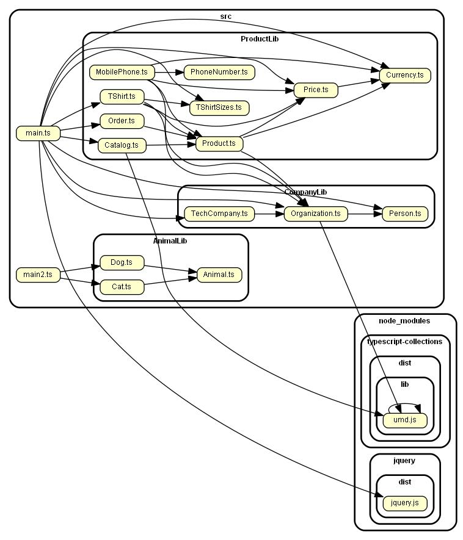

## Intro and scope
This README and associated project guide is for building web applications using TypeScript on the client side. 

Unlike others of its kind, this guide describes how to set up a TypeScript web application:
1. _Without_ a TypeScript-supporting framework (React, Angular, Vue.js, etc). 
2. With _any_ server-side technology (Node.js, Java + Spring MVC, Ruby on Rails, PHP, etc).

Instead of spending time integrating with frameworks, we go into depth on how to create client-side functionality using vanilla TypeScript, which is then transpiled to JavaScript and sent to the user. This approach allows the guide to be agnostic of any frameworks. 

This is an iterative guide covers the following topics:
1. Setting up a TypeScript build system using:
    1. Gulp + Browserify
    1. Gulp + Webpack
1. Source mapping (from client-side JavaScript to TypeScript).
1. Minification (up to L3, i.e. obfuscation).
1. Supporting both Dev and Production environments.
1. Modularizing TypeScript code.
1. Code-splitting to allow browser caching and reduced latency.

This guide is aimed at programmers familiar with JavaScript but new to TypeScript, and new to the various build tools required to deliver modern web applications using TypeScript on the client side.


## Why TypeScript on the browser?
A lot of large web applications today use Java on the server side. As a result, teams are often made completely of Java developers who are unfamilar with the strange and fast-paced world of JavaScript. This leads to a client-facing bugs and poor coding practices.

TypeScript is a very good solution to this problem, as it combines the strong-type assurance of Java with the flexibility of JavaScript. It offers the following advantages:

1. Unlike JavaScript, variable types are checked at _compile time_. This is a huge win over the standard JavaScript practice, where errors are often caught only at runtime. No amount of testing can catch all of these errors. TypeScript provides a level of assurance, especially with codebases maintained by several developers.

1. Its syntax, inheritance model, generics etc. is very similar to that of Java/C++:
    1. Object oriented programming concepts such as classes, interfaces, etc are baked into the language itself (albeit, with minor variations over those found in Java/C++). This removes the need to use a JavaScripe class framework such as BaseJS or Simple JavaScript Inheritance. There is also no need to write ECMAScript 6/7 and transpile to ECMAScript 5 to support old browsers.

    1. Classes can have final (readonly), static, and private member variables and functions. This is enforced at compile time but not runtime.

    1. Functions can have default arguments. Arguments can (optionally) have types (either basic types like "string" or "number", or classes).

    Thus, there should be minimum friction for Object-oriented programmers to cross over.

1. Supported by large industry players:
    - The language and compiler are designed and maintained by Microsoft, but open-sourced. Thus it is stable and secure. 
    - Google and Facebook have created frameworks that can leverage TypeScript (Angular and React, respectively).

1. Integration with existing JavaScript libraries is possible via [TypeScript definition files](https://stackoverflow.com/a/29197665). jQuery, Mocha, etc thus all have good support for TypeScript.
    
1. Unit tests for TypeScript classes can be written in TypeScript, using existing JavaScript unit-testing frameworks such as Mocha, Chai and Sinon.

1. Always minifiable (upto L3 minification level), thus reducing network latency as only the minified files need to be sent to the client.
    <br>
    Additionally, it is possible to use the Google Closure Compiler to opimize the minified JS to make it faster and lighter.

1. Can transpile all the way from ECMA3 to ECMA6. Depending on browser compatibility and optimization, you can create multiple versions and choose which one to use dynamically.
    <br>
    E.g. Newer browsers might be most optimized for ECMA 6 or 7 and can execute that code faster. Older devices might not support above ECMA5, so they can be targeted with that version.

1. Ability to debug TypeScript directly in browser, using sourcemaps.

1. The language is a superset of JavaScript, thus it supports the most advanced ECMAScript features, and more:
    - `let` variable declaration for block-scoping (whereas `var` has function scoping).
    - Basic data structures are same (Array, JSON, etc), and easy-to-use containers.
    - Advanced data structures (Set<T>, HashMap<K, V>, etc) are possible using the excellent third party library "typeScript-collections" (which has an overhead of ~30kB).
    - Closures
    - The "any" type allows functions to return any type, same as JavaScript.
    
1. As TypeScript finally becomes JavaScript (via transpilation), so how a certain feature is defined depends on the JavaScript version to which we transpile. Programmers only need to remember and use one syntax, without worrying which is the "right" one.

1. VSCode IDE provides excellent, first-class TypeScript support for free:
    - Syntax highlighting.
    - Jump to function/class definition.
    - Find all usages of a function/class.
    - etc.
    <br>
    Other editors which provide the same features are IntelliJ Ultimate Edition (paid).

1. Excellent learning materials:
    - The best TypeScript starter I have found so far is [TypeScript Deep Dive by Barasat](https://basarat.gitbooks.io/typescript/). Check it out.


# Project aim
The idea is to set up TypeScript such that:
1. We develop a web application using TypeScript and some external libraries such as `jquery` and `typescript-collections`
1. We can debug TypeScript directly on the browser in a Dev/Pre-production setting. 
1. During Production, we can use L3 minified JavaScript (i.e. with function names, class names etc. replaced by single letters). 
1. Code-splitting will allow us to leverage browser caching, so that client-side network latency is reduced.

This is **not** a tutorial on how to develop TypeScript to be hosted from a Node.js server (although we do use Node.js for the build system). 

Additionally, we use vanilla TypeScript, with no other frameworks (Angular, React, etc). 

Finally, HTML and CSS code in this project will be minimal and only for example purposes.

Let's get started.

# Gulp + Browserify build system

The major steps of this section are taken from [this tutorial](https://www.typescriptlang.org/docs/handbook/gulp.html) on the Microsoft website. However, I have used a more comprehensive example involving a third-party libraries:
1. `'jquery'`: the extremely popular JavaScript library for working with the DOM.
1. `'typescript-collections'`: Data structures in TypeScript like `Set<T>`, `Map<K,V>`, etc.

## Basic setup

### Node installation:
First, you must install NodeJS, which by default comes bundled with `npm` (there's lots of tutorials for this). 
    
Node is only used for the build system, it will _not_ be used to host a webserver.

### Install build dependencies:

Next, install the list of NPM modules. 
Either run `npm install` to install them from the `package.json` file, or download them explictly with the following command:

> `npm install --save-dev typescript gulp gulp-typescript browserify tsify vinyl-source-stream gulp-uglify vinyl-buffer gulp-sourcemaps`

Either way, the dependencies should be installed to the package's `node_modules/` folder. We add this folder to the repository's `.gitignore` since we don't want to add it to Git.


### Initial project structure:

Let's set up the project structure:
- `src/` stores all our source code (`*.ts`, `*.html`, `*.css`, etc)
    At present, it looks like this:
    ```JS
    src
    |
    |-- CompanyLib  // a library folder
    |   |-- Organization.ts
    |   |-- Person.ts
    |   |-- TechCompany.ts
    |-- ProductLib  // a library folder
    |   |-- Price.ts
    |   |-- Product.ts
    |   |-- TShirt.ts
    |   |-- Catalog.ts
    |   |-- Order.ts
    |-- main.ts     // a file that uses the libraries
    |-- index.html  // an HTML that includes our minified, browserified JS.
    ```
- `tst/` should store any and all unit tests. Right now, there aren't any, but we'll add them later.
- `build/` will store all the `*.js` files which are accessed by client-facing webpages.  It is the same as `dist/` in other tutorials.


### Loading static assets:

In this sample, we just use `build/index.html` as a static webpage, but in an actual web app, the webpage might be rendered by Node, JSP, Ruby, etc. In all of these cases, there are three ways to import the generated JS files:

1. Put all the JS code in the HTML payload sent to the client:
    ```html
    <!-- JSP example -->
    ...
    <script>
        <jsp:include page="build/someJsFile.js">  
    </script>
    ...
    ```
    On rendering, the following is sent to the client (the JS executes on page load):
    ```html
    ...
    <script>
        (function Person(){
            ...
        })
        ...
    </script>
    ...
    ```
    This is a bad solution, because it increases the HTML payload size, and the browser cannot cache the JS code.
1. Add static imports to the `*.js` files. 

    ```html
    ...
    <script src="build/someJsFile.js"/></script>
    ...
    ```

    This is a decent solution, because browsers can cache these files. However, it still adds a load to the server to send the files.

1. Upload the files to a CDN (Content Delivery Network) and let the client browser fetch the files from there. 
    ```html
        ...
        <script 
        src="http://cdnjs.cloudflare.com/209182031/someJsFile.js">
        </script>
        ...
    ```

    This is the best solution performance-wise: CDNs are built for high uptime and low latency, and the load is taken off the server. 
    
    However, the compiled `*.js` files need to be uploaded to a production CDN before users arrive at the page. Depending on how Prod deployments happen on your stack, this might be an issue, as you need all `*.js` files to be reflected to the Prod CDN at same time, as well as at the same time that backend code changes (requiring these JS files) are deployed onto your Prod server. 
    
    A possible solution is to write some backend code on the Prod server which checks the version of the file on the CDN against that of the JS code available in the `build` folder. If the CDN has an older version stale, the server can push the newer JS code to the CDN, replacing the stale version but preserving the CDN URL to the file (this assumes the newly compiled JS code was deployed onto the server along with the backend code changes). Thus the changes are seamless.

From the above three solutions, only the first two are possible with the build system described in this sample project. You'll have to integrate with a CDN on your own.

## Build system setup

Now, we set up the build system.

### TypeScript inbuilt support:

1. TypeScipt by default provides the `tsc` command to compile a `*.ts` file to the equivalent `*.js` file (technically called _transpilation_). It saves the resultant file in the same folder as the source. 

    E.g. `$ tsc src/CompanyLib/Person.ts` becomes `src/CompanyLib/Person.js`

1. Doing this for every file is time consuming. We can create a file [`tsconfig.json`](http://www.typescriptlang.org/docs/handbook/tsconfig-json.html) at the project root, which tells us which files to compile, and some options on how to compile them:
    ```json
    {
        "include": [
            "src/**/*.ts"
        ],
        "exclude": [
            "node_modules",
            "**/*.spec.ts"
        ],
        "compilerOptions": {
            "noImplicitAny": true,
            "target": "es5",
            "removeComments": false
        }
    }
    ```
    Here, by running `$ tsc` from anywhere in the project, we can compile each the `*.ts` files in `src/` to a corresponding `*.js` file in the same folder. From a webpage, we can import them using folder-relative paths.

### Integrating Gulp:

These `*.js` files generated by running `$ tsc` are annoying to delete individually. So, we can use the `gulp` task runner and `gulp-delete-file` plugin to remove them. 
   
Gulp works as follows ([Source](http://brandonclapp.com/what-is-gulp-js-and-why-use-it/)):
- We start by defining a task that we would like to accomplish. This is a JavaScript function passed to one or more `gulp.task(...)`s, which we define in `gulpfile.js`, placed at the project root.
- Within that task, a desired set of files (`*.ts`, `*.js`, `*.html`, `*.css`, etc) are loaded into the _gulp stream_ to be processed. 
- Once files are in the stream, zero or more modifications can be made to the files. This processing of files in the stream happpens in-memory without any creation of temporary files in between.
- Finally, the output files at the end of the stream (i.e. the built files) are usually written to disk, in specified destination directory(s).
- Processing of the files in a stream might mean different things depending on the type of file, location of the file, target environment (e.g. Devo vs Prod) and other such factors. 
    - The files that go into the stream might not be the same as the ones that come out. There might be fewer (or more!), they might be minified, etc.
- To open a stream, we use `gulp.src(...)`, to which we pass a regex that matches files in or filesystem. This function reads in all the files from disk and puts them in our stream.
- To add a stream-processing step, we use `.pipe(...)`, chained to the `gulp.src(...)` call or a previous `.pipe(...)` call. More info about this step can be found [here](https://stackoverflow.com/a/38404984).
- Once we are done processing the stream, we optionally write the files to disk using `.dest(...)` (we pass the output folder name).

For our current use-case of removing all `*.js` files from the `src/` directory, we create `gulpfile.js` (in the project root). 

However, we expect that we are also going to create a lot of other gulp tasks, so to keep the gulpfile clean, we create a `gulp/` folder in the project root to hold all the tasks (credit to [this blogpost](https://lincolnloop.com/blog/speedy-browserifying-multiple-bundles/) for the idea). The gulpfile will import tasks from this folder using `require(gulp/task-name-*.js);`. E.g.     
```js
/* gulpfile.js */
var SOURCE_DIR = 'src';
require('./gulp/js-clean-src')(SOURCE_DIR); // Source: https://stackoverflow.com/a/10688968
```
In the imported file, we define a task which will delete all `*.js` files from the `src/` directory. This task will use a Gulp plugin, [`gulp-delete-file`](https://www.npmjs.com/package/gulp-delete-file) during stream processing:
```js
/* gulp/js-clean-src.js */
var gulp = require("gulp"),
    deleteFile = require('gulp-delete-file');

module.exports = function (SOURCE_DIR) {
    /* delete all *.js files in the src/ folder */
    gulp.task('js-clean-src', function () {
        var stream = gulp.src([
            './' + SOURCE_DIR + '/**/*.js'
        ]);
        /* From all the files in the stream, pick 
        those matching the regular expression, and
        delete them. */
        var regexp = /.*\.js$/
        stream.pipe(deleteFile({
            reg: regexp, 
            deleteMatch: true
        }));
    });
}
```
Note that the SOURCE_DIR parameter is passed while importing, to keep the task more generic ([Source]( https://stackoverflow.com/a/10688968)).

The `gulp.task(...)` call registers a task, which we can run using `$ gulp js-clean-src` anywhere in the project directory.
Note that since we don't have a write-to-disk step now, calling `.dest(...)` at the end is not necessary.

### Integrating Browserify with Gulp:

Module inclusion in NodeJS is done using the `module.exports = {...}` and `require` keywords. This is all fine when we use it on the backend, but our use-case here is about getting TypeScript to work on browsers. In browsers, all `<script>` tags are executed from top to bottom once the page loads. Both `require` and `exports` keywords are not supported.

This is a problem for us, because the compiled files we generated by running `$ tsc` use `export`.
We thus use another NodeJS library called `browserify`. According to its documentation:
> Browsers don't have the `require` method defined, but Node.js does. With Browserify you can write code that uses `require` in the same way that you would use it in Node, and use it in the browser. [[1]](http://browserify.org)
>
> Browserify is a tool for compiling [node-flavored](http://nodejs.org/docs/latest/api/modules.html) commonjs modules for the browser.
> You can use browserify to organize your code and use third-party libraries even if you don't use node itself in any other capacity except for bundling and installing packages with npm.
> 
> The module system that browserify uses is the same as node, so packages published to npm that were originally intended for use in node but not browsers will work just fine in the browser too. [[2]](https://github.com/browserify/browserify-handbook)

We can use browserify to combine all our compiled `src/**/*.js` files into one single file, `build/allFiles.js`. Our HTML code only needs import this file to work.

Lets add Browserify to our build system:

- To give an elevator pitch ([Source](https://github.com/browserify/browserify-handbook#how-browserify-works)): 
    > Browserify starts at the entry point files that you give it and searches for any `require()` calls it finds in these files.
    >
    > For every require() call with a string in it, browserify resolves those module strings to file paths and then searches those file paths for `require()` calls recursively, until the entire dependency graph is visited.
    >
    > Browserify is a build step that runs on the server. It generates a single **bundle** file that has everything in it. The HTML just needs to import this file.

- Initially, there was a separate plugin called `gulp-browserify` which was a wrapper around the browserify library to make it compatible with Gulp. However, as of this writing (Feb 2018), the Gulp team decided to [blacklist the plugin](https://www.npmjs.com/package/gulp-browserify) and get users to use browserify directly, since they both use [NodeJS streams](https://www.sitepoint.com/basics-node-js-streams/), albiet [in slightly different ways](https://fettblog.eu/gulp-browserify-multiple-bundles/). 

    As a result, we shall be importing the browserify library directly to use in our Gulp tasks. Using browserify directly is great because you'll always have access to 100% of the features, as well as the most up-to-date version. However, it means that there will be two incompatible streams inside a single Gulp task: the Gulp stream, and the Browserify stream. Gulp is built on the library `vinyl-source-stream`, so we use this to convert the Gulp stream into the stream format Browserify is expecting ([source](https://www.viget.com/articles/gulp-browserify-starter-faq/) for the above).

- Browserify's JS API depends on the concept of "entry" files, i.e. a list of files which are at the root of the `require()` dependency graph. From this set of files, all imported files are discovered. 
    
    In our example code, `src/main.ts` is the only such entry file. It is a TypeScript file, which on running `$ tsc` generates a `main.js` file with several `require(...)` calls:
    ```js
    "use strict";
    Object.defineProperty(exports, "__esModule", { value: true });
    var $ = require("jquery");
    var Person_1 = require("./CompanyLib/Person");
    var Organization_1 = require("./CompanyLib/Organization");
    var TechCompany_1 = require("./CompanyLib/TechCompany");
    var Order_1 = require("./ProductLib/Order");
    var TShirt_1 = require("./ProductLib/TShirt");
    var Catalog_1 = require("./ProductLib/Catalog");
    var Price_1 = require("./ProductLib/Price");
    ...
    ```
    Note that all of the imported files are `*.js` files.
    
    We can now create a Gulp task to combine them all into a single "bundle" file. This file will be in the Browserify stream format, so we have to use `vinyl-source` to first convert it to the Gulp stream format. We can then write to `build/allFiles.js` using the normal `gulp.dest(...)` step:
    ```js
    /* gulp/js-browserify-single-file.js */
    var gulp = require('gulp'),
        browserify = require('browserify'),
        source = require('vinyl-source-stream');

    module.exports = function (SOURCE_DIR, ENTRY_FILE_NAME, BUILD_DIR, OUT_FILE_NAME) {
        gulp.task('js-browserify-single-file', function () {
            return browserify({
                entries: [
                    SOURCE_DIR + '/' + ENTRY_FILE_NAME
                ]
            })
            .bundle()
            .pipe(source(OUT_FILE_NAME)) /* convert to Gulp stream format. */
            .pipe(gulp.dest(BUILD_DIR));
        });
    }
    ```
    And import it in the gulpfile:
    ```js
    /* gulpfile.js */
    var SOURCE_DIR = 'src';
    var BUILD_DIR = 'build';

    require('./gulp/js-browserify-single-file')(
        SOURCE_DIR, 'main.js',
        BUILD_DIR, 'allFiles.js'
    );
    ```
    We can make the task more generic (e.g. to take an array of entry files as input), but this suffices for now.

### Integrating `tsify`, the Browserify plugin for TypeScript:

One annoying thing is that to run the above, we must actually run four commands every time we want to re-compile our TypeScript, create one single file and then clean all the compiled files in the `src/` folder:
```
$ gulp js-clean-src
$ tsc
$ gulp js-browserify-single-file
$ gulp js-clean-src
```
This is error-prone, and - quite frankly - I am personally too lazy to do it. You could write a bash script to automate it, but that's just avoiding the problem, which is: we need to transpile each TypeScript file to JavaScript as an intermediate step in our build process.

The solution is to use `tsify`, which is a Browserify plugin which allows us to work with TypeScript entry files, and compile them (using the options into our `tsconfig.json`), then browserify them into a single file. To do this, we must call `.plugin(tsify)` before we call `.bundle()`:
```js
/* gulp/ts-browserify-single-file.js */
var gulp = require('gulp'),
    browserify = require('browserify'),
    source = require('vinyl-source-stream'),
    tsify = require("tsify");
    
module.exports = function (SOURCE_DIR, ENTRY_FILE_NAME, BUILD_DIR, OUT_FILE_NAME) {
    gulp.task('ts-browserify-single-file', function () {
        return browserify({
            entries: [
                SOURCE_DIR + '/' + ENTRY_FILE_NAME
            ]
        })
        .plugin(tsify)
        .bundle()
        .pipe(source(OUT_FILE_NAME))
        .pipe(gulp.dest(BUILD_DIR));
    });
}
```
We import it in the gulpfile as before:
```js
/* gulpfile.js */
var SOURCE_DIR = 'src';
var BUILD_DIR = 'build';

require('./gulp/ts-browserify-single-file')(
    SOURCE_DIR, 'main.ts', /* Note: TypeScript file */
    BUILD_DIR, 'allFiles.js'
);
```
`build/allFiles.js` is exactly the same as it was before, but we don't generate any intermediate files.

Our TypeScript is now automatically converted to JavaScript, and we can import it in the browser. `src/index.hml` is an example file which uses our compiled JavaScript:
```html
<!-- src/index.html -->
<!DOCTYPE html>
<html>
    <head>
        <meta charset="UTF-8" />
        <title>Hello TypeScript!</title>
    </head>
    <body>
        <p id="employees">EMPTY</p>
        <script src="../build/allFiles.js"></script>
    </body>
</html>
```
The thing is, when we try to debug the code in the browser, it looks like this (note, I'm using Vivaldi, which is a Chromium derivative):


### Minification with Uglify:

Minification is an important step in the build process for client-side JavaScript. As we can see, `build/allFiles.js` is very large:

```
$ wc -m build\allFiles.js
400672 build\allFiles.js
```
That's over 390kB! Granted, a lot of it is because we have `jqeury` and the `typescript-collections` libraries. However, it's still too much. We use the `gulp-uglify` plugin to minify the generated JS, before we write it to the minified JS file, `build/addFiles-min.js`. 

However, we cannot just add another `.pipe(uglify())` statement directly before `gulp.dest(...)`. This is because, the uglify libary requires one big file to uglify together, whereas after we call `pipe(source(OUT_FILE_NAME))`, the data is in a Gulp-stream format. So, we use `vinyl-buffer` to first buffer (i.e. collect) the stream, then we pass the buffered stream files to UglifyJs ([Source](https://stackoverflow.com/a/38883791)):
```js
/* gulp/ts-browserify-minify-single-file.js */
var gulp = require('gulp'),
    browserify = require('browserify'),
    tsify = require("tsify");
    source = require('vinyl-source-stream'),
    buffer = require('vinyl-buffer'),
    uglify = require('gulp-uglify');

module.exports = function (SOURCE_DIR, ENTRY_FILE_NAME, BUILD_DIR, OUT_FILE_NAME) {
    gulp.task('ts-browserify-minify-single-file', function () {
        return browserify({
            entries: [
                SOURCE_DIR + '/' + ENTRY_FILE_NAME
            ]
        })
        .plugin(tsify)
        .bundle()
        .pipe(source(OUT_FILE_NAME))
        .pipe(buffer())
        .pipe(uglify())
        .pipe(gulp.dest(BUILD_DIR));
    });
}
```
And import it:
```js
/* gulpfile.js */
var SOURCE_DIR = 'src';
var BUILD_DIR = 'build';

require('./gulp/ts-browserify-minify-single-file')(
    SOURCE_DIR, 'main.ts',
    BUILD_DIR, 'allFiles-min.js'
);
```
Let's see how much we saved:
```
$ wc -m build\allFiles-min.js
123677 build\allFiles-min.js
```
Wow! The file is now only around 120kB...that's a 69% reduction! (As a side note, this happy number occurred completely by accident :P).

### Using SourceMaps for debugging:

After minification, the HTML will import the minified `build/allFiles-min.js` file, and our original TypeScript is nowhere to be seen. This is good in one sense that it reduced the payload sent to the client, thus making the page load faster. 

However, minified JavaScript is incomprehensible; as we can see from the following image, even after we preyty-print it, all of our identifiers are lost.


You can't debug this minified code during development. Worse, you can't debug it if your app gets a high-severity, user-facing issue.

The solution: _Source Maps_.
> A source map provides a way of mapping code within a compressed file back to it’s original position in a source file. This means that – with the help of a bit of software – you can easily debug your applications even after your assets have been optimized. The Chrome and Firefox developer tools both ship with built-in support for source maps.
>
> We’re going to be focussing primarily on source maps for JavaScript code but the principles apply to CSS source maps too. ([Source](http://blog.teamtreehouse.com/introduction-source-maps))

We're going to use source maps to trace our minified JavaScript _all the way back to TypeScript_, using the `gulp-sourcemaps` plugin. We create a new dependency called `sourcemap` and add calls to `sourcemaps.init(...)` and `sourcemaps.write(...)`. The latter one one generates and writes source maps, and the former loads any cached source maps which already exist. We also have to enable the `debug` plugin in browserify:
```js
/* gulp/ts-browserify-single-file-with-sourcemap.js */
var gulp = require('gulp'),
    browserify = require('browserify'),
    tsify = require("tsify");
source = require('vinyl-source-stream'),
    buffer = require('vinyl-buffer'),
    sourcemaps = require('gulp-sourcemaps'),
    uglify = require('gulp-uglify');

module.exports = function (
    SOURCE_DIR,
    ENTRY_FILE_NAME,
    BUILD_DIR,
    OUT_FILE_NAME,
    SOURCE_MAPS_DIR) {
    gulp.task('/ts-browserify-single-file-with-sourcemap', function () {
        return browserify({
            entries: [
                SOURCE_DIR + '/' + ENTRY_FILE_NAME
            ],
            debug: true, /* Source mapping requires this flag.*/
        })
            .plugin(tsify)
            .bundle()
            .pipe(source(OUT_FILE_NAME))
            .pipe(buffer())
            .pipe(sourcemaps.init({
                loadMaps: true,
                sourceRoot: SOURCE_MAPS_DIR,
            }))
            /* Source *.ts TypeScript files will be available inside 
            BUILD_DIR/SOURCE_MAPS_DIR/src/
            */
            .pipe(sourcemaps.write(SOURCE_MAPS_DIR))
            .pipe(gulp.dest(BUILD_DIR));
    });
}
```
And import it:
```js
var SOURCE_DIR = 'src';
var BUILD_DIR = 'build';
var SOURCE_MAPS_DIR = 'sourcemaps';

require('./gulp/ts-browserify-single-file-with-sourcemap')(
    SOURCE_DIR, 'main.ts', 
    BUILD_DIR, 'allFiles-min.js',
    SOURCE_MAPS_DIR
);
```
Note how we drop the call to uglify; since we're going to only call this gulp task while debugging, we don't need to generate a minified file. However, to avoid having to change our import in the `index.html`, we've kept the resultant JS file name the same. 

This laziness will pay off when we have dozens of js imports: we don't have to keep removing `-min` from lots and lots of filenames. 

The end result is pretty great:


Viola, we are able to use the Chrome debugger to set up breakpoints, observe variables etc in the TypeScript code itself. We could not have asked for better! 

[You can actually do more than just uglify before and after generating the source map](https://github.com/gulp-sourcemaps/gulp-sourcemaps/wiki/Plugins-with-gulp-sourcemaps-support). This is useful if you want to perform other gulp steps in between generating and writing your source maps.

--- 

We're at a point where our build system can now be used both in production (by only creating the minified JS file) and for debugging (by creating source maps for unminified JS). 

Let's make it more concrete by creating two gulp tasks, `debug` and `prod`. These tasks will each have a Gulp dependency on the tasks we created previously, as well as a new task `clean-build`, which (surprise!) cleans the `build/` folder of all content.
```js
/* gulpfile.js */
var gulp = require('gulp');

var SOURCE_DIR = 'src';
var BUILD_DIR = 'build';
var SOURCE_MAPS_DIR = 'sourcemaps';

require('./gulp/clean-build')(BUILD_DIR);

require('./gulp/ts-browserify-minify-single-file')(
    SOURCE_DIR, 'main.ts',
    BUILD_DIR, 'allFiles-min.js'
);

require('./gulp/ts-browserify-single-file-with-sourcemap')(
    SOURCE_DIR, 'main.ts', 
    BUILD_DIR, 'allFiles-min.js',
    SOURCE_MAPS_DIR
);

/* Create dummy tasks, which just invoke their dependent tasks. */
gulp.task('debug', ['clean-build', 'ts-browserify-single-file-with-sourcemap']);
gulp.task('prod', ['clean-build', 'ts-browserify-minify-single-file']);
```
And:
```js
/* gulp/clean-build.js */
var gulp = require("gulp"),
    deleteFile = require('gulp-delete-file');

module.exports = function (BUILD_DIR) {
    /* delete all *.js files in the src/ folder */
    gulp.task('clean-build', function () {
        var stream = gulp.src([
            './' + BUILD_DIR + '/**/*.js',
            './' + BUILD_DIR + '/**/*.map',
        ]);
        /* From all the files in the stream, pick 
        those matching the regular expression, and
        delete them. */
        var regexp = /.*\.js$|.*\.map$/
        stream.pipe(deleteFile({
            reg: regexp,
            deleteMatch: true
        }));
    });
}
```
Now, we can just run `$ gulp debug` to while debugging, or `$ gulp prod` before pushing to a real website. You should add these commands to your deployment scripts.

### Avoiding conflicts due to minification:

One possible issue we might face is the  minified file clashing with other minified dependencies that we have. E.g. if, along with importing `build/allFiles-min.js`, you also need to include `https://cdn.com/someLib-version-1.min.js`. Since the files are only minified within their own scope, it is entirely possible they use some of the same obfuscated variable names like `o`, `p`, `s`, etc.
    
The way to avoid this problem is simple: we just add a flag in our `uglify(...)` call to ensure that the function names are not stripped ([Source](https://github.com/terinjokes/gulp-uglify/issues/160)). In TypeScript, you only need to make sure that the identifiers of your top-level code (classes, functions visible in the browser context) are unique across the page. TypeScript classes are compiled to functions from ECMAScript3 to ECMAScript5, and to JavaScript classes in ECMAScript6 and above.

The change required for this has minimal differences for our `gulp prod` invocation:
```js
/* gulp/ts-browserify-minify-single-file-keep-fnames.js */
var gulp = require('gulp'),
    browserify = require('browserify'),
    tsify = require("tsify");
    source = require('vinyl-source-stream'),
    buffer = require('vinyl-buffer'),
    uglify = require('gulp-uglify');

module.exports = function (SOURCE_DIR, ENTRY_FILE_NAME, BUILD_DIR, OUT_FILE_NAME) {
    gulp.task('ts-browserify-minify-single-file-keep-fnames', function () {
        return browserify({
            entries: [
                SOURCE_DIR + '/' + ENTRY_FILE_NAME
            ]
        })
            .plugin(tsify)
            .bundle()
            .pipe(source(OUT_FILE_NAME))
            .pipe(buffer())
            .pipe(uglify({ mangle: { keep_fnames: true } }))
            .pipe(gulp.dest(BUILD_DIR));
    });
}
```
And update the gulpfile:
```js
/* gulpfile.js */
var gulp = require('gulp');

var SOURCE_DIR = 'src';
var BUILD_DIR = 'build';

require('./gulp/ts-browserify-minify-single-file-keep-fnames')(
    SOURCE_DIR, 'main.ts',
    BUILD_DIR, 'allFiles-min.js'
);

gulp.task('prod', ['clean-build', 'ts-browserify-minify-single-file-keep-fnames']);
```
Now, when we run `$ gulp prod`, we get a minified file that retains the function names (no JavaScript classes, since our `tsconfig.json` has us compiling with `"target": "es5"`).

Let's check the size of our minified file:
```
$ wc -m build\allFiles-min.js
129143 build\allFiles-min.js
``` 
The filesize increase in minimal (from 120kB to 126 kB...a little more than 4.4%). Which is a good tradeoff to ensure that the code does not interact badly with other code on the page.


## Modular TypeScript

### The need for Code Splitting on the frontend:

If your web application is just one page, then maybe it's okay to minify all your source code into a single file and send to your clients, like we did above with `allFiles-min.js`. 
- However, if you have multiple pages in your web app, then most likely they will require different sets of JavaScript code. 

    For example, if your app has `Page1.html` which requires:
    - `ModueA/`, `ModuleB/` and `ModuleC/` 
    
    And `Page2.html` requires: 
    - `ModuleA/` and `ModuleD/`
    
    ...then it makes sense to split the each module into a separate JavaScript file, which can be imported as required:

    ```html
    <!-- Page1.html -->
    <script src="build/ModuleA-min.js" ></script>
    <script src="build/ModuleB-min.js" ></script>
    <script src="build/ModuleC-min.js" ></script>
    ```

    ```html
    <!-- Page2.html -->
    <script src="build/ModuleA-min.js" ></script>
    <script src="build/ModuleD-min.js" ></script>
    ```
    If you keep all the code bundled up in one file, then your client ends up paying the price, as they have to load extra code on for both `Page1.html` and `Page2.html`.

- Even if your app has only one page (say, `Page1.html` from the above point), then it still makes sense to modularize your JS imports:
    
    Throughout the life of your web application, you will probably make many changes to JavaScript modules, adding new features, fixing new bugs, and so on. Depending on your deployment policy, you will periodically push such changes to your Production environment, where they will be visible to users.
    
    However, there is no neccessity that _all_ your JavaScript modules must change between deployment cycles. By allowing your codebase's modules to become JS imports on the client side, you can leaverage [_browser caching_](https://developers.google.com/web/fundamentals/performance/optimizing-content-efficiency/http-caching) to avoid re-sending code files which have not changed.
    
    E.g. suppose your team has a two-week deployment cycle,starting on 3rd March. The next deployment is scheduled on 17th March. In those two weeks, you've been working on `Page1.html` (the only page in your web app), and have made changes to `ModuleA` and `ModuleC`. `ModuleB` was untouched. 
    
    When the two weeks are up, you must upload these changes to your Production server so that users can see the updates. There are two ways to do this:
    
    1. Combine all the code into one bundle, `allFiles-min.js`, and upload it. In this scenario, the hash of the file will have changed, and the user's browser will be unable to cache the file. 
    1. Keep each module as a separate file, `ModuleA-min.js`, `ModuleB-min.js` and `ModuleC-min.js`, and import each of these from the client HTML. Lets assume these are the filesizes:
        ```
        ModuleA-min.js : 100 kB
        ModuleB-min.js : 50 kB
        ModuleB-min.js : 30 kB
        ```
    By relying on the browser's ability to cache files, you have shaved 27% off your JS payload size! This number will of course vary depending on which module(s) have been modified during the last deployment cycle: the number can vary from 0% to 100%. You should think about modularizing your JavaScript codebase in a way that each module will be changed independent of others, thus minimizing the number of modules.

    Note: it won't be _exactly_ 27%, since if you minify all the files together, you can technically achieve a better minification. But the difference will most likely be minimal - less than 1% - for which you give up any savings provided by browser caching. The difference reduces further if you keep the function names during minification, as shown earlier (you always have to do this when you use modularized JS imports).

    Note: the idea of making multiple JS imports out of a single import is called _Code Splitting_. It took me a really long time to figure this out :P


### Structure of a modular TypeScript codebase:

So now, let's get started with creating multiple JS files from each module. This is a bit tricky, so I will start with a simpler codebase with a single module, `src/AnimalLib/`, which is consumed by `src/main2.ts`. On transpilation, these become `build/AnimalLib-min.js` and `build/main2-min.js`, respectively. The HTML file `index2.html` will import them (in the correct order):
    
```html
<!-- src/index2.html -->
<!DOCTYPE html>
<html>
    <head>
        <meta charset="UTF-8" />
        <title>Hello TypeScript!</title>
    </head>
    <body>
        <script src="../build/AnimalLib-min.js"></script>
        <script src="../build/main2-min.js"></script>
    </body>
</html>
```
AnimalLib is a module of source code, meaning it is a directory. After much experimenting with TypeScript [namespaces](https://www.typescriptlang.org/docs/handbook/namespaces.html), TypeScript [modules](https://www.typescriptlang.org/docs/handbook/modules.html) and [their interactions](https://www.typescriptlang.org/docs/handbook/namespaces-and-modules.html), I have come up with the following module structure:
```
src
|
|-- AnimalLib  // a library folder
|   |-- index.ts
|   |-- Animal.ts
|   |-- Cat.ts
|   |-- Dog.ts
```

`Animal.ts` exports and abstract class `Animal`, which is consumed by concrete classes `Dog` and `Cat`.

This look similar to the structure of `CompanyLib` and `ProductLib`, doesn't it? And it is, with one crucial difference: now, each of the classes inside the [file-level modules](https://basarat.gitbooks.io/typescript/docs/project/external-modules.html) `Animal.ts`, `Cat.ts` and `Dog.ts` is [re-exported](https://www.typescriptlang.org/docs/handbook/modules.html#re-exports) via `AnimalLib/index.ts`:

```ts
/* AnimalLib/index.ts */
export { Animal } from "./Animal";
export { Cat } from "./Cat";
export { Dog } from "./Dog";
```
Now, instead of importing each file individually, we can import them all in one go:
```ts
/* main2.ts */
import { Cat, Dog } from "./AnimalLib";
let c: Cat = new Cat("Mittens", new Date());
let d = new Dog("Coco", new Date())
console.log(c.makeNoise());
console.log(d.makeNoise());
```
This feature of "importing folders as modules" is allowed by [TypeScript's module import resolution strategy](https://basarat.gitbooks.io/typescript/docs/project/external-modules.html#module-paths): folders become modules when we specify an `index.ts` file inside them. That `index.ts` is responsible for re-exporting the exported members of the different `*.ts` files located inside the folder. If, later, we add the file `AnimalLib/Snake.ts`, we will also have to modify `AnimalLib/index.ts` to export `Snake` explicitly, or consumers won't be able to use it when importing the folder.

In the build system set up that follows, _it is important to use the above import syntax and not any other_. For example **don't** do this:
```ts
/* main2.ts */
import { Cat } from "./AnimalLib/Cat";
import { Dog } from "./AnimalLib/Dog";
```
There won't any syntax or compilation errors, but now the file `main2-min.js` will contain the code of the `Cat` and `Dog` classes, which should ideally only be present in `AnimalLib-min.js`. If you keep using the this import syntax rather than the recommended one, you will find your minified file sizes balooning, due to extra dependencies being added unnecessarily.

Note that the above point does not apply to external libraries like `jQuery`, because the build system handles them differently. You can import them however you want.

### Setting up multiple dependent libraries:

We can structure our other libraries in the same way:
```
src
|
|-- CompanyLib  // a library folder, becomes a single js bundle.
|   |-- index.ts
|   |-- Person.ts
|   |-- Organization.ts
|   |-- TechCompany.ts
|
|-- ProductLib  // a library folder, becomes a single js bundle.
|   |-- index.ts
|   |-- Currency.ts
|   |-- Price.ts
|   |-- Product.ts
|   |-- TShirt.ts
|   |-- TShirtSizes.ts
|   |-- Catalog.ts
|   |-- Order.ts
```
These are consumed by `main.ts`, just as `AnimalLib` was consumed by `main2.ts`.

Here is the dependency graph between the modules: 



Our intention is to make each library directory a separate `*.js` bundle, and a separate bundle for each  entry file. 

So, our build system should generate the following bundles:
1. `build/main.js` (entry file)
1. `build/main2.js` (entry file)
1. `build/AnimalLib.js` (library bundle)
1. `build/CompanyLib.js` (library bundle)
1. `build/ProductLib.js` (library bundle)

The assumption is that different pages in our webapp will require a single entry file but different library bundles. E.g.
1. `src/index.html` will contain imports for `main.js`, `CompanyLib.js`, and `ProductLib.js`.
1. `src/index2.html` will contain imports for `main2.js`, and `AnimalLib.js`.

Note: this graph was generated by the awesome tool [dependency-cruiser](https://github.com/sverweij/dependency-cruiser)). The command to generate it is:
```
depcruise --exclude "^node_modules" --ts-pre-compilation-deps --output-type dot src | dot -T jpg > img/Module-Dependency-Graph.jpg
```
For this to work, you have to first install [Graphviz](https://graphviz.gitlab.io/download/) and ensure `dot` is available on the command-line.


### My issues setting up code splitting with Browserify:

Unfortunately, this was as far as I got with Browserify. I spent a multiple days looking for a good solution, and in fact found a few decent articles/posts on how to achieve code splitting in Browserify:

1. I tried plugins such as [`factor-bundle`](https://www.npmjs.com/package/factor-bundle) and [`partition-bundle`](https://www.npmjs.com/package/partition-bundle), as specified in the [browserify handbook](https://github.com/browserify/browserify-handbook#partitioning). 

    I actually got factor-bundle to work with the help of [this SO answer](https://stackoverflow.com/questions/23748841/create-separate-javascript-bundles-with-a-shared-common-library-using-browserify), but not as described above wanted: factor-bundle creates a `common.js` file that contains code common to _all_ your modules, whereas we want to make each module an import. Still, it was worth knowing.

1. I played with the idea of [using exclude and external](https://stackoverflow.com/questions/32746512/what-is-the-difference-between-browserify-external-vs-exclude), but I could not get a file to recognize its compiled dependency from the HTML.

1. I tried [adding `exclude` params to the tsify call](https://github.com/TypeStrong/tsify), but that didn't work at all.

1. I tried just [excluding `src/**/index.ts` in the `tsconfig.json`](http://www.typescriptlang.org/docs/handbook/tsconfig-json.html), but tsify seemed to ignore it.

1. [I tried setting up my TypeScript modules to use Browserify's `external` and `require` functions, using these links as reference points: [[1](https://benclinkinbeard.com/posts/how-browserify-works/)] [[2](https://github.com/vigetlabs/blendid/issues/75)] [[3](https://github.com/browserify/browserify/issues/1014)] [[4](https://lincolnloop.com/blog/speedy-browserifying-multiple-bundles/)] [[5](https://benclinkinbeard.com/posts/external-bundles-for-faster-browserify-builds/)] [[6](https://github.com/browserify/browserify#multiple-bundles)]. 

    I did actually get this to work upto an extent using this gulp setup:
    
    - We create the bundle `build/AnimalLib.js` from the folder `src/AnimalLib/`, and expose it in the browser via the global string `./AnimalLib`:
        ```js
        /* gulp/ts-browserify-animal-module.ts */
        var gulp = require('gulp'),
            browserify = require('browserify'),
            tsify = require("tsify"),
            source = require('vinyl-source-stream'),
            buffer = require('vinyl-buffer'),
            sourcemaps = require('gulp-sourcemaps'),
            transform = require('vinyl-transform');

        module.exports = function (
            SOURCE_DIR,
            BUILD_DIR,
            SOURCE_MAPS_DIR
        ) {
            var entries = [
                SOURCE_DIR + '/' + 'AnimalLib/index.ts'
            ]
            gulp.task('ts-browserify-animal-module', function () {
                return browserify()
                .require(
                    './' + SOURCE_DIR + '/' + 'AnimalLib/index.ts', 
                    { expose: './AnimalLib' }
                )
                .plugin(tsify)
                .on('dep', function (dep) {
                    console.log("Included in bundle: " + dep.file);
                })
                .bundle()
                .pipe(source("AnimalLib.js"))
                .pipe(gulp.dest(BUILD_DIR));
            });
        }
        ```
    - Now, we build `main2.ts`, which imports files from the folder-module `AnimalLib`. To do so, we create a gulp task `ts-browserify-main2`, which will first clean the `src/` and `build/` folders of `*.js` files, and then invoke the task `ts-browserify-animal-module` that was defined above.
        Inside this task, we use the plugin `.external('src/AnimalLib/index.ts)'` to tell browserify not to include the files in `src/AnimalLib/`, to the bundle `build/main2.js`.
        ```js
        /* gulp/ts-browserify-main2.ts */
        var gulp = require('gulp'),
            browserify = require('browserify'),
            tsify = require("tsify"),
            source = require('vinyl-source-stream'),
            buffer = require('vinyl-buffer'),
            fs = require('fs'), 
            factor = require('factor-bundle'),
            sourcemaps = require('gulp-sourcemaps');

        module.exports = function (
            SOURCE_DIR,
            BUILD_DIR,
            SOURCE_MAPS_DIR
        ) {
            gulp.task('ts-browserify-main2', ['js-clean-src', 'clean-build', 'ts-browserify-animal-module'], function () {
                return browserify()
                .add(SOURCE_DIR + '/' + 'main2.ts')
                .plugin(tsify)
                .external('./' + SOURCE_DIR + '/' + 'AnimalLib/index.ts')
                .on('dep', function (dep) {
                    console.log("Included in bundle: " + dep.file);
                })
                .bundle()
                .pipe(source("main2.js"))
                .pipe(gulp.dest(BUILD_DIR));
            });
        }
        ```
    - We import these into the gulpfile:
        ```js
        var SOURCE_DIR = 'src';
        var BUILD_DIR = 'build';
        var SOURCE_MAPS_DIR = 'sourcemaps';

        require('./gulp/ts-browserify-animal-module')(
            SOURCE_DIR, 
            BUILD_DIR,
            SOURCE_MAPS_DIR
        );

        require('./gulp/ts-browserify-main2')(
            SOURCE_DIR, 
            BUILD_DIR,
            SOURCE_MAPS_DIR
        );
        ```
    - Let's take a look at the output bundles:

        1. `build/main2.js`:
            ```js
            (function(){function e(t,n,r){function s(o,u){if(!n[o]){if(!t[o]){var a=typeof require=="function"&&require;if(!u&&a)return a(o,!0);if(i)return i(o,!0);var f=new Error("Cannot find module '"+o+"'");throw f.code="MODULE_NOT_FOUND",f}var l=n[o]={exports:{}};t[o][0].call(l.exports,function(e){var n=t[o][1][e];return s(n?n:e)},l,l.exports,e,t,n,r)}return n[o].exports}var i=typeof require=="function"&&require;for(var o=0;o<r.length;o++)s(r[o]);return s}return e})()({1:[function(require,module,exports){

            "use strict";
            exports.__esModule = true;
            /* main2.ts */
            var AnimalLib_1 = require("./AnimalLib");
            var c = new AnimalLib_1.Cat("Mittens", new Date());
            console.log(c.makeNoise());
            var d = new AnimalLib_1.Dog("Coco", new Date());
            console.log(d.makeNoise());

            },{"./AnimalLib":undefined}]},{},[1]);
            ```
        2. `build/AnimalLib.js`
            ```js
            require=(function(){function e(t,n,r){function s(o,u){if(!n[o]){if(!t[o]){var a=typeof require=="function"&&require;if(!u&&a)return a(o,!0);if(i)return i(o,!0);var f=new Error("Cannot find module '"+o+"'");throw f.code="MODULE_NOT_FOUND",f}var l=n[o]={exports:{}};t[o][0].call(l.exports,function(e){var n=t[o][1][e];return s(n?n:e)},l,l.exports,e,t,n,r)}return n[o].exports}var i=typeof require=="function"&&require;for(var o=0;o<r.length;o++)s(r[o]);return s}return e})()({"./AnimalLib":[function(require,module,exports){

            "use strict";
            exports.__esModule = true;
            /* AnimalLib/index.ts */
            var Animal_1 = require("./Animal");
            exports.Animal = Animal_1.Animal;
            var Cat_1 = require("./Cat");
            exports.Cat = Cat_1.Cat;
            var Dog_1 = require("./Dog");
            exports.Dog = Dog_1.Dog;

            },{"./Animal":1,"./Cat":2,"./Dog":3}],1:[function(require,module,exports){
            "use strict";
            exports.__esModule = true;
            var Animal = /** @class */ (function () {
                function Animal(name, dob) {
                    this.name = name;
                    this.dob = dob;
                }
                return Animal;
            }());
            exports.Animal = Animal;

            },{}],2:[function(require,module,exports){
            "use strict";
            var __extends = (this && this.__extends) || (function () {
                var extendStatics = Object.setPrototypeOf ||
                    ({ __proto__: [] } instanceof Array && function (d, b) { d.__proto__ = b; }) ||
                    function (d, b) { for (var p in b) if (b.hasOwnProperty(p)) d[p] = b[p]; };
                return function (d, b) {
                    extendStatics(d, b);
                    function __() { this.constructor = d; }
                    d.prototype = b === null ? Object.create(b) : (__.prototype = b.prototype, new __());
                };
            })();
            exports.__esModule = true;
            var Animal_1 = require("./Animal");
            var Cat = /** @class */ (function (_super) {
                __extends(Cat, _super);
                function Cat(name, dob) {
                    return _super.call(this, name, dob) || this;
                }
                Cat.prototype.makeNoise = function () {
                    return "Meow! My name is: " + this.name;
                };
                return Cat;
            }(Animal_1.Animal));
            exports.Cat = Cat;

            },{"./Animal":1}],3:[function(require,module,exports){
            "use strict";
            var __extends = (this && this.__extends) || (function () {
                var extendStatics = Object.setPrototypeOf ||
                    ({ __proto__: [] } instanceof Array && function (d, b) { d.__proto__ = b; }) ||
                    function (d, b) { for (var p in b) if (b.hasOwnProperty(p)) d[p] = b[p]; };
                return function (d, b) {
                    extendStatics(d, b);
                    function __() { this.constructor = d; }
                    d.prototype = b === null ? Object.create(b) : (__.prototype = b.prototype, new __());
                };
            })();
            exports.__esModule = true;
            var Animal_1 = require("./Animal");
            var Dog = /** @class */ (function (_super) {
                __extends(Dog, _super);
                function Dog(name, dob) {
                    return _super.call(this, name, dob) || this;
                }
                Dog.prototype.makeNoise = function () {
                    return "Woof! I'm: " + this.name + "! I love you!";
                };
                return Dog;
            }(Animal_1.Animal));
            exports.Dog = Dog;

            },{"./Animal":1}]},{},[]);

            ```

        The first line of each bundle is just boilerplate to set up the Browserify require structure. A good introduction to the structure is [this post on how Browserify works](https://benclinkinbeard.com/posts/how-browserify-works/). 
        
        1. However, looking at the two bundles, you can see that in `main2.js`, there is no code from the Animal package. Instead, at the end, there is a statement `{"./AnimalLib":undefined}`. This basically tells the Browserify structure that there is an external requirement on a library which is exposed by the global string `"./AnimalLib"`. A global `require=` is defined, which is an instantly instantiating function that returns the function `function e(t,n,r){...}`, inside of which is more boilerplate. To this function's three paramters, we pass:
            - For `t`, a hashtable of all the transpiled code in `main2.ts`:
                ```js
                {1:[function(require,module,exports){

                "use strict";
                exports.__esModule = true;
                /* main2.ts */
                var AnimalLib_1 = require("./AnimalLib");
                var c = new AnimalLib_1.Cat("Mittens", new Date());
                console.log(c.makeNoise());
                var d = new AnimalLib_1.Dog("Coco", new Date());
                console.log(d.makeNoise());

                },{"./AnimalLib":undefined}]}
                ```
            - For `n`, an empty object `{}`
            - For `r`, the reference to the code on `main2.ts`, indexed in the hashtable: `[1]`.

        2. Now, in the AnimalLib bundle, the boilerplate line sets up a similar require (that's okay) and passed the first argument as  `{"./AnimalLib":{...}}`, the second as `{}` and the third as `[]`. All the code for AnimalLib (including the Animal, Cat and Dog classes) is in the `...`. Inside this, each of the classes in the package require one another in a way that is not visible outside (but the same structure is used).
            Essentially, what happens is that the `AnimalLib.js` bundle exposes its contents via the global string `"./AnimalLib"`.

        3. Let's include these two in `index2.html`:
            ```html
            <!-- src/index2.html -->
            <!DOCTYPE html>
            <html>

            <head>
                <meta charset="UTF-8" />
                <title>Hello TypeScript!</title>
            </head>

            <body>
                <script src="../build/AnimalLib.js"></script>
                <script src="../build/main2.js"></script>
            </body>

            </html>
            ```

            The result is as we expect: 
            
        
        Seems great so far, right? However, there is a significant issue: `main2.ts`, on compilation using the gulp task, _always_ imports `"./AnimalLib"`. This string is autogenerated by the TypeScript compiler; there is no way to set up _any_ other string. As a result, the AnimalLib task _must_ expose `"./AnimalLib"`. 

        The big problem here is that the string has a _path_ in it. Think about what this means for a second. `src/main.ts` can import from `src/AnimalLib/index.ts` via `import {Cat, Dog} from "./AnimalLib";`. However, if the AnimalLib must be imported from another library that is not in `src/`, then the TypeScript import string will be different. 
        
        E.g. if in `src/PetsLib/Pet.ts` we use AnimalLib, it must be imported via `import {Cat, Dog} from "../AnimalLib";`. 
        
        To accomodate this, the gulp task for AnimalLib must expose _all varieties of AnimalLib imports_. This is not possible, as something like `{ expose: ['./AnimalLib', '../AnimalLib'] }` is not allowed by Browserify.

        Even if it were possible, moving the files around into dfferent modules would be a huge and error-prone task. 

        Note that external libraries like `jquery` will not have this issue.

    Note that this method is not entirely useless. If you are okay with sacrificing project flexibility, you can possibly keep all of the files in the format `src/ModuleName/FileName.ts`, and have each module expose only the string `../ModuleName`. 
    
    However, I advise against it. Instead, you should use the recommended alternative (described in the next section).

I still think it is possible to do code-splitting using Browserify, but I can't figure out how to incorporate it into the module structure mentioned above. If you're still interested in continuing down this path, here are some more references that may help you:

1. [How Browserify actually works](https://benclinkinbeard.com/posts/how-browserify-works/).

1. [The Browserify handbook entry on how to split code into multiple bundles](https://github.com/browserify/browserify-handbook#partitioning).

1. [A great SO question/answer on how to actually use factor-bundle with Gulp](https://stackoverflow.com/questions/23748841/create-separate-javascript-bundles-with-a-shared-common-library-using-browserify).

1. A quote from the [`tsify` package documentation](https://www.npmjs.com/package/tsify):
    > The TypeScript compiler automatically builds a dependency graph on module imports, much like Browserify. 
    >
    > Browserify transforms are not flexible enough to deal with multiple file outputs given a single file input, which means that any working TypeScript compilation transform either skips the resolution step (which is necessary for complete type checking) or performs multiple compilations of source files further down the dependency graph.
    >
    > **tsify uses the power of plugins to perform a single compilation of the TypeScript source up-front, and then uses Browserify to glue together the resulting `*.js` files.**

Your best bets are either `external` and `require`, `factor-bundle`, or `partition-bundle`. If you do figure it out, please add it to [the repo](https://github.com/ARDivekar/TypeScript-on-the-Browser-Starter/issues)! I'd be very thankful :)


# Webpack-based build system

To enable code-splitting in the fashion specified above, we are forced to ditch Browserify since it does not easily support the features we want. Instead, we will use Webpack as our module loader. It has numerous advantages, including:

1. [Excellent configurability via a separate configuration file](https://webpack.js.org/configuration/).

1. [Wide usage by large industry players](https://webpack.js.org), much more than Browserify. Frameworks such as Google's Angular use it as the default module bundler.

1. First-class feature support: this is a philosophical difference between Browserify and Webpack. Browserify allows developers create their own plugins for any new feature. Thus, there are a _lot_ of things you can do in Browserify, but occasionally they are via obscure, unsupported and brittle libraries. Webpack, on the other hand, keeps enhancing existing features. This keeps its core set of features smaller but more robust. For our use-case, Webpack is the better fit.

1. Webpack can perform the vast majority of the tasks you’d otherwise do through a task runner. For instance, Webpack already provides options for minification and sourcemaps for your bundle. By using loaders, you can also add ES6 to ES5 transpilation, and CSS pre- and post-processors. That really just leaves unit tests and linting as major tasks that Webpack can’t handle independently. ([Source](https://www.toptal.com/front-end/webpack-browserify-gulp-which-is-better))

1. Solid documentation.

1. As per their  Suited for big projects

[This post](https://scotch.io/tutorials/getting-started-with-webpack-module-bundling-magic) is a good introduction to Webpack and how to set it up.

As stated from the main webpack site, the main goals of creating another module bundler are the abilities to:
- Split the dependency tree into chunks loaded on demand
- Keep initial loading time low
- Every static asset should be able to be a module
- Ability to integrate 3rd-party libraries as modules
- Ability to customize nearly every part of the module bundler
- Suited for big projects


## The working of Webpack

From the website [[1]](https://webpack.js.org/concepts/) [[2](https://webpack.js.org/concepts/loaders/)] (paraphrased):

> At its core, webpack is a _static module bundler; when webpack processes your application, it builds a dependency graph by recursively including every module your application needs, then packages all of those modules into one or more bundles.
>
> An _entry point_ indicates which module(s) webpack should use to begin building the dependency graph. After entering the entry point, webpack will follow the trail of imports and discover which other modules and libraries that entry point depends on (directly and indirectly). Every such dependency is then processed and outputted into files called _bundles_.
>
> The _output_ field of the configuration js file, tells webpack where to emit the bundles it creates and how to name those bundle files. (You may see the term emitted or emit used throughout our documentation and plugin API. This is a fancy term for 'produced' or 'discharged').

So far, it's similar to Browserify. A critical difference comes in the next section:

> _Loaders_ enable webpack to process **more than just JavaScript files** (webpack itself only understands JavaScript). They give you the ability to leverage webpack's bundling capabilities for all kinds of static asset files by converting them to valid modules that webpack can process. Essentially, webpack loaders transform all types of files into modules that can be included in your application's dependency graph (and eventually a bundle).
>
> Loaders are transformations that are applied on the source code of a module. They allow you to pre-process files as you import or “load” them. Thus, loaders are kind of like “tasks” in other build tools, and provide a powerful way to handle front-end build steps. 
>
> Loaders can transform files from a different language (like TypeScript) to JavaScript, or inline images as data URLs. Loaders even allow you to do things like import CSS files directly from your JavaScript modules!
>
> Note that the ability to import any type of module, e.g. .css files, is a feature specific to webpack and may not be supported by other bundlers or task runners. We feel this extension of the language is warranted as it allows developers to build a more accurate dependency graph.

Webpack aims to be the "one module bundler to rule them all". It can handle multiple different types of static assets that need to be served on the client-side: 
1. JavaScript
1. CSS
1. Images
1. etc. 

Loaders are basically transformers; they convert one file type into another before adding it to the output bundle. For example, the `ts-loader` converts TypeScript to JavaScript while Webpack is processing it. We have similar loaders to convert CoffeeScript to JavaScript, Sass to CSS, etc. 

In Browserify, loaders exist, but they are considered plugins for the framework. This leads to loaders having maintainers other than the Browserify team, which leads to the loaders being inconsistent with each other. Webpack removes this problem by exposing loaders as a core framework concept, in a separate category from other plugins.

> While loaders are used to transform certain types of modules, _plugins_ can be leveraged to perform a wider range of tasks. Plugins range from bundle optimization and minification all the way to defining environment-like variables. The plugin interface is extremely powerful and can be used to tackle a wide variety of tasks.


### Webpack config file:

The [recommended way](https://webpack.js.org/concepts/loaders/#using-loaders) to use Webpack is to set up a configuration file `webpack.config.js` in the root of your project. 

You can learn all about it from[ here](https://webpack.js.org/configuration/).

The [Webpack concepts doc](https://webpack.js.org/concepts/) is pretty clear on how a basic config file is put together:

1. Structure:

    The config file in general has this structure:
    ```js
    /* webpack.config.js */
    const config = {
        ...
    };
    module.exports = config;
    ```
    The JSON object `config` is exported by this file is the configuration. In the following sections, we will reference different configuration properties using the syntax `config.property.subproperty`

1. Entries:
    
    An entry point indicates which module(s) webpack should use to begin building out its internal dependency graph.

    `config.entry` allows you to specify the entry point(s). It takes as input either a:
    1. String:
        ```js
        const config = {
            entry: './path/to/my/entry/file.js',
            ...
        };
        ```
        Here, there is only a single entry file.
    1. Array of strings:
        ```js
        const config = {
            entry: ['./path/to/my/entry/file.js', './path/to/my/entry/file2.js', './path/to/my/entry/file3.js'],
            ...
        };
        ```
        Passing an array of file paths to the entry property creates what is known as a "multi-main entry". This is useful when you would like to inject multiple dependent files together and graph their dependencies into one "chunk".
    1. Map (i.e. JSON):
        ```js
        const config = {
            entry: {
                entryOne: './src/entryOne.js',
                entryTwo: './src/entryTwo.js',
                entryThree: './src/entryThree.js',
            },
            ...
        };
        ```
        Here, we tell Webpack to make separate dependency graphs for each entry point. However, we can configure plugins such that one dependency graph is modified with respect to the others. See the [scenarios](https://webpack.js.org/concepts/entry-points/#scenarios) part of the docs:
            - If we do an `app.js` and `vendor.js` split of entry points, we can use the `CommonsChunkPlugin` to replace all `require()`s in `app.js` that refer to vendor libraries, with calls to `__webpack_require__()`. Thus, the vendor code (i.e. dependencies like jQuery, etc) does not get built into the app bundle, so that the webpage can import them both in separate `<script>` tags. Thus, the vendor code can be cached by the browser, as it seldom changes. Only the `app.js` bundle is reloaded.
            - If we create an entry point for each page in our multi-page app, `CommonsChunkPlugin` can create a bundle of the JS application code that is shared between pages. Multi-page applications that reuse a lot of code/modules between entry points can greatly benefit from these techniques, as the amount of entry points increase.
        
        Note that as a rule of thumb in Webpack, each page should have its own _entry point_ (not necessarily one `<script>` import). We adhere to this principle in our code structure: `main.ts` is an entry point for `index.html`, and `main2.ts` for `index2.html`. These entry point files do have some business logic, but it is possible that they will dumbly import some of our library bundles (AnimalLib, ProductLib, CompanyLib) which in turn register JavaScript event handlers so that the user can interact with the page.

1. Outputs:

    ([Source](https://webpack.js.org/concepts/output/))

    1. The output property tells webpack where to emit the bundles it creates and how to name these files. You can configure this part of the process by specifying a field `config.output` in the configuration. `config.output.filename` and `config.output.path` tell webpack the name of our bundle and where we want it to be "emitted" to (i.e. where we want it to be saved):
        ```js
        const path = require('path');
        const config = {
            entry: './path/to/my/entry/file.js',
            output: {
                path: path.resolve(__dirname, 'build'),
                filename: 'my-webpack.bundle.js'
            }
        };
        ```
        This generates the file `build/my-webpack.bundle.js`.
        
        Note that we use Node's built-in `path` module and prefix it with the `__dirname` global. This prevents file path issues between operating systems and allows relative paths to work as expected.
        
    1. If your configuration creates multiple bundles via more than one entry point, code splitting, or various plugins (like `CommonsChunkPlugin`), you should use [substitutions](https://webpack.js.org/configuration/output/#output-filename) to ensure that each file has a unique name. With substitutions, the value of `config.output.filename` that we specify is a _template string_ from all the outpt files will be named.

        There are different types of substitutions possible:
        1. Using entry name:
            ```js
            filename: "[name].bundle.js"
            ```
        1. Using internal chunk id:
            ```js
            filename: "[id].bundle.js"
            ```
        1. Using the unique hash generated for every build:
            ```js
            filename: "[name].[hash].bundle.js"
            ```
        1. Using hashes based on each chunks' content:
            ```js
            filename: "[chunkhash].bundle.js"
            ```
        Note that output files created by loaders aren't affected by this option; you would have to try the specific loader's available options.

        Note this option is called filename but you are still allowed to use something like `"js/[name]/bundle.js"` to create a folder structure.
    
    1. `config.output.publicPath` is used for on-demand loading of resources, or loading of external resources (e.g. from a CDN, etc). ([Source](https://webpack.js.org/configuration/output/#output-publicpath))

        This option is used in conjunction with `path`, and specifies the public URL of the output directory, when referenced in a browser. 

        E.g. If we expect the contents of our local directory `public/assets` will be hosted on a CDN:
        ```js
        const config = {
            output: {
                path: path.resolve(__dirname, "public/assets"),
                publicPath: "https://cdn.example.com/my-uid/assets/"
                ...
            }
        }
        ```
        Then, the HTML might have something like this:
        ```html
        <link href="/assets/spinner.gif" />
        ```
        Or when loading an image in the CSS:
        ```css
        background-image: url(/assets/spinner.gif);
        ```

        
        Note that this is the path of the public _directory_. So, it usually ends in `/`.

        A relative URL is resolved relative to the HTML page (i.e. `<base>` tag). Server-relative URLs, protocol-relative URLs, absolute URLs are sometimes required, e.g. when hosting assets on a CDN. 

        ```js
        publicPath: "https://cdn.example.com/assets/"   /* CDN (always HTTPS) */
        publicPath: "//cdn.example.com/assets/"         /* CDN (same protocol) */
        publicPath: "/assets/"      /* server-relative */
        publicPath: "assets/"       /* relative to HTML page */
        publicPath: "../assets/"    /* relative to HTML page */
        publicPath: ""              /* relative to HTML page (in same directory) */
        ```

         If you don't know the publicPath while compiling, you can omit it and set `__webpack_public_path__` in your entry point file:
         ```js
         __webpack_public_path__ = myRuntimePublicPath
        /* rest of your entry file code */
        ```
        See [this discussion](https://github.com/webpack/webpack/issues/2776#issuecomment-233208623) for more info.


1. Module Loaders:

    Sources: [[1](https://webpack.js.org/concepts/#loaders)], [[2](https://webpack.js.org/concepts/loaders/#using-loaders)]

    1. In contrast to Node.js modules, webpack modules can express their dependencies in a variety of ways. A few examples are:
        - An ES2015 `import` statement (also used by newer versions of TypeScript).
        - A CommonJS `require()` statement
        - An AMD `define` and `require` statement
        - An `@import` statement inside of a css/sass/less file.
        - An image url in a stylesheet (`url(...)`) or html (``) file.

        Webpack supports modules written in a variety of languages and preprocessors, via loaders. Loaders describe to webpack how to process non-JavaScript modules and include these dependencies into your bundles. 
        
        The webpack community has built loaders for a wide variety of popular languages and language processors, including CoffeeScript, TypeScript, Sass, Less, ESNext (Babel), etc. See the [list of loaders](https://webpack.js.org/loaders).

        [Source](https://webpack.js.org/concepts/modules/) for above.

        The option `config.module` object in the Webpack config determines how the different types of modules will be treated. This includes specifying loaders. 

    1. Webpack loaders are specified as [_Rules_]((https://webpack.js.org/configuration/module/#rule)). 
    A Rule is a pair of a [_Condition_](https://webpack.js.org/configuration/module/#condition) and a [_Result_](https://webpack.js.org/configuration/module/#rule-results). Their relation is simple: while bundling dependencies, if a module (i.e. source file) matches a Condition, the corresponding Result is triggered. Additionally, nested rules may be evaluated if the parent Rule condition matches, allowing us to create if-else heirarchies of rules.

        `config.module.rules` is the array of all Rules for that webpack config (remember, loaders are Rules). Each Rules is a JSON object with various subproperties such as `issuer`, `loader`, `include`, `exclude`, `rules` etc. Some of these properties belong to the Rule's Condition, and some to the Rule's Result. [Nested rules](https://webpack.js.org/configuration/module/#nested-rules) can be specified under the properties `rules` and `oneOf`. 

        1. [Rule Condition(s)](https://webpack.js.org/configuration/module/#rule-conditions) are the crierion to be checked before the rule is executed. 

            A [Condition](https://webpack.js.org/configuration/module/#condition) is a specific thing in Webpack. It is either:

            1. A string: To match, the input must start with the provided string. i.e. an absolute directory path, or absolute path to the file.
            1. A RegExp: It's tested with the input.
            1. A function: It's called with the input and must return a truthy value to match.
            1. An array of Conditions: At least one of the Conditions must match.
            1. An object: All properties must match exactly. Each property has a defined behavior.

            There are two types of Condition a Rule can specify:
            
            1. _Resource_: An absolute path to the file requested/imported, that is already resolved using webpacks's [resolve rules](https://webpack.js.org/configuration/resolve)
        
            1. _Issuer_: An absolute path to the file of the module which requested the resource. It is the file in which the `import` statement is located.
                
            E.g. When `app.js` has an import statement for `'./style.css'`, we will create Conditions to match the issuer as `/path/to/app.js` and the resource as `/path/to/style.css`. 
            
            > Basically, the "issuer" issues requests for "resources", which are fulfilled by Webpack's module loader.


        1. Rule Results are the actions to be performed when a rule condition matches (it specifies what the result of a rule should be).

            The values of this config property can be either:

            1. Loaders: An array of loaders that is applied to the resource. The next point shall talk about this in detail.

            1. Parsers: An options object which should be used to create the parser for this module. This is specified by the [`Rule.parser` object](https://webpack.js.org/configuration/module/#rule-parser) (if it exists).
    
    1. As mentioned, each object in the array `config.module.rules` defines a Rule, which is itself an (unnamed) JSON. The key-value pairs of this JSON define properties for the Rule. 
    
        > Remember, each Rule is applied to a module (source file) in the dependency graph; if the Condition matches either the module's resource or issuer, then the Rule's Result is applied to the module.

        There are actually only a few different properties which are a direct child of the Rule JSON, e.g. `Rule.use`, `Rule.resource`, `Rule.issuer`, `Rule.enforce`, etc. The others that are specified in [the docs](https://webpack.js.org/configuration/module/#rule-enforce), such as `Rule.include`, `Rule.test`, and `Rule.loader`, are just aliases for `Rule.resource.include`, `Rule.resource.test`, `Rule.use: [ { loader } ]`, etc. 
        
        To prevent confusion, I shall not be using these aliases, but will specify the subproperties explicitly.

        1. `Rule.resource` specifies Conditions to match the "resource" defined above (i.e. the file which is being imported). This has the following subproperties ([Source](https://webpack.js.org/configuration/module/#condition)):
            - `Rule.resource.test`: The Condition passed must match. The convention is to provide a RegExp or array of RegExps here, but it's not enforced. Generally used to specify the filenames to which we should apply the Rule.

            - `Rule.resource.include`: The Condition passed must match. The convention is to provide a string or array of strings here, but it's not enforced. Generally used to specify directories to include in the search path.

            - `Rule.resource.exclude`: The Condition must NOT match. The convention is to provide a string or array of strings here, but it's not enforced. Generally used to specify directories to exclude from the search path.

            - `Rule.resource.and`: specifies an Array of conditions. All Conditions must match. 

            - `Rule.resource.or`: specifies an Array of conditions. Any Condition must match. 

            - `Rule.resource.not`: specifies an Array of conditions. No Condition must match. 

            Note that `test` and `include` are actually identical, the only difference is how they are conventionally used. Both must be matched for the Rule to be triggered ([Source](https://webpack.js.org/configuration/)).

            E.g. (following the conventions):
            ```js
            /* webpack.config.js */
            const path = require('path');

            const config = {
                ...
                module: {},
                ...
            };
            config.module.rules = [
                {
                    resource: {
                        test: /\.css$/,
                        include: [
                            path.resolve(__dirname, "app/styles"),
                            path.resolve(__dirname, "vendor/styles")
                        ]
                    }
                }
            ];
            module.exports = config; /* the CommonJS module of webpack.config.js */
            ```

        1. `Rule.issuer` is used to match against the module that issued the request for the resource. E.g.
        ```js
        /* index.js */
        import A from 'a.js'
        ```
        Here, the resouce is `a.js` and its issuer is the _path_ to `index.js`. This option can be used to apply loaders to the dependencies of a specific module or set of modules.


        1. `Rule.use` specifies an Array of [UseEntry](https://webpack.js.org/configuration/module/#useentry)s. Each UseEntry specifies a loader to be used to do the transforming, and (optionally) some options used to configure the loader. 

            A UseEntry is an object, which must have the property `'loader'` (a string), and an optional `'options'` property (a string or an object) to configure the loader. 

            E.g. 
            ```js
            config.module.rules[i].use = [
                {
                    loader: "css-loader",
                    options: {
                        modules: true
                    }
                }
            ];
            ```

            There are a few shortcuts to specifying a loader:
            1. If there is only one loader for the rule, which takes the default options, we can use:
                ```js
                config.module.rules[i].use = 'some-loader-name';
                ```
            1. If we have multiple loaders, for any one which uses its default options, we can just give the loader string instead of an object:
                ```js
                config.module.rules[i].use = [
                    'style-loader',
                    {
                        loader: 'css-loader',
                        options: {
                        importLoaders: 1
                        }
                    },
                    {
                        loader: 'less-loader',
                        options: {
                        noIeCompat: true
                        }
                    }
                ];
                ```
            1. `Rule.loader` is an alias for a single `Rule.use: [ { loader } ]`. Note that `Rule.loaders` is deprecated as per Webpack 4.
            
            - The simplest loader (which does no pre-processing) is the `'raw-loader'`:
                ```js
                /* webpack.config.js */
                const path = require('path');

                const config = {
                    entry: './path/to/my/entry/file.js',
                    output: {
                        path: path.resolve(__dirname, 'dist'),
                        filename: 'my-first-webpack.bundle.js'
                    },
                    module: {
                        rules: [
                        { 
                            resource: { test: /\.txt$/ },
                            use: 'raw-loader' 
                        }
                        ]
                    }
                };
                ```
                This config essentially says:
                > "Hey webpack compiler, when you come across a path that resolves to a '.txt' file inside of a `require()` or `import` statement, use the `raw-loader` to transform it before you add it to the bundle."
            
            - We can also have more complex loaders, which we must configure. 
                
                E.g. `awesome-typescript-loader` is an npm library which allows Webpack to convert TypeScript to JavaScript. An alternative is `ts-loader`, but this one is faster.

                The config for using this loader, in our current project would be:

                ```js
               /* webpack.config.js */
                const path = require('path');

                const config = {
                    entry: './src/main.ts',
                    module: {
                        rules: [
                            {
                                resource: {
                                    test: /\.ts$/,
                                    exclude: /node_modules/,
                                },
                                use: 'awesome-typescript-loader',
                            }
                        ]
                    },
                    resolve: {
                        extensions: ['.ts', '.js']
                    },
                    output: {
                        filename: 'output.bundle.js',
                        path: path.resolve(__dirname, 'build')
                    }
                };
                module.exports = config;
                ```
                On running `$ webpack`, this generates a single bundle file, `build/output.bundle.js`
        
        1. `Rule.enforce` specifies the category of the loader.

            Loaders in Webpack have a category, which defines the order in which they are sorted and used:
            1. `pre` loaders (`Rule.enforce` is `'pre'`)
            2. [Inline loaders]. These are loaders applied inline of the import/require.(https://webpack.js.org/concepts/loaders/#inline)
            3. Normal loader (no value of `Rule.enforce`)
            4. `post` loaders (`Rule.enforce` is `'post'`)

            Now, you may be thinking, if this property is applied on individual loaders, why isn't part of the UseEntry for that loader e.g. in the loader options? I didn't find a really good answer for this. I do know that you have to put `enforce` on the entire rule, as described in [this SO answer](https://stackoverflow.com/a/44310311/4900327). To separate loaders by their value of `enforce`, you have to make separate rules.

        1. Nested rules are supported by two properties:
            1. `Rule.oneOf`: An array of Rules from which only the first matching Rule is used when the Rule matches.
            1. `Rule.rules`: An array of Rules that is also used when the Rule matches.

        1. There is also [`Rule.resourceQuery`](https://webpack.js.org/configuration/module/#rule-resourcequery) which matches rules based on the value of [`Rule.options`](https://webpack.js.org/configuration/module/#rule-options-rule-query).
    
